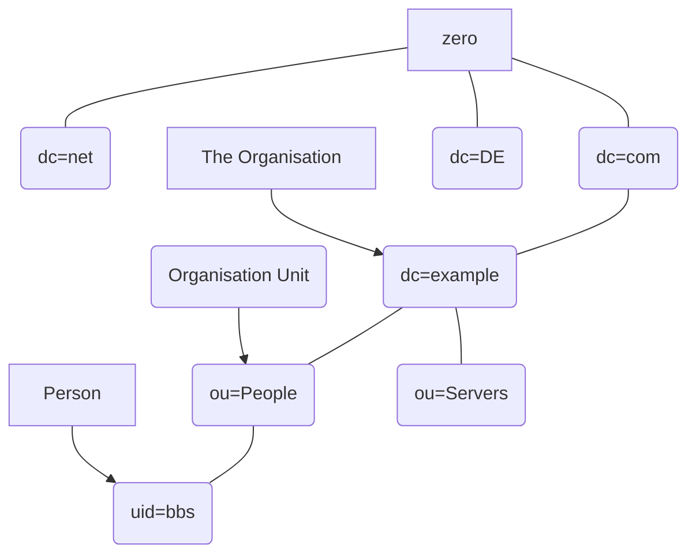
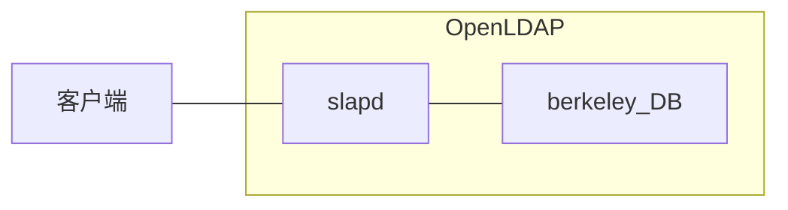

# OpenLDAP 初识


from [本末丶 's Blog](http://blog.leanote.com/post/benmo/e98d072f2b28)

## OpenLDAP 概述

### OpenLDAP 简介

OpenLDAP 是一款轻量级目录访问协议（Lightweight Directory Access Protocol，LDAP），属于开源集中账号管理架构的实现，且支持众多系统版本，被广大互联网公司所采用。

LDAP 具有两个国家标准，分别是 `X.500` 和 `LDAP`。OpenLDAP 是基于 X.500 标准的，而且去除了 X.500 复杂的功能并且可以根据自我需求定制额外扩展功能，但与 X.500 也有不同之处，例如 OpenLDAP 支持 TCP/IP 协议等，目前 TCP/IP 是 Internet 上访问互联网的协议。

OpenLDAP 则直接运行在更简单和更通用的 TCP/IP 或其他可靠的传输协议层上，避免了在 OSI会 话层和表示层的开销，使连接的建立和包的处理更简单、更快，对于互联网和企业网应用更理想。LDAP 提供并实现目录服务的信息服务，目录服务是一种特殊的数据库系统，对于数据的读取、浏览、搜索有很好的效果。目录服务一般用来包含基于属性的描述性信息并支持精细复杂的过滤功能，但 OpenLDAP 目录服务不支持通用数据库的大量更新操作所需要的复杂的事务管理或回滚策略等。

OpenLDAP 默认以 `Berkeley DB` 作为后端数据库，Berkeley DB 数据库主要以散列的数据类型进行数据存储，如以键值对的方式进行存储。Berkeley DB 是一类特殊的数据库，主要用于搜索、浏览、更新查询操作，一般对于一次写入数据、多次查询和搜索有很好的效果。Berkeley DB 数据库是面向查询进行优化，面向读取进行优化的数据库。Berkeley DB 不支持事务型数据库（MySQL、MariDB、Oracle等）所支持的高并发的吞吐量以及复杂的事务操作。

OpenLDAP 目录中的信息是按照 `树形结构` 进行组织的，具体信息存储在条目（entry）中，条目可以看成关系数据库中的表记录，条目是具有区别名（Distinguished Name，DN）的属性（attribute），DN 是用来引用条目，DN 相当于关系数据库（Oracle/MySQL）中的主键（primary key），是唯一的。属性由类型（type）和一个或者多个值（value）组成，相当于关系数据库中字段的概念。

> OpenLDAP 特点

- OpenLDAP 是一个跨平台的标准互联网协议，它基于 X.500 标准协议。
- OpenLDAP 提供静态数据查询搜索，不需要像在关系数据中那样通过 SQL 语句维护数据库信息。
- OpenLDAP 基于推和拉的机制实现节点间数据同步，简称复制（replication）并提供基于 TLS、SASL 的安全认证机制，实现数据加密传输以及 Kerberos 密码验证功能。
- OpenLDAP 可以基于第三方开源软件实现负载（LVS、HAProxy）及高可用性解决方案，24 小时提供验证服务，如 Headbeat、Corosync、Keepalived 等。
- OpenLDAP 数据元素使用简单的文本字符串（简称 LDIF 文件）而非一些特殊字符，便于维护管理目录树条目。
- OpenLDAP 可以实现用户的集中认证管理，所有关于账号的变更，只须在 OpenLDAP 服务器端直接操作，无须到每台客户端进行操作，影响范围为全局。
- OpenLDAP 默认使用协议简单如支持 TCP/IP 协议传输条目数据，通过使用查找操作实现对目录树条目信息的读写操作，同样可以通过加密的方式进行获取目录树条目信息。
- OpenLDAP 产品应用于各大应用平台（Nginx、HTTP、vsftpd、Samba、SVN、Postfix、OpenStack、Hadoop 等）、服务器（HP、IBM、Dell等）以及存储（EMC、NetApp等）控制台，负责管理账号验证功能，实现账号统一管理。
- OpenLDAP 实现具有费用低、配置简单、功能强大、管理容易及开源的特点。
- OpenLDAP 通过 ACL（Access Control List）灵活控制用户访问数据的权限，从而保证数据的安全性。

> OpenLDAP 功能

- `查询操作（ldapsearch）`：允许查询目录并取得条目，其查询性能比关系数据库好。
- `更新操作（ldapupdate）`：目录树条目支持条目的添加、删除、修改等操作。
- `同步操作`：OpenLDAP 是一种典型的分布式结构，提供复制同步，可将主服务器上的数据通过推或拉的机制实现在从服务器上更新，完成数据的同步，从而避免 OpenLDAP 服务器出现单点故障，影响用户验证。
- `认证和管理操作`：允许客户端在目录中识别自己，并且能够控制一个会话的性质。

> OpenLDAP 高级功能：

- 实现账号统一集中管理
- 权限控制管理（sudo）
- 密码控制策略管理
- 密码审计管理
- 密码控制策略
- 主机控制管理
- 同步机制管理
- TLS/SASL 加密传输
- 高可用负载均衡架构
- 自定义 schema
- 各种应用平台集成账号管理

### OpenLDAP 架构

#### 目录结构

> 互联网命名架构





> 企业级命名架构


#### OpenLDAP 系统架构

OpenLDAP 的系统架构为 `服务器/客户端（C/S）`模式，其工作模型如下图所示：




### OpenLDAP schema 概念

schema 是 OpenLDAP 软件的重要组成部分，主要用于控制目录树中各种条目所拥有的对象类以及各种属性的定义，并通过自身内部规范机制限定目录树条目所遵循的逻辑结构以及定义规范，保证整个目树没有非法条目数据，避免不合法的条目存在目录树中，从而保障整个目录树信息的完整性、唯一性。

在 OpenLDAP 目录树中，schema 用来指定一个条目所包含的对象类（objectClass）以及每一个对象类所包含的属性值（attribute value）。其属性又分为必要属性和可选属性两种，一般必要属性是指添加条目时必须指定的属性，可选属性是可以选择或不选择的。schema 定义对象类，对象类包含属性的定义，对象类和属性组合成条目。

目录树中条目可理解为是一个具体的对象，它们均是通过 schema 创建的，并符合 schema 的标准规范，如对你所添加的数据条目中所包含的对象类级属性进行检测，检测通过完成添加，否则打印错误信息。因此，schema 是一个数据模型，数据模型可以理解为关系数据库的存储引擎，如 MyISAM、InnoDB，主要用来决定数据按照什么方式进行存储，并定义存储在目录树不同条目中数据类型之间的关系。

schema 是一个标准，定义了 OpenLDAP 目录树对象和属性存取方式，这也是 OpenLDAP 能够存储什么数据类型的取决因素。因此数据有什么属性等均根据 schema 来实现。OpenLDAP 默认的 schema 文件一般存放在 /etc/openldap/schema/ 目录下，此目录下每个文件定义了不同的对象类和属性。如果想引用额外的 schema，只需要在配置文件中通过 include 包含所指定的 schema 即可。

> 常见的 schema

| Schema File          | Description                        |
| -------------------- | ---------------------------------- |
| core.schema          | OpenLDAP core (required)           |
| cosine.schema        | Cosine and Internet X.500 (useful) |
| inetorgperson.schema | InetOrgPerson (useful)             |
| misc.schema          | Assorted (experimental)            |
| nis.schema           | Network Information Services (FYI) |
| openldap.schema      | OpenLDAP Project (experimental)    |
| sudo.schema          | Define sudo rules                  |

> 获取 schema

默认安装 OpenLDAP 组件后，系统的配置定义一组常用的 schema 文件，这组文件一般存放在 `/etc/openldap/schema` 目录内，可通过 include 引用。当所定义的 objectClass 不存在时，可查询其它服务提供的 schema 文件。

例：

```
# rpm -ql sudo | grep schema/usr/share/doc/sudo-1.8.6p7/schema.ActiveDirectory/usr/share/doc/sudo-1.8.6p7/schema.OpenLDAP/usr/share/doc/sudo-1.8.6p7/schema.iPlanet 
```


> 自定义 schema 文件，需要注意以下几点：

- 保证属性名称唯一性
- 通过 OID 标识符定义 objectClass
- 属性的描述
- 必选属性以及可先属性集合定义

### OpenLDAP 条目概述

#### objectClass 的分类

- 结构型（structural）：如 person 和 oraganizationUnit
- 辅助型（auxiliary）：如 extensibleObject
- 抽象型（abstract）：如 top，抽象型的 objectClass 不能直接使用。

> 常见的 objectClass：

- alias
- applicationEntity
- dSA
- applicationProcess
- bootableDevice
- certificationAuthority
- certificationAuthority-V2
- country
- cRLDistributionPoint
- dcObject
- device
- dmd
- domain
- domainNameForm
- extensibleObject
- groupOfNames
- groupOfUniqueNames
- ieee802Device
- ipHost
- ipNetwork
- ipProtocol
- ipService
- locality
- dcLocalityNameForm
- nisMap
- nisNetgroup
- nisObject
- oncRpc
- organization
- dcOrganizationNameForm
- organizationalRole
- organizationalUnit
- dcOrganizationalUnitNameForm
- person
- organizationalPerson
- inetOrgPerson
- uidOrganizationalPersonNameForm
- residentialPerson
- posixAccount
- posixGroup
- shadowAccount
- strongAuthenticationUser
- uidObject
- userSecurityInformation

当 OpenLDAP 官方以及系统提供的对象类无法满足企业的特殊要求时，可根据 OpenLDAP shcema 内部结构制定 schema 规范并生成对象，来满足当前需求。

#### objectClass 详解

在 OpenLDAP 目录树中，每个条目必须包含一个属于自身条件的对象类，然后再定义其条目属性及对应的值。

OpenLDAP 条目的属性能否添加取决于条目所继承的 objectClass 是否包含此属性。objectClass 具有继承关系，也就是说，条目添加的属性最终取决于自身所继承的所有 objectClass 的集合。如果所添加的属性不在 objectClass 范围内，此时目录服务器不允许添加此属性。如果要添加，就必须添加 schema 文件产生 objectClass 所对应的属性。`objectClass` 和 `Attribute` 由 `schema` 文件来规定，存放在 `/etc/openldap/schema` 目录下，schema 文件规范 objectClass 的构成以及属性和值在目录树中的对应关系。通过定义 schema 文件来产生objectClass，从而生成所需要的属性。所有的 objectClass 定义都存放在 /etc/openldap/schema/ *.schema 文件中。

每一个属性和值将用作每个条目在目录树中存储信息的标准，例如能包含哪些属性信息。对于 objectClass 的理解，可以将 objectClass 的属性值理解为一种模板。模板定义哪些信息可以存取，哪些信息不可以存储在目录树中。

`例 1`：person 属性的定义就存放在 core.schema 文件中

```
objectclass ( 2.5.6.6 NAME 'person'
	DESC 'RFC2256: a person'
	SUP top STRUCTURAL
	MUST ( sn $ cn )
	MAY ( userPassword $ telephoneNumber $ seeAlso $ description ) )
### 如果要定义 person 类型，需要定义顶级为 top，并且必须定义 sn 和 cn 两个属性，
### 还可以附加 userPassword、telephoneNumber、seeAlso、description 4 个属性值。
### 邮件地址、国家等属性不可以定义，除非读者添加相关的 objectClass 条目，否则提示相关属性不允许添加。
```

 

```
例 2：
objectClass: (2.5.6.0 NAME 'top'
	ABSTRACT
	MUST (objectClass))
objectClass: ( 2.5.6.6 NAME 'person'
	SUP top STRUCTURAL
	MUST (sn $ cn )
	MAY (userPassword $ telephoneNumber $seeAlso $ description ))
### 该示例中，如果要定义 top 属性，必须定义一个 objectClass 属性。
### 因为此案例中还定义了 person 属性，所以要必须定义 sn 和 cn 属性，
### 以及可以附加的属性（userPassword、telephoneNumber、seeAlso、description）。
### 此示例中必须要定义的有3个属性分别是 objectClass、sn 以及 cn。
### 通过此示例下一级的 objectClass 可以继承上一级 objectClass 的属性信息。 
```

### 属性

属性（Attribute）在目录树中主要用于描述条目相关信息，例如用户条目的用途、联系方式、邮件、uid、gid、公司地址等辅助信息。属性由 objectClass 所控制，一个 objectClass 的节点具有一系列Attribute，Attribute 可以理解为 Linux 系统当中的变量，每个变量都有对应的值，OpenLDAP Attribute 也是有对应的值。这些属性的对应值表示每个对象的特点，但有些属性在添加时是必须指定的，有些属性是非必要的（类似于条目更详细的描述）。在目录树中常用的 Attribute 有 uid、sn、giveName、I、objectClass、dc、ou、cn、mail、telephoneNumber、c 等。

| Attribute               | Note                                                         |
| ----------------------- | ------------------------------------------------------------ |
| dn (distinguished name) | 唯一标识名，类似于Linux文件系统中的绝对路径，每个对象都有唯一标识名。 例如，uid=dpgdy，ou=People，dc=gdy，dc=com |
| rdn (relative dn)       | 通常指相对标识名，类似于Linux文件系统中的相对路径。 例如，uid=dpgdy |
| uid（user id）          | 通常指一个用户的登录名称。 例如，uid=dpgdy，与系统中的uid不是一个概念 |
| sn（sur name）          | 通常指一个人的姓氏。例如，sn：Guo                            |
| giveName                | 通常指一个人的名字。例如，giveName：Guodayong，但不能指姓氏  |
| I                       | 通常指一个地方的地名。例如，I：Shanghai                      |
| objectClass             | objectClass是特殊的属性，包含数据存储的方式以及相关属性信息  |
| dc (domain component)   | 通常指定一个域名。例如，dc=example，dc=com                   |
| o (organization Name)   | 通常指定一个组织的名字                                       |
| ou (organization unit)  | 通常指定一个组织单元的名称。 例如，ou=people，dc=example，dc=com |
| cn（common name）       | 通常指一个对象的名称，如果是人，需要使用全名                 |
| mail                    | 通常指登录账号的邮箱地址，例如，mail：dayong_guo@126.com     |
| telephoneNumber         | 通常指登录账号的手机号码，例如，telephoneNumber：xxxxxxxxxxx |
| c（country）            | 通常指一个二位国家的名称，例如CN、US等国家代号。例如，c：CN  |

### LDIF 详解

LDIF（LDAP Data Interchanged Format）的轻量级目录访问协议数据交换格式的简称，是存储 LDAP 配置信息及目录内容的标准文本文件格式，之所以使用文本文件来存储这些信息是为了方便读取和修改，这也是其他大多数服务配置文件所采取的格式。通常用来交换数据并在 OpenLDAP 服务器之间互相交换数据，并且可以通过 LDIF 实现数据文件的导入、导出以及数据文件的添加、修改、重命名等操作，这些信息需要按照 LDAP 中 schema 的规范进行操作，并会接受 schema 的检查，如果不符合 OpenLDAP schema 规范要求，则会提示相关语法错误。

> LDIF 文件特点：

- LDIF 文件每行的结尾不允许有空格或者制表符。
- LDIF 文件允许相关属性可以重复赋值并使用。
- LDIF 文件以 .ldif 结尾命名。
- LDIF 文件中以#号开头的一行为注释，可以作为解释使用。
- LDIF 文件所有的赋值方式为：属性:[空格]属性值。
- LDIF 文件通过空行来定义一个条目，空格前为一个条目，空格后为另一个条目的开始。

LDIF 格式语法

```
### 注释，用于对条目进行解释
dn：条目名称
changetype: modify
add/delete/replace: <属性>
objectClass： 对象类类型<属性>: <属性值> 
```


修改 `多条目` 时，语法

```
dn：条目名称
changetype: modify
add/delete/replace: <属性>
<属性>: <属性值>
-
add/delete/replace: <属性>
<属性>: <属性值> 
```

 

示例（注意冒号后面有一个空格，然后才是属性的值）

```
dn: uid=Guodayong,ou=people,dc=gdy,dc=com
objectClass: top
objectClass: posixAccount
objectClass: shadowAccount
objectClass: person
objectClass: inetOrgPerson
objectClass: hostObject
sn: Guo
cn: Guodayong
telephoneNumber：xxxxxxxxxxx
mail: dayong_guo@126.com 
```

 

多条目

```
dn: olcDatabase={2}hdb,cn=config
changetype: modify
replace: olcRootDN
olcRootDN: cn=Superadmin,dc=mallux,dc=org
-
replace: olcAccess
olcAccess: {0}to attrs=userPassword,shadowLastChange by dn="cn=Superadmin,dc=mallux,dc=org"
  write by anonymous auth by self write by * none
olcAccess: {2}to * by dn="cn=Superadmin,dc=mallux,dc=org" write by * read 
```

 

### 对象标识符

对象标识符（object identifier）被 LDAP 内部数据库引用的数字标识。Attribute 的名字是为了方便人们读取，但为了方便计算机的处理，通常使用一组数字来标识这些对象，这类同于 SNMP 中的 MIB2。例如，当计算机接收到 dc 这个 Attribut e时，它会将这个名字转换为对应的 OID：1.3.6.1.4.1.1466.115.121.1.26。

schema定义了 OpenLDAP 框架目录所应遵循的结构和规则，保障整个目录树的完整性。主要包括 4 个部分，分别是 OID、objectClass、匹配规则、属性，本小节主要介绍 OID 相关知识点。

每个 schema 中，都具有合法而全局唯一的对象标识符，简称 OID。主要用于被 LDAP 内部数据库引用的标识，schema 生产 objectClass，objectClass 生成 Attribute，Attribute 的产生主要是为了方便人们所理解，但为了方便计算机处理，通常使用一组数字来标识这些对象，类似于 SNMP 中 MIB2概念。

OID 在 OpenLDAP 项目中承担重要角色，是存在层级关系的。由下表得知，项目 ID 为 1.1，分为 6 个层级，分别是 SNMP 元素定义、LDAP 元素定义、属性类型、属性名称、对象类型、对象名称。如果你要定义一个 OID，需要到 http://www.iana.org/ 申请免费已注册的 OID 或者通过 http://pen.iana.org/pen/PenApplication.page 填写信息并提交来完成 OID 的申请。

OID 层级关系：

| OID       | Assignment         |
| --------- | ------------------ |
| 1.1       | Organization’s OID |
| 1.1.1     | SNMP Elements      |
| 1.1.2     | LDAP Elements      |
| 1.1.2.1   | AttributeTypes     |
| 1.1.2.1.1 | x-my-Attribute     |
| 1.1.2.2   | objectClasses      |
| 1.1.2.2.1 | x-my-objectClass   |

## OpenLDAP 安装与配置

安装 OpenLDAP 服务器需要提供守护进程和传统的 OpenLDAP 管理配置工具，主要是 slapd 和 ldap-utils 套件。

1. 获取 OpenLDAP 软件包
2. 安装 OpenLDAP 软件包（通过 rpm 或源码编译安装）
3. 生成 OpenLDAP 配置文件（slapd.conf）或数据库文件（DB_CONFIG）
4. 配置 OpenLDAP（slapd.conf 或 cn=config）
5. 生成组织架构、添加目录树条目
6. 加载 slapd 进程（可选，若采用配置 slapd.conf 的方式）
7. 验证

### OpenLDAP 安装

> 安装 OpenLDAP 组件

```
[root@c6-host ~]# yum install openldap openldap-servers \
openldap-clients openldap-devel compat-openldap migrationtools
 
### 软件包说明：
openldap：OpenLDAP 服务端和客户端必须用的库文件
openldap-clients：在 LDAP 服务端上使用，用于查看和修改目录的命令行的包
openldap-servers：用于启动服务和设置，包含单独的 LDAP 后台守护程序
openldap-servers-sql：支持 sql 模块
compat-openldap：OpenLDAP 兼容性库
migrationtools: 转换系统账号（/etc/passwd）和组（/etc/group）文件为 ldif 文件，以便导入到 openldap 中
```

> 启动 OpenLDAP 服务

```
# systemctl enable slapd.service
# systemctl start slapd.service
# netstat -nplt | grep slapd
tcp        0      0 0.0.0.0:389             0.0.0.0:*               LISTEN      29015/slapd
tcp6       0      0 :::389                  :::*                    LISTEN      29015/slapd 
```


测试环境测试需要，备份初始刚安装完的 OpenLDAP 配置和数据库：

```
# tar -zcvf openldap.tgz /etc/openldap /var/lib/ldap 
```

 

初始化还原脚本：

```
#!/usr/bin/env bash
systemctl stop slapd
rm -rf /etc/openldap /var/lib/ldap ; tar -zxf openldap.tgz -C /
if [ $? -eq 0 ]
then
    cp /usr/share/openldap-servers/DB_CONFIG.example /var/lib/ldap/DB_CONFIG
    chown -R ldap.ldap /var/lib/ldap/ /etc/openldap/
    slapd_process="none"
    systemctl start slapd
    echo -e "OpenLDAP slapd service\n------"
    netstat -nplt | grep slapd ; [ $? -eq 0 ] && slapd_process="exists"
    echo -e "\n------"
    read -p "Import schema(s) (y/n): " yesno
    ### import schema(s)
    [ x"$slapd_process" == x"exists" -a x"$yesno" == x"y" ] && {
        echo "---"
        for ldif in `ls /etc/openldap/schema/*.ldif`;
        do
            ldapadd -Y EXTERNAL -H ldapi:/// -f $ldif
        done
    } || {
        echo
    }
    ### change search DOMAIN
    sed -i "/URI/a BASE    dc=mallux,dc=org\nURI     ldap://192.168.112.5" /etc/openldap/ldap.conf
fi 
```

 

### OpenLDAP 命令

> 客户端命令：

- `ldapsearch`：搜索 OpenLDAP 目录树条目。
- `ldapadd`：通过 LDIF 格式，添加目录树条目。
- `ldapdelete`：删除 OpenLDAP 目录树条目。
- `ldapmodify`：修改 OpenLDAP 目录树条目。
- `ldapwhoami`：检验 OpenLDAP 用户的身份。
- `ldapmodrdn`：修改 OpenLDAP 目录树 DN 条目。
- `ldapcompare`：判断 DN 值和指定参数值是否属于同一个条目。
- `ldappasswd`：修改 OpenLDAP 目录树用户条目实现密码重置。

> 服务端命令：

- `slaptest`：验证 slapd.conf 文件或 cn=config 配置目录
- `slapindex`：创建 OpenLDAP 目录树索引，提高查询效率
- `slapcat`：将数据条目转换为 OpenLDAP 的 LDIF 文件

> 公用参数：

- `-b `：指定查找的节点
- `-D `：指定查找的 DN，DN 是整个 OpenLDAP 树的唯一识别名称，类似系统中根的概念
- `-v`：详细输出信息
- `-x`：使用简单的认证，不使用任何加密的算法，例如，TLS、SASL 等相关加密算法
- `-W`：在查询时，会提示输入密码，如果不想输入密码，使用 -w password 即可
- `-h`（OpenLDAP 主机）：使用指定的 ldaphost，可以使用 FQDN 或 IP 地址
- `-H `：使用 LDAP 服务器的 URI 地址进行操作
- `-p `：指定 OpenLDAP 监听的端口（默认端口为 389，加密端口为 636）
- `-P `：这里指的是 OpenLDAP 的版本号，如 V2 或 V3
- `-LLL`：禁止输出与过滤条件不匹配的信息
- `-c`：持续操作模式，例如，在操作过程中出现错误，也会进行后续相关操作
- `-n`：显示正在进行的相关操作，但不实际修改数据，一般用于测试
- `-y `：可以通过将密码写在文件里进行简单验证
- `-r`：递归删除，这个操作会从目录树删除指定的 DN 的所有子条目
- `-a`：新增条目
- `-f <文件名.ldif>`：根据指定的文件，对数据库进行操作
- `-F`：检测指定 OpenLDAP 数据库目录（/etc/openldap/slapd/）

### 配置 OpenLDAP（CentOS 7）

在 OpenLDAP 2.4 版本中，配置 OpenLDAP 的方法有两种：

- 一种通过修改配置文件（`slapd.conf`）实现配置：`/etc/openldap/slapd.conf`
- 另一种通过修改数据库（`cn=config`）的形式完成配置：`/etc/openldap/slapd.d/cn=config`

通过配置数据库（cn=config）完成各种配置，属于动态配置且不需要重新启动 slapd 进程服务。此配置数据库包含一个基于文本的集合 LDIF 文件（位于 /etc/openldap/slapd.d 目录下）。

当前仍然可以使用传统的配置文件（slapd.conf）方式进行配置，通过修改配置文件来实现 slapd 的配置方式，需要重新生成（cn=config）数据库配置，这个过程会影响已经运行的 slpad 服务。因此，最新的 OpenLDAP 已不建义使用 slapd.conf 的配置方式，且以后可能会废弃。

#### slapd.conf 配置文件（废弃）

> 默认模板

- `CentOS 6`：/usr/share/openldap-servers/slapd.conf.obsolete
- `CentOS 7`：/usr/share/openldap-servers/slapd.ldif

#### cn=config 配置目录 （推荐，初始化环境）

配置目录：`/etc/openldap/slapd.d/cn=config`

> **Step 1**： 配置 OpenLDAP 数据库

```
# cp /usr/share/openldap-servers/DB_CONFIG.example /var/lib/ldap/DB_CONFIG
# chown -R ldap:ldap /var/lib/ldap/ 
```


```
# cat /var/lib/ldap/DB_CONFIG
# $OpenLDAP$
# Example DB_CONFIG file for use with slapd(8) BDB/HDB databases.
#8
# See the Oracle Berkeley DB documentation
#   <http://www.oracle.com/technology/documentation/berkeley-db/db/ref/env/db_config.html>
# for detail description of DB_CONFIG syntax and semantics.
#
# Hints can also be found in the OpenLDAP Software FAQ
#   <http://www.openldap.org/faq/index.cgi?file=2>
# in particular:
#   <http://www.openldap.org/faq/index.cgi?file=1075>
# Note: most DB_CONFIG settings will take effect only upon rebuilding
# the DB environment.
# one 0.25 GB cache
set_cachesize 0 268435456 1
# Data Directory
#set_data_dir db
# Transaction Log settings
set_lg_regionmax 262144
set_lg_bsize 2097152
#set_lg_dir logs
# Note: special DB_CONFIG flags are no longer needed for "quick"
# slapadd(8) or slapindex(8) access (see their -q option). 
```


> **Step 2**：配置 OpenLDAP 管理员

生成管理员密码：

```
# slappasswd
New password:
Re-enter new password:
{SSHA}vgmRyKYiDJwLp2g0AYnnzo8doJrcf5Vw 
```


更改 cn=config 配置：

```
# cat <<EOF | ldapadd -Y EXTERNAL -H ldapi:///
dn: olcDatabase={2}hdb,cn=config
changetype: modify
add: olcRootPW
olcRootPW: {SSHA}vgmRyKYiDJwLp2g0AYnnzo8doJrcf5Vw
EOF
### 返回结果：
－－－
SASL/EXTERNAL authentication started
SASL username: gidNumber=0+uidNumber=0,cn=peercred,cn=external,cn=auth
SASL SSF: 0
modifying entry "olcDatabase={2}hdb,cn=config"
```

 

`或`：将配置写到一个临时的 ldif 文件，导入配置

```
# cat /root/ldif/manager.ldif
dn: olcDatabase={2}hdb,cn=config
changetype: modify
add: olcRootPW
olcRootPW: {SSHA}vgmRyKYiDJwLp2g0AYnnzo8doJrcf5Vw
# ldapadd -Y EXTERNAL -H ldapi:/// -f ~/ldif/manager.ldif 
```

 

> **Step 3**：导入 Schemas

- CentOS 6 中默认已导入 `/etc/openldap/schema` 下的所有 schema
- CentOS 7 中默认只导入了 `/etc/openldap/schema/core.schema`，其它 schema 需要自行导入
- 导入 schema 后，其生成的配置存放在 `/etc/openldap/slapd.d/cn=config/cn=schema` 目录下

```
# ls /etc/openldap/schema/ | xargs -n1
collective.ldif
collective.schema
corba.ldif
corba.schema
core.ldif
core.schema
cosine.ldif
cosine.schema
duaconf.ldif
duaconf.schema
dyngroup.ldif
dyngroup.schema
inetorgperson.ldif
inetorgperson.schema
java.ldif
java.schema
misc.ldif
misc.schema
nis.ldif
nis.schema
openldap.ldif
openldap.schema
pmi.ldif
pmi.schema
ppolicy.ldif
ppolicy.schema
sudo.ldif
sudo.schema 
```

导入 Schemas：

```
# for ldif in `ls /etc/openldap/schema/*.ldif`;
do
    ldapadd -Y EXTERNAL -H ldapi:/// -f $ldif
done
### 返回结果：
---
SASL/EXTERNAL authentication started
SASL username: gidNumber=0+uidNumber=0,cn=peercred,cn=external,cn=auth
SASL SSF: 0
adding new entry "cn=collective,cn=schema,cn=config"
SASL/EXTERNAL authentication started
SASL username: gidNumber=0+uidNumber=0,cn=peercred,cn=external,cn=auth
SASL SSF: 0
adding new entry "cn=corba,cn=schema,cn=config"
SASL/EXTERNAL authentication started
SASL username: gidNumber=0+uidNumber=0,cn=peercred,cn=external,cn=auth
SASL SSF: 0
adding new entry "cn=core,cn=schema,cn=config"
ldap_add: Other (e.g., implementation specific) error (80)
    additional info: olcAttributeTypes: Duplicate attributeType: "2.5.4.2"
SASL/EXTERNAL authentication started
SASL username: gidNumber=0+uidNumber=0,cn=peercred,cn=external,cn=auth
SASL SSF: 0
adding new entry "cn=cosine,cn=schema,cn=config"
SASL/EXTERNAL authentication started
SASL username: gidNumber=0+uidNumber=0,cn=peercred,cn=external,cn=auth
SASL SSF: 0
adding new entry "cn=duaconf,cn=schema,cn=config"
SASL/EXTERNAL authentication started
SASL username: gidNumber=0+uidNumber=0,cn=peercred,cn=external,cn=auth
SASL SSF: 0
adding new entry "cn=dyngroup,cn=schema,cn=config"
SASL/EXTERNAL authentication started
SASL username: gidNumber=0+uidNumber=0,cn=peercred,cn=external,cn=auth
SASL SSF: 0
adding new entry "cn=inetorgperson,cn=schema,cn=config"
SASL/EXTERNAL authentication started
SASL username: gidNumber=0+uidNumber=0,cn=peercred,cn=external,cn=auth
SASL SSF: 0
adding new entry "cn=java,cn=schema,cn=config"
SASL/EXTERNAL authentication started
SASL username: gidNumber=0+uidNumber=0,cn=peercred,cn=external,cn=auth
SASL SSF: 0
adding new entry "cn=misc,cn=schema,cn=config"
SASL/EXTERNAL authentication started
SASL username: gidNumber=0+uidNumber=0,cn=peercred,cn=external,cn=auth
SASL SSF: 0
adding new entry "cn=nis,cn=schema,cn=config"
SASL/EXTERNAL authentication started
SASL username: gidNumber=0+uidNumber=0,cn=peercred,cn=external,cn=auth
SASL SSF: 0
adding new entry "cn=openldap,cn=schema,cn=config"
SASL/EXTERNAL authentication started
SASL username: gidNumber=0+uidNumber=0,cn=peercred,cn=external,cn=auth
SASL SSF: 0
adding new entry "cn=pmi,cn=schema,cn=config"
SASL/EXTERNAL authentication started
SASL username: gidNumber=0+uidNumber=0,cn=peercred,cn=external,cn=auth
SASL SSF: 0
adding new entry "cn=ppolicy,cn=schema,cn=config" 
```

 

> **Step 4**：初始化 OpenLDAP 配置

定义 /root/ldif/init.ldif 文件：

```
### 允许更改 monitor 数据库配置权限
dn: olcDatabase={1}monitor,cn=config
changetype: modify
replace: olcAccess
olcAccess: {0}to * by dn.base="gidNumber=0+uidNumber=0,cn=peercred,cn=external,cn=auth"
  read by dn.base="cn=Superadmin,dc=mallux,dc=org" read by * none
### 定义组织，配置 hdb 数据库
dn: olcDatabase={2}hdb,cn=config
changetype: modify
replace: olcSuffix
olcSuffix: dc=mallux,dc=org
### 定义管理员，配置 hdb 数据库
dn: olcDatabase={2}hdb,cn=config
changetype: modify
replace: olcRootDN
olcRootDN: cn=Superadmin,dc=mallux,dc=org
### 允许更改 hdb 数据库配置权限：
###    - 允许 Superadmin 管理员修改配置
###    - 允许用户修改自己的密码
dn: olcDatabase={2}hdb,cn=config
changetype: modify
add: olcAccess
olcAccess: {0}to attrs=userPassword,shadowLastChange by
  dn="cn=Superadmin,dc=mallux,dc=org" write by anonymous auth by self write by * none
olcAccess: {1}to dn.base="" by * read
olcAccess: {2}to * by dn="cn=Superadmin,dc=mallux,dc=org" write by * read
```

 

导入 ldif 初始化配置：

```
# ldapadd -Y EXTERNAL -H ldapi:/// -f init.ldif
### 返回结果：
---
SASL/EXTERNAL authentication started
SASL username: gidNumber=0+uidNumber=0,cn=peercred,cn=external,cn=auth
SASL SSF: 0
modifying entry "olcDatabase={1}monitor,cn=config"
modifying entry "olcDatabase={2}hdb,cn=config"
modifying entry "olcDatabase={2}hdb,cn=config"
modifying entry "olcDatabase={2}hdb,cn=config" 
```

 

**Step 5**：配置 ldapsearch 搜索域

默认不配置 `/etc/openldap/ldap.conf` 时，使用 ldapsearch 搜索条目将报如下错误：

```
# ldapsearch -x -LLL
No such object (32) 
```

 

配置默认搜索域：

```
# grep -iE '^(BASE|URI)' /etc/openldap/ldap.conf
BASE    dc=mallux,dc=org
URI     ldap://192.168.112.5 ldaps://ldap.mallux.org
```

 

```
# ldapsearch -x -LLL
### 返回结果：
---
dn: dc=mallux,dc=org
dc: mallux
objectClass: top
objectClass: domain
objectClass: domainRelatedObject
associatedDomain: mallux.org
dn: ou=Devops,dc=mallux,dc=org
ou: Devops
objectClass: top
objectClass: organizationalUnit
objectClass: domainRelatedObject
associatedDomain: mallux.org
dn: ou=Groups,dc=mallux,dc=org
ou: Group
objectClass: top
objectClass: organizationalUnit
objectClass: domainRelatedObject
associatedDomain: mallux.org
```

#### 启用 SSL 认证

> **Step 1**：证书生成

参见 [OPENSSL 加密技术及私有 CA 构建](http://blog.mallux.me/2017/02/07/openssl/)

```
# chwon ldap.ldap /etc/openldap/certs
# ls cacert.pem ldapsrv.* | xargs -n1
cacert.pem
ldapsrv.crt
ldapsrv.key  
```

> **Step 2**：配置 OpenLDAP SSL

```
# cat << EOF | ldapmodify -Y EXTERNAL -H ldapi:///
dn: cn=config
changetype: modify
add: olcTLSCACertificateFile
olcTLSCACertificateFile: /etc/openldap/certs/cacert.pem
-
replace: olcTLSCertificateFile
olcTLSCertificateFile: /etc/openldap/certs/ldapsrv.crt
-
replace: olcTLSCertificateKeyFile
olcTLSCertificateKeyFile: /etc/openldap/certs/ldapsrv.key
-
replace: olcTLSVerifyClient
olcTLSVerifyClient: never
EOF
### 返回结果：
---
SASL/EXTERNAL authentication started
SASL username: gidNumber=0+uidNumber=0,cn=peercred,cn=external,cn=auth
SASL SSF: 0
modifying entry "cn=config" 
```

- `never`：不需要验证 client 端的身份，Client 端只需要有 CA 证书就可以了
- `allow`：Server 会要求 client 提供证书，如果 client 端没有提供证书，会话会正常进行
- `try`：Client 端提供了证书，但是 Server 端有可能不能校验这个证书，这个证书会被忽略，会话正常进行
- `demand`：Server 端需要认证 client 端的身份，Client 端需要有自己的证书和私钥

开启 SSL：

```
 # grep "SLAPD_URLS" /etc/sysconfig/slapd
SLAPD_URLS="ldapi:/// ldap:/// ldaps:///" 
```

重启 slapd 服务：

```
# systemctl restart slapd
# netstat -nplt | grep slapd
tcp        0      0 0.0.0.0:636             0.0.0.0:*               LISTEN      31216/slapd
tcp        0      0 0.0.0.0:389             0.0.0.0:*               LISTEN      31216/slapd
tcp6       0      0 :::636                  :::*                    LISTEN      31216/slapd
tcp6       0      0 :::389                  :::*                    LISTEN      31216/slapd
 
```

 

确认当前套接字是否能通过 CA 的验证：

```
# openssl s_client -connect ldap.mallux.org:636 -showcerts -state -CAfile /etc/openldap/certs/cacert.pem
CONNECTED(00000003)
SSL_connect:before/connect initialization
SSL_connect:SSLv2/v3 write client hello A
SSL_connect:SSLv3 read server hello A
depth=1 C = CN, ST = GuangDong, L = ShenZhen, O = mallux.org, OU = DevOps, CN = ca.mallux.org, emailAddress = admin@mallux.org
verify return:1
depth=0 C = CN, ST = GuangDong, O = mallux.org, OU = DevOps, CN = ldap.mallux.org, emailAddress = admin@mallux.org
verify return:1
SSL_connect:SSLv3 read server certificate A
SSL_connect:SSLv3 read server key exchange A
SSL_connect:SSLv3 read server done A
SSL_connect:SSLv3 write client key exchange A
SSL_connect:SSLv3 write change cipher spec A
SSL_connect:SSLv3 write finished A
SSL_connect:SSLv3 flush data
SSL_connect:SSLv3 read finished A
---
Certificate chain
 0 s:/C=CN/ST=GuangDong/O=mallux.org/OU=DevOps/CN=ldap.mallux.org/emailAddress=admin@mallux.org
   i:/C=CN/ST=GuangDong/L=ShenZhen/O=mallux.org/OU=DevOps/CN=ca.mallux.org/emailAddress=admin@mallux.org
-----BEGIN CERTIFICATE-----
MIIEITCCAwmgAwIBAgIBATANBgkqhkiG9w0BAQsFADCBnTELMAkGA1UEBhMCQ04x
EjAQBgNVBAgMCUd1YW5nRG9uZzERMA8GA1UEBwwIU2hlblpoZW4xFTATBgNVBAoM
DHdvbGFpZGFpLmNvbTEPMA0GA1UECwwGRGV2T3BzMRgwFgYDVQQDDA9jYS53b2xh
aWRhaS5jb20xJTAjBgkqhkiG9w0BCQEWFml0c2VydmljZUB3b2xhaWRhaS5jb20w
HhcNMTcwMzA5MDIwMzA5WhcNMTkxMjA0MDIwMzA5WjCBjDELMAkGA1UEBhMCQ04x
EjAQBgNVBAgMCUd1YW5nRG9uZzEVMBMGA1UECgwMd29sYWlkYWkuY29tMQ8wDQYD
VQQLDAZEZXZPcHMxGjAYBgNVBAMMEWxkYXAud29sYWlkYWkuY29tMSUwIwYJKoZI
hvcNAQkBFhZpdHNlcnZpY2VAd29sYWlkYWkuY29tMIIBIjANBgkqhkiG9w0BAQEF
AAOCAQ8AMIIBCgKCAQEAyfoiqmAQCwqI7Se0x0cK4EcAmkzpK0fcvGHYhq2RBzCo
cn15Ad71e3FTiLmyuw2PL88+zfQ2ZJJrKvpj5Q7ZxgdzP7/zewa1IW+h26UxzBOp
JICle8J31/nbfojgE6U2IEVa+oJfVO75KL0w2b5tTLpLnIDWffzUwA9RGxiAT42H
aE0wnJaWX0isOvJKYqyUut9IiHG1ZKZZ2rQMpHbXxZBrLpW5aAKQgbbhO4uXlu5M
/pr03mC71FUX62ngYkRjwl8ZyPVB0OmZR57V1i1n+c16ZihsAl4bnULxUDukGJ+1
GdoiUMdQdpvGp5/e99sR8N3920oPfrtf257knd3ZYQIDAQABo3sweTAJBgNVHRME
AjAAMCwGCWCGSAGG+EIBDQQfFh1PcGVuU1NMIEdlbmVyYXRlZCBDZXJ0aWZpY2F0
ZTAdBgNVHQ4EFgQUiEmN11xUfc36TPoDOl1X+I9rnPswHwYDVR0jBBgwFoAUFgLM
DccCd0a6gH0rfD6MtH4AppUwDQYJKoZIhvcNAQELBQADggEBAJxAvthgLV+MMZCn
GXsRoSvFq/Mh5rYlf09nyHIuAH4ag7kb0L+nrfDFuExAKzz4+gIWsz9XQqMCIzPq
wZpraw/3xbgpSaZu42njOJxj1LtQ9PeoTEOR1z+tf8NNtneWFVOhVxy5WTSUwioM
yVyxB3IbM5otZJzKLkWrwVLB3b4NT82CiZLOmfrmmu5R3/AfXx4DmbHdFBMn8Hor
sxQOEzanHGb2aXFkw3gzC+FKkOC9LtuXfI3ba2KvnqjDhFVY45B6Q/OEtWjML/tE
f8J1Wr5kEGtVM2G5WxXwiEc2ZKwdhyIhO0obPkp1hdRq9jTkP1tPn5IK55P/Da2V
tGuOgpk=
-----END CERTIFICATE-----
 1 s:/C=CN/ST=GuangDong/L=ShenZhen/O=mallux.org/OU=DevOps/CN=ca.mallux.org/emailAddress=admin@mallux.org
   i:/C=CN/ST=GuangDong/L=ShenZhen/O=mallux.org/OU=DevOps/CN=ca.mallux.org/emailAddress=admin@mallux.org
-----BEGIN CERTIFICATE-----
MIIEDzCCAvegAwIBAgIJAP7joYrtj+GhMA0GCSqGSIb3DQEBCwUAMIGdMQswCQYD
VQQGEwJDTjESMBAGA1UECAwJR3VhbmdEb25nMREwDwYDVQQHDAhTaGVuWmhlbjEV
MBMGA1UECgwMd29sYWlkYWkuY29tMQ8wDQYDVQQLDAZEZXZPcHMxGDAWBgNVBAMM
D2NhLndvbGFpZGFpLmNvbTElMCMGCSqGSIb3DQEJARYWaXRzZXJ2aWNlQHdvbGFp
ZGFpLmNvbTAeFw0xNzAzMDkwMTQ1MzJaFw0yNzAzMDcwMTQ1MzJaMIGdMQswCQYD
VQQGEwJDTjESMBAGA1UECAwJR3VhbmdEb25nMREwDwYDVQQHDAhTaGVuWmhlbjEV
MBMGA1UECgwMd29sYWlkYWkuY29tMQ8wDQYDVQQLDAZEZXZPcHMxGDAWBgNVBAMM
D2NhLndvbGFpZGFpLmNvbTElMCMGCSqGSIb3DQEJARYWaXRzZXJ2aWNlQHdvbGFp
ZGFpLmNvbTCCASIwDQYJKoZIhvcNAQEBBQADggEPADCCAQoCggEBAMS08fZwbFKI
0fORv9sPE6F2DUjJz8yy5shrkDv2Cm2AJEfYxoBuIrHFNZ/iX7s5eoqizwWPHXh+
108V9DX3TaHjfo+R+hbZ3dL1NwkymF6oIRXzPdbEk964+UWOWvhJqpPhNBUAfGld
K1IdlWjtZlj1HDhATQVO44MhMudIa9nF2LLnkIpTBHn8P6HP+bRu/KaSVlV2eIVa
8M8gvk7X6F0m/uctDaTlzr4i/q9z7WbX5ZlzSph2BawSecov/Jt0IEG50Q3G3Dis
kFU+KmVGzMSUGFW5JeJ26A5HA7MsUpH5FopwRE1HOfRRnt8day3kMdpiVxor1G3a
jwJj6CzfZVUCAwEAAaNQME4wHQYDVR0OBBYEFBYCzA3HAndGuoB9K3w+jLR+AKaV
MB8GA1UdIwQYMBaAFBYCzA3HAndGuoB9K3w+jLR+AKaVMAwGA1UdEwQFMAMBAf8w
DQYJKoZIhvcNAQELBQADggEBAMPrMUeDU98q4f9E3bry8zM+GE/J8O4HUfcm3EiV
lGETm2nuevj5EbrvA2Qk/6Tg2g20wNvh7/BDN/+CbnJmxTL1ZicGR5AtXECrowoi
TfE0ur1RaoVsL27168xbeQ7u79YXRwoP44xYffbxGj8hy2xO26NCTjp8QjPHYeMy
P+lTXMhbWVzIVCfI8AnvlmgxcHXWdN/d15BJYGLMqrPqoojuL2SKH5F65XUpUBfZ
wP8CWE7/adaFJjtm8dItrbrQvM4xtusC9CCWh3UEcSXL57J8s0YnMWWfKAxlNMSi
MSF5OUO1CUKK+713/q45TdyZSxx54GcY+HiXPP+AD7SDvzY=
-----END CERTIFICATE-----
---
Server certificate
subject=/C=CN/ST=GuangDong/O=mallux.org/OU=DevOps/CN=ldap.mallux.org/emailAddress=admin@mallux.org
issuer=/C=CN/ST=GuangDong/L=ShenZhen/O=mallux.org/OU=DevOps/CN=ca.mallux.org/emailAddress=admin@mallux.org
---
No client certificate CA names sent
Server Temp Key: ECDH, prime256v1, 256 bits
---
SSL handshake has read 2597 bytes and written 373 bytes
---
New, TLSv1/SSLv3, Cipher is ECDHE-RSA-AES256-GCM-SHA384
Server public key is 2048 bit
Secure Renegotiation IS supported
Compression: NONE
Expansion: NONE
SSL-Session:
    Protocol  : TLSv1.2
    Cipher    : ECDHE-RSA-AES256-GCM-SHA384
    Session-ID: 4CB55E57ADBECDB63DE7D50C84132DE20D6673998160BE60C568EE1E660D9CAB
    Session-ID-ctx:
    Master-Key: F3C997974A6EE5043AAA169A159FFB4F0FB22647E41BD9D94986F24C2B46C738CE827539645AC2B26717E5DB3E07CB42
    Key-Arg   : None
    Krb5 Principal: None
    PSK identity: None
    PSK identity hint: None
    Start Time: 1491377406
    Timeout   : 300 (sec)
    Verify return code: 0 (ok)
--- 
```

 

## 配置 OpenLDAP

### 配置 OpenLDAP 组织架构

> 配置组织架构

ldif文件中, 在每个 `dn` 前要有空行或注释

```shell
error: ldapadd: attributeDescription "dn": (possible missing newline after line 6, entry "dc=91fun,dc=club"?)

Solution  :

You need an empty line before each line starting with “dn:”
LDIF separates entries by blank lines.
dn: denotes the distinguished name of an entry and 
needs to be the first line of each entry.
example :

 

###EMPTY line
dn: dc=ldap-kike,dc=com,dc=uy
objectclass: dcObject
objectclass: organization
o: Servidor LDAP ldap-kike
dc: ldap-kike
###EMPTY line
dn: cn=Manager,dc=ldap-kike,dc=com,dc=uy
objectclass: organizationalRole
cn: Manager
```

组织架构 ldif 文件：

```
dn: dc=mallux,dc=org
objectClass: dcObject
objectClass: organization
dc: mallux
o: mallux.org
dn: ou=Devops,dc=mallux,dc=org
objectClass: organizationalUnit
objectClass: top
ou: Devops
dn: ou=Groups,dc=mallux,dc=org
objectClass: organizationalUnit
ou: Group
dn: cn=Superadmin,dc=mallux,dc=org
objectClass: organizationalRole
cn: Superadmin
dn: cn=devops,ou=Groups,dc=mallux,dc=org
objectClass: posixGroup
cn: DevOps
gidNumber: 3000
dn: cn=dba,ou=Groups,dc=mallux,dc=org
objectClass: posixGroup
cn: dbateam
gidNumber: 4000
dn: cn=manager,ou=Groups,dc=mallux,dc=org
objectClass: posixGroup
cn: appteam
gidNumber: 5000
dn: cn=developer,ou=Groups,dc=mallux,dc=org
objectClass: posixGroup
cn: appteam
gidNumber: 6000
dn: cn=tester,ou=Groups,dc=mallux,dc=org
objectClass: posixGroup
cn: testteam
gidNumber: 7000 
```

 

前面的配置中，已设置只有 Superadmin 管理员可管理 OpenLDAP，因此这里需要指定 Superadmin 的 DN 来导入 ldif 配置：

```
# ldapadd -x -W -D "cn=Superadmin,dc=mallux,dc=org" -f organization.ldif
Enter LDAP Password:
### ldapadd 返回的结果：
adding new entry "dc=mallux,dc=org"
adding new entry "ou=Devops,dc=mallux,dc=org"
adding new entry "ou=Groups,dc=mallux,dc=org"
adding new entry "cn=Superadmin,dc=mallux,dc=org"
adding new entry "cn=devops,ou=Groups,dc=mallux,dc=org"
adding new entry "cn=dba,ou=Groups,dc=mallux,dc=org"
adding new entry "cn=manager,ou=Groups,dc=mallux,dc=org"
adding new entry "cn=developer,ou=Groups,dc=mallux,dc=org"
adding new entry "cn=tester,ou=Groups,dc=mallux,dc=org" 
```

 

> 添加用户账号

```
# slappasswd
New password:
Re-enter new password:
{SSHA}5+XJK1rrRQov8orV0EzT2i+1tJ/bhJig 
```

ldif 示列文件：

```
dn: uid=hj.mallux,ou=Devops,dc=mallux,dc=org
objectClass: top
objectClass: posixAccount
objectClass: shadowAccount
objectClass: inetorgperson
objectClass: pwdPolicy
uid: hj.mallux
uidNumber: 3006
gidNumber: 3000
sn: Wang
givenName: huaijian
cn: HuaiJian.Wang
mail: hj.mallux@gmail.com
homeDirectory: /home/mallux
loginShell: /bin/bash
pwdMaxFailure: 5
pwdAttribute: 2.5.4.35
shadowMax: 99999
shadowMin: 0
shadowWarning: 7
telephoneNumber: 13688888888
userPassword: {SSHA}5+XJK1rrRQov8orV0EzT2i+1tJ/bhJig 
```

 

添加用户：

```
# ldapadd -x -W -D "cn=Superadmin,dc=mallux,dc=org" -f people.ldif
Enter LDAP Password:
adding new entry "uid=hj.mallux,ou=Devops,dc=mallux,dc=org" 
```

 

```
# ldapsearch -x -LLL uid=hj.mallux
dn: uid=hj.mallux,ou=Devops,dc=mallux,dc=org
objectClass: top
objectClass: posixAccount
objectClass: shadowAccount
objectClass: inetOrgPerson
objectClass: pwdPolicy
uid: hj.mallux
sn: Wang
givenName: huaijian
cn: HuaiJian.Wang
mail: hj.mallux@gmail.com
telephoneNumber: 13688888888
homeDirectory: /home/mallux
loginShell: /bin/bash
uidNumber: 3006
gidNumber: 3000
pwdMaxFailure: 5
pwdAttribute: 2.5.4.35
shadowMax: 99999
shadowMin: 0
shadowWarning: 7
### 使用 + 查看隐藏属性
---
# ldapsearch -x -LLL uid=hj.mallux +
dn: uid=hj.mallux,ou=Devops,dc=mallux,dc=org
structuralObjectClass: inetOrgPerson
entryUUID: 6dfc02ac-976e-1036-8941-ef5f51498ecc
creatorsName: cn=Superadmin,dc=mallux,dc=org
createTimestamp: 20170307104156Z
pwdChangedTime: 20170308162832Z
entryCSN: 20170309025430.963068Z#000000#000#000000
modifiersName: cn=Superadmin,dc=mallux,dc=org
modifyTimestamp: 20170309025430Z
entryDN: uid=hj.mallux,ou=Devops,dc=mallux,dc=org
subschemaSubentry: cn=Subschema
hasSubordinates: FALSE 
```

添加 hdb 索引：

```
# cat << EOF | ldapadd -Y EXTERNAL -H ldapi:///
dn: olcDatabase={2}hdb,cn=config
changetype: modify
replace: olcDbIndex
olcDbIndex: uid,ou,cn,mail,surname,givenname eq,pres,sub
olcDbIndex: uidNumber,memberUid,gidNumber eq,pres
olcDbIndex: loginShell,homeDirectory,gecos,objectClass eq,pres
EOF
### 返回结果：
---
SASL/EXTERNAL authentication started
SASL username: gidNumber=0+uidNumber=0,cn=peercred,cn=external,cn=auth
SASL SSF: 0
modifying entry "olcDatabase={2}hdb,cn=config" 
```

 配置 Sudo 权限

拷贝 sudo.schema 文件：

```
# cp /usr/share/doc/sudo-1.8.6p7/schema.OpenLDAP \
/etc/openldap/shcema/sudo.schema
# restorecon /etc/openldap/schema/sudo.schema 
```

 

创建一个配置文件，以包含所有需要的模式（和依赖项）：

```
# mkdir /root/openldap
# echo "include /etc/openldap/shcema/sudo.schema" > \
/root/openldap/sudoSchema.conf
```

 

查看现在已存在的 ldif 文件，确定配置序号：

```
# ls /etc/openldap/slapd.d/cn\=config/cn\=schema | xargs -n1
cn={0}core.ldif
cn={10}openldap.ldif
cn={11}pmi.ldif
cn={12}ppolicy.ldif
cn={1}collective.ldif
cn={2}corba.ldif
cn={3}cosine.ldif
cn={4}duaconf.ldif
cn={5}dyngroup.ldif
cn={6}inetorgperson.ldif
cn={7}java.ldif
cn={8}misc.ldif
cn={9}nis.ldif 
```

转换 schema 为 ldif 文件（去除不必段的信息）：

```
# slapcat -f ~/sudo/sudoSchema.conf -F /tmp/ -n0 \
-s "cn={13}sudo,cn=schema,cn=config" > /etc/openldap/schema/sudo.ldif
```

导入 schema.ldif 文件：

```
# ldapadd -Y EXTERNAL -H ldapi:/// -f /etc/openldap/schema/sudo.ldif
SASL/EXTERNAL authentication started
SASL username: gidNumber=0+uidNumber=0,cn=peercred,cn=external,cn=auth
SASL SSF: 0
adding new entry "cn={13}sudo,cn=schema,cn=config"
```

 

> 查看 sudo schema 所支持对象类型

```
# ldapsearch -LLLY EXTERNAL -H ldapi:/// -b cn={13}sudo,cn=schema,cn=config | \
grep NAME | awk '{ print $4,$5}' | sort
SASL/EXTERNAL authentication started
SASL username: gidNumber=0+uidNumber=0,cn=peercred,cn=external,cn=auth
SASL SSF: 0
NAME 'sudoCommand'
NAME 'sudoHost'
NAME 'sudoNotAfter'
NAME 'sudoNotBefore'
NAME 'sudoOption'
NAME 'sudoOrder'
NAME 'sudoRole'
NAME 'sudoRunAs'
NAME 'sudoRunAsGroup'
NAME 'sudoRunAsUser'
NAME 'sudoUser 
```

- `sudoCommand`：可执行的二进制命令，如 useradd、userdel、mount、umount 等
- `sudoHost`：可在哪些机器上执行 sudoCommand 定义的 BASH 命令
- `sudoNotAfter`：起始时间 sudo 规则匹配
- `sudoNotBefore`：结束时间 sudo 规则匹配
- `sudoOption`：定义超过自身权限及切换至其他用户时，是否需要输入当前用户密码
- `sudoOrder`：sudo 规则执行顺序，其属性是一个整数
- `sudoRole`：定义的规则
- `sudoRunAs`：可切换到定义的用户身份下执行 BASH 命令
- `sudoRunAsGroup`：可切换到定义所属组并具有该组的权限
- `sudoRunAsUser`：定义可切换至哪些用户下执行命令
- `sudoUser`：限制哪些用户或哪些组内的成员具有 sudo 相关规则

> 配置 sudo

添加 `ou=sudoers` 组：

```
# cat << EOF | ldapadd -D "cn=Superadmin,dc=mallux,dc=org" -h 192.168.112.5 -x -W
dn: ou=sudoers,dc=mallux,dc=org
objectClass: organizationalUnit
ou: sudoers
EOF
### 返回结果：
---
adding new entry "ou=sudoers,dc=mallux,dc=org"
```

 

添加默认 `cn=sudoDefault` 策略：

```
# cat << EOF | ldapadd -D "cn=Superadmin,dc=mallux,dc=org" -h 192.168.112.5 -x -W
dn: cn=sudoDefault,ou=sudoers,dc=mallux,dc=org
objectClass: sudoRole
cn: sudoDefault
description: Default sudoOption's go here
sudoOption: requiretty
sudoOption: !visiblepw
sudoOption: always_set_home
sudoOption: env_reset
sudoOption: env_keep="COLORS DISPLAY HOSTNAME HISTSIZE INPUTRC KDEDIR LS_COLORS"
sudoOption: env_keep+="MAIL PS1 PS2 QTDIR USERNAME LANG LC_ADDRESS LC_CTYPE"
sudoOption: env_keep+="LC_COLLATE LC_IDENTIFICATION LC_MEASUREMENT LC_MESSAGES"
sudoOption: env_keep+="LC_MONETARY LC_NAME LC_NUMERIC LC_PAPER LC_TELEPHONE"
sudoOption: env_keep+="LC_TIME LC_ALL LANGUAGE LINGUAS _XKB_CHARSET XAUTHORITY"
sudoOption: secure_path=/sbin:/bin:/usr/sbin:/usr/bin
EOF
### 返回结果：
---
adding new entry "cn=sudoDefault,ou=sudoers,dc=mallux,dc=org" 
```

 

> 配置 sudo 策略

```
cat << EOF | ldapadd -D "cn=Superadmin,dc=mallux,dc=org" -h 192.168.112.5 -x -W
dn: cn=%devops,ou=sudoers,dc=mallux,dc=org
objectClass: sudoRole
cn: %devops
sudoUser: %devops
sudoHost: ALL
sudoRunAsUser: root
sudoOption: !authenticate
sudoCommand: /bin/bash
dn: cn=%dba,ou=sudoers,dc=mallux,dc=org
objectClass: sudoRole
cn: %dba
sudoUser: %dba
sudoHost: ALL
sudoRunAsUser: dbaadmin
sudoRunAsUser: postgres
sudoOption: !authenticate
sudoCommand: /bin/bash
dn: cn=%developer,ou=sudoers,dc=mallux,dc=org
objectClass: sudoRole
cn: %admin
sudoUser: %admin
sudoHost: ALL
sudoRunAsUser: dev
sudoOption: !authenticate
sudoCommand: /bin/cat
sudoCommand: /bin/grep
sudoCommand: /bin/ls
sudoCommand: /bin/more
sudoCommand: /usr/bin/tail
sudoCommand: !/usr/bin/passwd
sudoOrder: 0
EOF
### 返回结果：
---
adding new entry "cn=%devops,ou=sudoers,dc=mallux,dc=org"
adding new entry "cn=%dba,ou=sudoers,dc=mallux,dc=org"
adding new entry "cn=%developer,ou=sudoers,dc=mallux,dc=org" 
```

配置 /etc/nsswitch.conf 文件，增加如下配置：

```
sudoers:    ldap files 
```

 

配置 /etc/sudo-ldap.conf 文件，增加如下配置：

```
SUDOERS_BASE    ou=sudoers,dc=mallux,dc=org 
```

 

验证：

```
[magicdog.lu@c7-QHost ~]$ id
uid=3009(magicdog.lu) gid=3021(developer) groups=3021(developer)
[magicdog.lu@c7-QHost ~]$ sudo -l
Matching Defaults entries for magicdog.lu on this host:
    requiretty, !visiblepw, always_set_home, env_reset, env_keep="COLORS DISPLAY HOSTNAME HISTSIZE INPUTRC KDEDIR LS_COLORS", env_keep+="MAIL PS1 PS2 QTDIR USERNAME LANG LC_ADDRESS
    LC_CTYPE", env_keep+="LC_COLLATE LC_IDENTIFICATION LC_MEASUREMENT LC_MESSAGES", env_keep+="LC_MONETARY LC_NAME LC_NUMERIC LC_PAPER LC_TELEPHONE", env_keep+="LC_TIME LC_ALL LANGUAGE
    LINGUAS _XKB_CHARSET XAUTHORITY", secure_path=/sbin\:/bin\:/usr/sbin\:/usr/bin
User magicdog.lu may run the following commands on this host:
    (dev) NOPASSWD: /bin/cat, /bin/grep, /bin/ls, /bin/more, /usr/bin/tail, !/usr/bin/passwd
```

 

### 配置 OpenLDAP 密码策略

> **Step 1**：加载 PPolicy 模块

定义 `olcModuleList` 对象：

```
# cat << EOF | ldapadd -Y EXTERNAL -H ldapi:///
dn: cn=module{0},cn=config
objectClass: olcModuleList
cn: module{0}
olcModuleLoad: ppolicy.la
### 返回结果：
---
SASL/EXTERNAL authentication started
SASL username: gidNumber=0+uidNumber=0,cn=peercred,cn=external,cn=auth
SASL SSF: 0
adding new entry "cn=module{0},cn=config" 
```

 

添加模块路径 `/usr/lib64/openldap`：

```
# cat << EOF | ldapadd -Y EXTERNAL -H ldapi:///
dn: cn=module{0},cn=config
changetype: modify
add: olcModulePath
olcModulePath: /usr/lib64/openldap/
EOF
### 返回结果：
--- 
```

 

添加 objectClass 对象，增加额外属性和值：

```
# cat << EOF | ldapadd -Y EXTERNAL -H ldapi:///
dn: olcOverlay=ppolicy,olcDatabase={2}hdb,cn=config
changetype: add
objectClass: olcOverlayConfig
objectClass: olcPPolicyConfig
olcOverlay: ppolicy
olcPPolicyDefault: cn=pwdDefault,ou=Policies,dc=mallux,dc=org
olcPPolicyHashCleartext: TRUE
olcPPolicyUseLockout: TRUE
### 返回结果：
---
SASL/EXTERNAL authentication started
SASL username: gidNumber=0+uidNumber=0,cn=peercred,cn=external,cn=auth
SASL SSF: 0
adding new entry "olcOverlay=ppolicy,olcDatabase={2}hdb,cn=config" 
```

 

> **Step 2**：配置 OpenLDAP 密码策略

创建 ppolicy group：

```
# cat << EOF | ldapadd -x -D cn=Superadmin,dc=mallux,dc=org -W
dn: ou=Policies,dc=mallux,dc=org
ou: Policies
objectClass: organizationalUnit
EOF  
```

 

创建默认 pwdDefault 策略：

```
# cat << EOF | ldapadd -x -D cn=Superadmin,dc=mallux,dc=org -W
dn: cn=pwdDefault,ou=Policies,dc=mallux,dc=org
objectClass: pwdPolicy
objectClass: person
objectClass: top
cn: pwdDefault
sn: pwdDefault
pwdAllowUserChange: TRUE
pwdAttribute: userPassword
pwdCheckQuality: 0
pwdExpireWarning: 7
pwdFailureCountInterval: 0
pwdGraceAuthNLimit: 5
pwdInHistory: 0
pwdLockout: TRUE
pwdLockoutDuration: 300
pwdMaxAge: 0
pwdMaxFailure: 3
pwdMinAge: 0
pwdMinLength: 8
pwdMustChange: TRUE
pwdSafeModify: TRUE
EOF
### 返回结果：
---
adding new entry "cn=pwdDefault,ou=Policies,dc=mallux,dc=org" 
```

 

- `pwdAllowUserChange`：允许用户修改其密码
- `pwdAttribute`：pwdPolicy 对象的一个属性，用于标识用户密码
- `pwdExpireWarning`：密码过期前警告天数
- `pwdFailureCountInterval`：密码失败后恢复时间
- `pwdGraceAuthNLimit`：密码过期后不能登录的天数，0 代表禁止登录
- `pwdInHistory`：开启密码历史记录，用于保证不能和之前设置的密码相同
- `pwdLockout`：超过定义次数，账号被锁定
- `pwdLockoutDuration`：密码连续输入错误次数后，账号锁定时间
- `pwdMaxAge`：密码有效期，到期需要强制修改密码
- `pwdMaxFailure`：密码最大失效次数，超过后账号被锁定
- `pwdMinAge`：密码有效期
- `pwdMinLength`：用户修改密码时最短的密码长度
- `pwdMustChange`：用户登录系统后提示修改密码
- `pwdSafeModify`：是否允许用户修改密码，与 pwdMustChange 共同使用
- `pwdLockoutDuration`：账号锁定后，不能自动解锁，此时需要管理员干涉

`注意`：

- 测试中发现，如果指定 `pwdMustChange` 和 `pwdSafeModify` 为 `TRUE`， `Self Service Passoword` 会无法使用 `OpenLDAP 用户凭据`（即使用旧密码重置新密码）的方式来重置密码，更改密码的界面会一直显示 “密码被 LDAP 服务器拒绝”，需要将这两个值改成`FALSE` 解决。
- 至于要让用户第一次登陆时，强制用户更改密码的行为。可以为用户设置一个随机密码（管理员自己都不知道），强制用户在第一次使用账号时，必须使用 `Self Service Password` 的 `Mail Token` 的方式来重置密码。

> **Step 3**：设置用户，绑定密码策略（在用户存在的情况下）

```
# cat << EOF | ldapadd -x -D cn=Superadmin,dc=mallux,dc=org -W
dn: uid=hj.mallux,ou=Devops,dc=mallux,dc=org
changetype: modify
add: pwdPolicySubentry
pwdPolicySubentry: cn=pwdDefault,ou=Policies,dc=mallux,dc=org
EOF
### 返回结果：
---
modifying entry "uid=hj.mallux,ou=Devops,dc=mallux,dc=org" 
```

强制用户下次登陆时必须修改密码，结合 `Self Service Passoword` 的 `Mail Token` 让用户必须重置初始密码：

```
# cat << EOF | ldapadd -x -D cn=Superadmin,dc=mallux,dc=org -W
dn: uid=hj.mallux,ou=Devops,dc=mallux,dc=org
changetype: modify
replace: pwdReset
pwdReset: TRUE
EOF
### 返回结果：
---
modifying entry "uid=hj.mallux,ou=Devops,dc=mallux,dc=org" 
```

 

## OpenLDAP 客户端配置

### CentOS

#### 初始化配置

> 配置 LDAP server hosts 解析

```
# echo '192.168.112.5   ldap.mallux.org' >> /etc/hosts 
```

> 备份初始设置

```
# authconfig --saveback=system-init 
```

> 安装 OpenLDAP 客户端软件包

```
# yum reinstall openldap-clients nss-pam-ldapd nscd 
```

> 提供 CA 证书

```
# ll /etc/openldap/cacerts/
total 16
drwxr-xr-x  2 root root 4096 Apr  5 18:24 .
drwxr-xr-x. 4 root root 4096 Apr  5 18:24 ..
lrwxrwxrwx  1 root root   25 Apr  5 18:24 8e3aa4d3.0 -> authconfig_downloaded.pem
lrwxrwxrwx  1 root root   10 Apr  5 18:24 8e3aa4d3.1 -> cacert.pem
-rw-r--r--  1 root root 1468 Apr  5 18:24 authconfig_downloaded.pem
-rw-r--r--  1 root root 1468 Mar  9 09:45 cacert.pem
```

#### 配置 OpenLDAP TLS or SSL

SSL（Secure Sockets Layer 安全套接层），及其继任者传输层安全（Transport Layer Security，TLS）是为网络通信提供安全及数据完整性的一种安全协议。

OpenLDAP 支持 `STARTTLS` 和 `ldaps（SSL）` 两种加密方式。`STARTTLS` 是纯文本通信协议的扩展，它提供了将纯文本连接升级到加密（TLS 或 SSL）连接的方法，而不是使用单独的端口进行加密通信。

> ```
> StartTLS
> ```

**注意**：

- `--enableldaptls` 参数：使用 ldaps（SSL）时认证时，不能指定
- `--ldapserver=ldap://ldap.mallux.org:389` 参数：使用明文的端口

```
# authconfig --enableldap \
--enableldapauth \
--enablemd5 \
--enableldaptls \
--ldaploadcacert=file:///etc/openldap/cacerts/cacert.pem \
--enablemkhomedir \
--enablelocauthorize \
--ldapserver=ldap://ldap.mallux.org:389 \
--ldapbasedn="dc=mallux,dc=org" \
--enableshadow \
--update 
```

- `--enableshadow、--useshadow`：启用本地密码
- `--disableshadow`：禁用本地密码
- `--enablemd5、--usemd5`：启用 MD5 密码
- `--disablemd5`：禁用 MD5 密码
- `--enablenis`：启用默认 nis 用户信息
- `--disablenis`：关闭默认 nis 用户信息
- `--enableldap`：启用默认 LDAP 用户信息
- `--disableldap`：关闭默认 LDAP 用户信息
- `--enableldapauth`：启用 LDAP 身份验证功能
- `--disableldaputh`：禁用 LDAP 身份证验功能
- `--ldapserver=`：指定 OpenLDAP 服务器 IP 地址
- `--ldapbasedn=`：指定 OpenLDAP 服务器 dn 名称
- `--enableldaptls、 --enableldapstarttls`：开启 tls/sasl 加密传输（636）
- `--disableldaptls、--disableldapstarttls`：禁用 tls/sasl 加密，使用明文（389）
- `--ldaploadcacert=`：指定 OpenLDAP 公钥文件，当使用 —enableldaptls 时才配置
- `--enablesssd`：启用 sssd 用户功能
- `--disablesssd`：禁用 sssd 用户功能
- `--enablesssdauth`：启用 sssd 身份验证
- `--disablesssdauth`：禁用 sssd 身份验证
- `--enablemkhomedir`：启用用户登录自建主目录功能
- `--disablemkhomedir`：禁用用户登录自建主目录功能
- `--updateall`：更新所有配置
- `--savebackup=`：保存 authconfig 配置
- `--restorebackup=`：恢复 authconfig 配置

**/etc/openldap/ldap.conf 配置**：

```
URI             ldap://ldap.mallux.org
BASE            dc=mallux,dc=org
TLS_CACERTDIR   /etc/openldap/cacerts
TLS_CACERT      /etc/openldap/cacerts/cacert.pem
TLS_REQCERT     never
SSL             start_tls 
```

 

```TLSVerifyClient never```

：设置是否在 TLS 会话中检查 server 证书，其值可以是 `never、allow、try、demand | hard


- `never`：不检查任何证书，当设置为该值时，客户端只要 `提供 ca 证书` 即可
- `allow`：检查 server 证书，没有证书或证书错误，都允许连接
- `try`：检查server证书，没有证书（允许连接），证书错误（终止连接）
- `demand | hard`：检查 server 证书，没有证书或证书错误都将立即终止连接

**验证服务器端的 LDAP user 信息**：

```
# ldapsearch -x -ZZ -H ldap://ldap.mallux.org -b 'ou=Devops,dc=mallux,dc=org' 
```

 

- `ZZ`：选项用来启动 TLS 连接，Start TLS request ( -ZZ to require successful response )

**LDAP user 登陆验证**：

```
$ id hj.mallux
uid=3006(hj.mallux) gid=3000(devops) groups=3000(devops) 
```

 

**服务端日志（注意 `STARTTLS` 关键字）**：

```
Mar  9 17:54:40 i-infra-112-05 slapd[19637]: conn=2867 fd=28 ACCEPT from IP=192.168.112.6:57120 (IP=0.0.0.0:389)
Mar  9 17:54:40 i-infra-112-05 slapd[19637]: conn=2867 op=0 EXT oid=1.3.6.1.4.1.1466.20037
Mar  9 17:54:40 i-infra-112-05 slapd[19637]: conn=2867 op=0 STARTTLS
Mar  9 17:54:40 i-infra-112-05 slapd[19637]: conn=2867 op=0 RESULT oid= err=0 text=
Mar  9 17:54:40 i-infra-112-05 slapd[19637]: conn=2867 fd=28 TLS established tls_ssf=256 ssf=256
Mar  9 17:54:40 i-infra-112-05 slapd[19637]: conn=2867 op=1 BIND dn="" method=128
Mar  9 17:54:40 i-infra-112-05 slapd[19637]: conn=2867 op=1 RESULT tag=97 err=0 text=
Mar  9 17:54:40 i-infra-112-05 slapd[19637]: conn=2867 op=2 SRCH base="ou=Devops,dc=mallux,dc=org" scope=2 deref=0 filter="(&(objectClass=posixAccount)(uidNumber=3006))"
Mar  9 17:54:40 i-infra-112-05 slapd[19637]: conn=2867 op=2 SRCH attr=loginShell cn gidNumber uidNumber objectClass homeDirectory gecos uid
Mar  9 17:54:40 i-infra-112-05 slapd[19637]: conn=2867 op=2 SEARCH RESULT tag=101 err=0 nentries=1 text=
Mar  9 17:54:40 i-infra-112-05 slapd[19637]: conn=2867 op=3 SRCH base="ou=Devops,dc=mallux,dc=org" scope=2 deref=0 filter="(&(objectClass=posixGroup)(gidNumber=3000))"
Mar  9 17:54:40 i-infra-112-05 slapd[19637]: conn=2867 op=3 SRCH attr=memberUid cn gidNumber membe 
```

 

> ```
> ldaps（SSL）
> ```

```
### 还原初始设置
# authconfig --restorebackup=system-init
### 启用 SSL 认证
# authconfig --enableldap \
--enableldapauth \
--enableshadow \
--enablemd5 \
--disableldaptls \
--ldaploadcacert=file:///etc/openldap/cacerts/cacert.pem \
--enablemkhomedir \
--enablelocauthorize \
--ldapserver=ldaps://ldap.mallux.org:636 \
--ldapbasedn="dc=mallux,dc=org" \
--update 
```

**注意**：

- `--disableldaptls` 参数：禁用 tls（默认启用），否则会一直报 `RESULT oid= err=1 text=TLS already started` 错误
- `--ldapserver=ldaps://ldap.mallux.org:636` 参数：使用加密的端口

**/etc/openldap/ldap.conf 配置**：

```
URI             ldaps://ldap.mallux.org
BASE            dc=mallux,dc=org
TLS_CACERTDIR   /etc/openldap/cacerts
TLS_CACERT      /etc/openldap/cacerts/cacert.pem
TLS_REQCERT     never
SSL             on 
```

 

**验证服务器端的 LDAP user 信息**：

```
# ldapsearch -x -H ldaps://ldap.mallux.org -b "ou=Devops,dc=mallux,dc=org" 
```

 

**服务端日志**：

```
--
Mar  9 18:21:35 i-infra-112-05 slapd[19637]: conn=3303 fd=28 ACCEPT from IP=192.168.112.6:7003 (IP=0.0.0.0:636)
Mar  9 18:21:35 i-infra-112-05 slapd[19637]: conn=3303 fd=28 TLS established tls_ssf=256 ssf=256
Mar  9 18:21:35 i-infra-112-05 slapd[19637]: conn=3303 op=0 BIND dn="" method=128
Mar  9 18:21:35 i-infra-112-05 slapd[19637]: conn=3303 op=0 RESULT tag=97 err=0 text=
Mar  9 18:21:35 i-infra-112-05 slapd[19637]: conn=3303 op=1 SRCH base="dc=mallux,dc=org" scope=2 deref=0 filter="(&(objectClass=posixAccount)(uid=hj.mallux))"
Mar  9 18:21:35 i-infra-112-05 slapd[19637]: conn=3303 op=1 SRCH attr=loginShell cn gidNumber uidNumber objectClass homeDirectory gecos uid
Mar  9 18:21:35 i-infra-112-05 slapd[19637]: conn=3303 op=1 SEARCH RESULT tag=101 err=0 nentries=1 text=
Mar  9 18:21:35 i-infra-112-05 slapd[19637]: conn=3294 op=3 SRCH base="dc=mallux,dc=org" scope=2 deref=0 filter="(&(objectClass=posixAccount)(uidNumber=3006))"
Mar  9 18:21:35 i-infra-112-05 slapd[19637]: conn=3294 op=3 SRCH attr=loginShell cn gidNumber uidNumber objectClass homeDirectory gecos uid
Mar  9 18:21:35 i-infra-112-05 slapd[19637]: conn=3294 op=3 SEARCH RESULT tag=101 err=0 nentries=1 text=
Mar  9 18:21:35 i-infra-112-05 slapd[19637]: conn=3294 op=4 SRCH base="dc=mallux,dc=org" scope=2 deref=0 filter="(&(objectClass=posixAccount)(uidNumber=3006))"
Mar  9 18:21:35 i-infra-112-05 slapd[19637]: conn=3294 op=4 SRCH attr=loginShell cn gidNumber uidNumber objectClass homeDirectory gecos uid
```

### Ubuntu

`/etc/hosts` 配置：

```
# echo '192.168.112.5    ldap.mallux.org' >> /etc/hosts 
```

 

`OpenLDAP GUI` 配置：

```
# apt-get -y install libnss-ldap libpam-ldap ldap-utils
### 若已安装，可使用 dpkg-reconfigure 重新配置
# dpkg-reconfigure ldap-auth-config 
```

 

- `Should debconf manage LDAP configuration?`：yes
- `LDAP server Uniform Resource Identifier:`：ldap://ldap.mallux.org
- `Distinguished name of the search base:`：dc=mallux,dc=org
- `LDAP version to use:`：3
- `Make local root Database admin`：yes
- `Does the LDAP database require login?`：no
- `LDAP account for root`：cn=Superadmin,dc=mallux,dc=org
- `LDAP root account password`：Superadmin 认证密码
- `Local crypt to use when changing passwords`：md5

`/etc/nsswitch.conf` 配置：

```
passwd:         compat ldap
group:          compat ldap
shadow:         compat ldap 
```

 

`/etc/ldap/ldap.conf` 配置：

```
URI             ldap://ldap.mallux.org
BASE            dc=mallux,dc=org
TLS_CACERTDIR   /etc/ssl/certs
TLS_CACERT      /etc/ssl/certs/cacert.pem
TLS_REQCERT     never 
```

 

`/etc/ldap/.conf` 配置（启用 start_tls）：

```
SSL             start_tls 
```

 

`/etc/pam.d/common-password` 配置，移除 use_authtok：

```
#### line 26: change ( remove 'use_authtok' )
#password   [success=1 user_unknown=ignore default=die] pam_ldap.so use_authtok try_first_pass
password     [success=1 user_unknown=ignore default=die] pam_ldap.so try_first_pass  
```

 

`/etc/pam.d/common-session` 配置，允许自动创建家目录：

```
### add to the end if need ( create home directory automatically at initial login )
session optional pam_mkhomedir.so skel=/etc/skel umask=077 
```

 

验证：

```
[hj.mallux@gitlab-review-112-98 ~]$ cat /etc/issue
Ubuntu 16.04.1 LTS \n \l
[hj.mallux@gitlab-review-112-98 ~]$ id
uid=3006(hj.mallux) gid=3000(devops) groups=3000(devops)
```

## Self Service Password

[Doc] https://ltb-project.org/documentation/self-service-password/1.0/start

Self Service Password 是一个 PHP 应用程序能够让用户修改 LDAP 目录中的密码。

该应用程序基于标准的 LDAPv3 目录（OpenLDAP, OpenDS, ApacheDS, Sun Oracle DSEE, Novell, etc.）和 Active Directory。

> 特性：

支持通过 Samba 模式改变 Samba 密码
Active directory 模式本地密码策略:Minimum/maximum length
Forbidden charactersUpper, Lower, Digit or Special characters countersReuse old password checkComplexity ( different class of characters ) 帮助信息支持通过问题重置支持通过 mail challenge ( token sent by mail )reCAPTCHA ( Google API )支持密码变化之后发送邮件提醒

### 安装 Self Service Password

```

```

> Apache 2.4 配置

```
# wget http://ltb-project.org/archives/self-service-password-1.0-2.el7.noarch.rpm
# yum makecache
# yum install php-ldap php-mcrypt mod_ssl openssl httpd
# rpm -ivh self-service-password-1.0-2.el7.noarch.rpm
```

配置文件：`/etc/httpd/conf.d/self-service-password.conf`

```
NameVirtualHost *:443
<VirtualHost *:443>
    ServerName 192.168.112.5
    DocumentRoot /usr/share/self-service-password
    DirectoryIndex index.php
    AddDefaultCharset UTF-8
    SSLEngine on
    SSLCertificateFile "/usr/share/self-service-password/certs/sspweb.crt"
    SSLCertificateKeyFile "/usr/share/self-service-password/certs/sspweb.key"
    <Directory "/usr/share/self-service-password">
        Options FollowSymLinks
        AllowOverride None
        Require all granted
    </Directory>
    LogLevel warn
    ErrorLog /var/log/httpd/ssp_error_log
    CustomLog /var/log/httpd/ssp_access_log combined
</VirtualHost>
```

 

Web 访问：[https://192.168.112.5](https://192.168.112.5/)

[](https://blog.mallux.me/2017/03/03/openldap/openldap-sspweb.png)

### 配置 Self Service Password

配置文件：`/usr/share/self-service-password/conf/config.inc.php`

#### LDAP 配置

```
# grep -E '^\$(ldap_|ad|who_)' /usr/share/self-service-password/conf/config.inc.php
$ldap_url = "ldap://192.168.112.5";
$ldap_starttls = true;
$ldap_binddn = "";
$ldap_bindpw = "";
$ldap_base = "dc=mallux,dc=org";
$ldap_login_attribute = "uid";
$ldap_fullname_attribute = "cn";
$ldap_filter = "(&(objectClass=person)($ldap_login_attribute={login}))";
$ad_mode = true;
$ad_options['force_unlock'] = false;
$ad_options['force_pwd_change'] = false;
$ad_options['change_expired_password'] = true;
$who_change_password = "Superadmin";
```

- `ldap_bindn和 ldap_bindpw`  ：留空，允许用户使用自己的凭据修改密码。

  - 在启用   `Mail`    重置密码的情况下，不能留空。需要设置一个可以更改密码的账户，留空就意味着要使用用户的原始凭证来先验证身份。例：
    
    - $ldap_binddn = “cn=Superadmin,dc=mallux,dc=org”
    - $ldap_bindpw = “password”;

- `ad_mode`：OpenLDAP v3，指定为 false

- `force_unlock`：更改密码时，解除锁定的用户

- `force_pwd_chage`：强制用户在下次登录时更改密码

- `change_expired_password`：如果密码已过期，允许用户更改密码

- `who_change_password`：以 LDAP 什么用户身份来更改密码

#### 密码策略

[Doc] https://ltb-project.org/documentation/self-service-password/1.0/config_ppolicy

您可以使用这些方案在将密码发送到 LDAP 目录之前对其进行哈希：

- SHA
- SSHA
- MD5
- SMD5
- CRYPT
- clear
- auto

```
$hash = "SSHA";
$hash_options['crypt_salt_prefix'] = "$6$";
$pwd_min_length = 4;
$pwd_max_length = 8;
$pwd_min_lower = 3;
$pwd_min_upper = 1;
$pwd_min_digit = 1;
$pwd_min_special = 1;
$pwd_special_chars = "^a-zA-Z0-9";
$pwd_forbidden_chars = "@%";
$pwd_complexity = 2;
$pwd_no_reuse = true;
$pwd_show_policy = "never";
$pwd_show_policy_pos = "above";
```

- `crypt_salt_prefix`：加密盐
- `pwd_forbidden_chars`：禁用字符
- `pwd_no_reuse`：不允许使用以前使用过的密码
- `pwd_complexity = 2`：您可以定义密码中需要多少不同类别的字符（lower, upper, digit, special）
- `pwd_show_policy`：向用户显示密码策略，有三个值 always / never / onerror
- `pwd_show_policy_pos`：配置策略是否显示在表单上方或下方，有两个值 above / below

#### 重置密码策略

- `OpenLDAP 用户凭据`：使用旧密码设置新密码
- `Mail Token`：忘记密码的情况下，可以通过邮箱来重置密码
- `Question`：回答问题
- `SMS Token`：短信 token

> ```
> Mail Token
> ```

```
$use_tokens = true;
$crypt_tokens = true;
$token_lifetime = "3600";
$reset_request_log = "/var/log/self-service-password";
$reset_url = $_SERVER['HTTP_X_FORWARDED_PROTO'] . "://" . $_SERVER['HTTP_X_FORWARDED_HOST'] . $_SERVER['SCRIPT_NAME'];
```

- `use_tokens`：使用 token
- `crypt_tokens`：加密 token
- `token_lifetime`：token 有效时间（单位：秒）
- `reset_url`：默认情况下，使用服务器名称和端口来生成重置密码的 URL 链接，但如果应用程序位于反向代理之后，这些值可能会出错。 在这种情况下，您可以设置自己的重置网址

```
$mail_from = "admin@example.com";
$mail_from_name = "Self Service Password administrator";
$notify_on_change = true;
$mail_sendmailpath = '/usr/sbin/sendmail';
$mail_protocol = 'smtp';
$mail_smtp_debug = 0;
$mail_debug_format = 'html';
$mail_smtp_host = 'stmp.example.com';
$mail_smtp_auth = false;
$mail_smtp_user = 'user@example.com';
$mail_smtp_pass = 'password';
$mail_smtp_port = 465;
$mail_smtp_timeout = 30;
$mail_smtp_keepalive = false;
$mail_smtp_secure = 'ssl';
$mail_contenttype = 'text/plain';
$mail_wordwrap = 0;
$mail_charset = 'utf-8';
$mail_priority = 3;
$mail_newline = PHP_EOL;
```

- `$notify_on_change = true;`：密码修改成功后，向用户发送通知邮件

> 其它重置策略

- 禁用 `Question`：`$use_questions = false;`
- 禁用 `SMS Token`：`$use_sms = false;`

## OpenLDAP 集成配置

### GitLab 集成配置

> 认证方式一：`TLS 认证`

```
gitlab_rails['ldap_enabled'] = true
###! **remember to close this block with 'EOS' below**
gitlab_rails['ldap_servers'] = YAML.load <<-'EOS'
   main: # 'main' is the GitLab 'provider ID' of this LDAP server
     label: 'LDAP'
     host: '192.168.112.5'
     port: 389
     uid: 'uid'
     method: 'tls' # "tls" or "ssl" or "plain"
     bind_dn: ''
     password: ''
     active_directory: true
     allow_username_or_email_login: false
     block_auto_created_users: false
     base: 'dc=mallux,dc=org'
     user_filter: ''
     attributes:
       username: ['uid', 'userid', 'sAMAccountName']
       email:    ['mail', 'email', 'userPrincipalName']
       name:       'cn'
       first_name: 'givenName'
       last_name:  'sn'
#     ## EE only
#     group_base: ''
#     admin_group: ''
#     sync_ssh_keys: false
#
#   secondary: # 'secondary' is the GitLab 'provider ID' of second LDAP server
#     label: 'LDAP'
#     host: '_your_ldap_server'
#     port: 389
#     uid: 'sAMAccountName'
#     method: 'plain' # "tls" or "ssl" or "plain"
#     bind_dn: '_the_full_dn_of_the_user_you_will_bind_with'
#     password: '_the_password_of_the_bind_user'
#     active_directory: true
#     allow_username_or_email_login: false
#     block_auto_created_users: false
#     base: ''
#     user_filter: ''
#     attributes:
#       username: ['uid', 'userid', 'sAMAccountName']
#       email:    ['mail', 'email', 'userPrincipalName']
#       name:       'cn'
#       first_name: 'givenName'
#       last_name:  'sn'
#     ## EE only
#     group_base: ''
#     admin_group: ''
#     sync_ssh_keys: false
EOS
```

> 认证方式二：`SSL 认证`

```
host: '192.168.112.5'
port: 636
uid: 'uid'
method: 'ssl' # "tls" or "ssl" or "plain"
```

> 重新加载 gitlab 服务、验证服务

```
# gitlab-ctl reconfigure
```

Gitlab 登陆：[](https://blog.mallux.me/2017/03/03/openldap/openldap-gitlab-login.png)
Gitlab 验证：[](https://blog.mallux.me/2017/03/03/openldap/openldap-gitlab-verify.png)

### Gerrit 集成配置

`注意`，在上面的设置中，比如：

- 在创建 `cn=hj.mallux,ou=Devops,dc=mallux,dc=org` 用户时，虽然指定了其所属的组 `cn=devops,ou=Groups,dc=mallux,dc=org` 的`gidNumber`，但是该 DevOps 组（posixGroup 类）中仍然是没有记录相关成员信息的，默认它只包含组自身的定义。
- 测试中发现，Gerrit 虽然可以读取到 OpenLDAP 的相关组，但是无法检索到组内的成员。因此，这么一来，我们就没办法在 Gerrit 基于 OpenLDAP 的组来实施权限控制。

`解决方案`：将相关用户（hj.mallux）添加到 cn=devops,ou=Groups,dc=mallux,dc=org 组中，对于 `posixgroup` objectclass 来说，其属性值为 `memberUid=${username}`。

```
[ldap]
    server = ldaps://192.168.112.5:636
    sslVerify = false
    referral = follow
    accountBase = dc=mallux,dc=org
    accountScope = subtree
    accountPattern = (&(objectClass=person)(uid=${username}))
    accountFullName = cn
    accountEmailAddress = mail
    accountSshUserName = uid
    groupBase = ou=Groups,dc=mallux,dc=org
    groupScope = subtree
    groupPattern = (&(objectClass=posixGroup)(cn=${groupname}))
    groupMemberPattern = (memberUid=${username})
    groupName = cn
```

[](https://blog.mallux.me/2017/03/03/openldap/openldap-gerrit.png)
[](https://blog.mallux.me/2017/03/03/openldap/openldap-groups-memberuid.png)

### Phabricator 集成配置

> 安装 PHP LDAP 扩展

```
# apt-get install php5-ldap php5-mcrypt
```

> 开启 LDAP 认证

```
"Auth" -> "Add Auth Provider" -> "LDAP"
```

- `Allow Login`：选中
- `Allow Registration`：选中
- `Allow Linking Accounts`：选中
- `Allow Unlinking Accounts`：选中
- `Allow Unlinking Accounts`：选中
- `Trust Email Addresses`：选中
- `LDAP Hostname`：ldap://192.168.112.5
- `LDAP Port`：389
- `Base Distinguished Name`：dc=mallux, dc=org
- `Search Attributes`：uid
- `LDAP Version`：3

### Jumpserver 集成配置

暂略 …

### Zabbix 集成配置

暂略 …

## OpenLDAP 同步

### OpenLDAP 同步原理

OpenLDAP 同步复制（简称 `syncrepl`）机制是消费方的一个复制引擎，能让消费者服务器维护一个抽取片段的影子副本。一个 syncrepl 引擎作为 slapd 的一个线程驻留在消费者那里。它建立和维护一个消费者复制，方法是连接一个复制提供者以执行初始化 DIT（Directory Infromation Tree）内容载荷以及接下来定期内容拉取或及时根据内容变更来更新目录树信息。

syncrepl 使用 LDAP 内容同步协议作为服务器之间同步数据所使用的协议。LDAP Sync（replication）提供一个有状态的复制，它同时支持 `拉模式`（pull-mode，`refreshOnly`）和 `推模式`（push-mode，`refreshAndPersist`）同步，并且不要求使用历史存储。

- 在 `拉模式` 同步下，消费者定期拉取提供者（master）服务器的内容来更新本地目录树并应用。
- 在 `推模式` 同步下，消费者监听提供者实时发送的更新信息。因为协议不要求历史存储，所以提供者不需要维护任何接收到的更新日志。

注意，syncrepl 引擎是可扩展的，并支持未来新增的复制协议。

`syncrepl 通过维护和交换同步 cookie 来保持对复制内容的状态跟踪`。因为 syncrepl 消费者和提供者维护它们的内容状态，所以消费者可以拉取提供者的内容来执行增量同步，只需要请求那些最新的提供者内容条目。syncrepl 也通过维护复制状态方便了复制的管理。消费者副本可以在任何同步状态下从一个消费方或一个提供方的备份来构建。syncrepl 能自动重新同步消费者副本到和当前的提供者内容一致的最新状态。

syncrepl 同时支持拉模式（pull-mode）和推模式（push-mode）两种。在它基本的 refreshOnly 同步模式下，提供者使用基于拉模式的同步，这里消费者服务器不需要被跟踪并且不维护历史信息。需要提供者处理的定期的拉请求信息，包含在请求本身的同步 cookie 里面。为了优化基于拉模式的同步，syncrepl 把 LDAP 同步协议的当前阶段当成它的删除阶段一样，而不是频繁地回滚完全重载。为了更好地优化基于拉模式的同步，提供者可以维护一个按范围划分的会话日志作为历史存储。在它的 refreshAndPersist（持续保持同步）同步模式下，提供者使用基于推模式的同步。提供者维护对请求了一个持久性搜索的消费者服务器的跟踪，并且当提供者复制内容修改的时候向它们发送必要的更新。

如果消费者服务器有对被复制的 DIT 片段的适当操作权限，那么一个消费者服务器可以建立一个复制而不修改提供者的配置并且不需要重新启动提供者服务器。消费者服务器可以停止复制，也不需要提供方的任何变更和重启。

syncrepl 支持局部的、稀疏的片段复制。影子 DIT 片段由一个标准通用搜索来定义，包括基础、范围、过滤条件和属性列表。复制内容也受限于 syncrepl 复制连接的绑定用户的操作权限。

### OpenLDAP 同步机制

syncrepl 是 OpenLDAP 服务器之间同步所使用的协议，且属于 slapd 的一个模块。目前有 5 种同步机制（syncrepl、N-Way Multi-Master、MirrorMode、syncrepl Proxy 和 Delta-syncrepl），且 LDAP 同步提供一个有状态的复制，同时支持以拉（Pull）和推（Push）模式进行目录树信息同步。

拉模式同步机制下，消费者定期到提供者以拉取的方式进行同步数据更新。推模式同步机制下，消费者实时监听并接收提供者发送的更新信息，并在本地目录树进行更新。

> syncrepl 模式

syncrepl 模式是指从（slave）服务器到主（master）服务器以 `拉模式` 同步目录树。当主服务器对某个条目或更多条目修改条目属性时，从服务器会把修改的整个条目进行同步，而不是单独地同步修改的属性值。

> N-Way Multi-Master 模式

N-Way Multi-Master 主要用于 `多台主服务器` 之间进行 LDAP 目录树信息的同步，更好地提供了服务器的冗余性。

> MirrorMode 模式

MirrorMode 属于 `镜像同步` 模式，而且主服务器互相以 `推模式` 实现目录树条目同步，最多只允许且 `两台机器为主服务器`。如果要添加更多节点，此时只能增加多台从服务器，而不能将添加的节点配置为主服务器。当一台服务器出现故障时，另一台服务器立即对外提供验证服务。当异常服务器恢复正常时，会自动通过另一个节点所添加或修改的条目信息进行同步，并应用在本地。

> syncrepl Proxy 模式

syncrepl Proxy 同步模式属于 `代理同步`，它将主服务器隐藏起来，而代理主机通过 syncrepl 从主服务器上以拉的方式同步目录树数据，当代理主机数据发生改变时，代理服务器又以推的方式将数据更新到下属的从 LDAP 服务器上，且从 LDAP 服务器只有对代理 LDAP 服务器有读权限。

> Delta-syncrepl 模式

在 Delta-syncrepl 同步模式下，当主服务器对目录树上的相关条目进行修改时，会产生一条日志信息，于是这时候，从服务器会通过复制协议，将主服务器记录的日志应用到从服务器本地，完成数据同步的过程。但每个消费者获取和处理完全改变的对象，都执行同步操作。

### OpenLDAP 同步条件

- OpenLDAP 服务器之间需要保持时间同步
- OpenLDAP 软件包版本保持一致
- OpenLDAP 节点之间域名可以互相解析
- 配置 OpenLDAP 同步复制，需要提供完全一样的配置及目录树信息
- 数据条目保持一致
- 额外的 schema 文件保持一致

### OpenLDAP 同步参数

OpenLDAP 主服务器参数：

```
### 后端工作在 overlay 模式
overlay syncprov
### 设置同步条件
syncprov-checkpoint 100 10
### 当满足修改 100 个条目或者 10 分钟的条件时，
### 主动以推的方式执行
### 会话日志条目的最大数量
syncprov-sessionlog 100
### 设置同步更新时间，interval 格式 day:hour:minitus:second
interval=01:00:00:00
### 匹配根域所有条目
scope=subbase
### 只与所给的 DN 相匹配，one 只与父条目是所给 DN 的条目相匹配
### sub 只与根为所给 DN 的子树下所有条目相匹配，
### 所以我们在 master-1 中通过 phpldapadmin 进行备份时，选择的是 sub。
### 同步属性信息，同步所有属性信息
attrs="*,+"
### 同步指定属性信息attrs="cn,sn,ou,telephoneNumber,title,l"
### 同步更新时是否开启 schema 语法检测schemachecking=off
```

 

OpenLDAP从服务器参数：

```
### 节点 ID 必须在整个 OpenLDAP 集群中是唯一的，server ID 与 MySQL 复制中的 server-id 是同等的概念
serverID 1
overlay syncprov
syncrepl rid=001
    ### 另外一台主 OpenLDAP 服务器 IP 地址及端口
    provider=ldap://192.168.218.206:389
    ### 设置类型为持续保持同步
    type=refreshAndPersist
    ### 从另外一台OpenLDAP服务器域同步条目
    searchbase="dc=gdy,dc=com"
    ### 开启 schema 语法检测功能
    schemachecking=on
    ### 同步验证模式为简单模式（即明文），或修改为密文
    bindmethod=simple
    ### 使用 Manager 用户读取目录树信息
    binddn="cn=Manager,dc=gdy,dc=com"
    ### 用户密码（cn=Manager）
    credentials=redhat
    ### 尝试时间，切记60与+号之间有空格
    retry="60  +"
```

## 未完待续

## END
