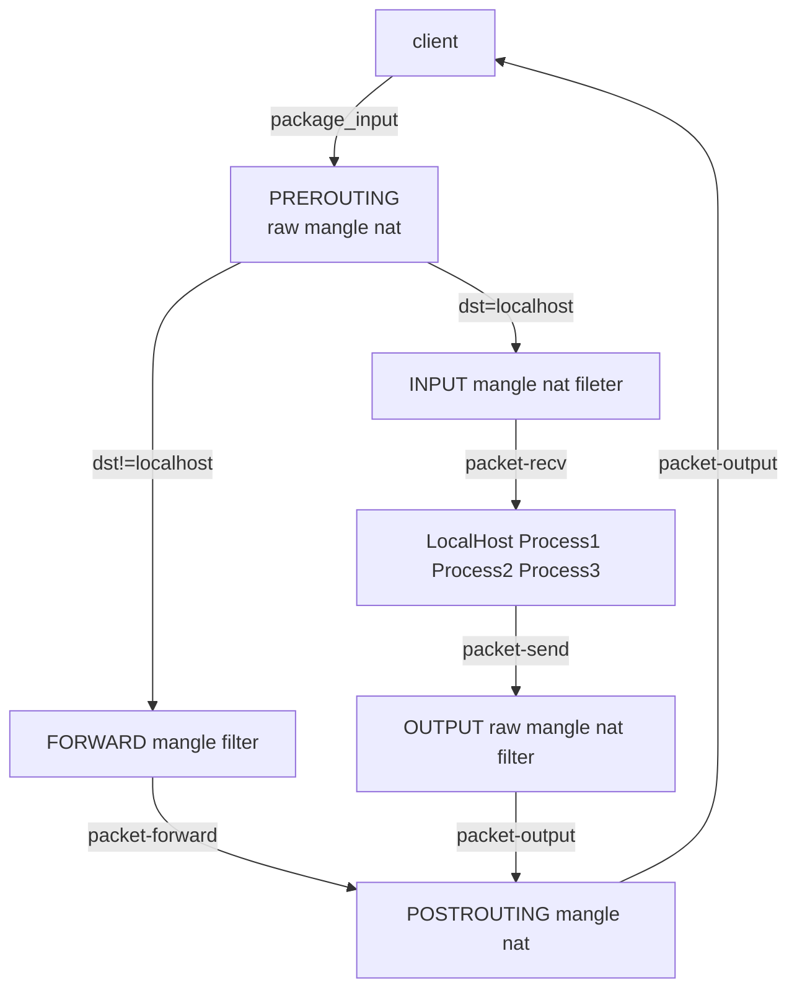

# linux command

## awk 文本编辑器

语法格式

>awk [options] 'script' var=value files  
awk [options] -f scriptfile var=value files

### 常用命令选项

`-F fs` 指定输入分割符, fs 可以是字符串或正则表达式  
`-v var=value` 复制一个用户自定义变量,将外部变量传递给awk  
`-f scriptfile` 从脚本读取awk命令  

### awk模式

* `/正则/`: 使用通配符的扩展集
* 关系表达式: 使用运算符进行操作, 可以是字符串或数字的比较测试
* 模式匹配表达式: 用运算符 `~` 匹配, 或者 `~!` 不匹配
* BEGIN 语句, pattern语句, END语句块

### awk操作

操作由一个或多个命令,函数,表达式组成, 之间由换行符或者分号隔开, 并位于大括号内, 主要部分是:

* 变量或数组赋值
* 输出命令
* 内置函数
* 控制流语句

### 基本机构

`awk 'BEGIN{ print "start" } pattern{ commands } END{ print "end" }' files`

`awk "BEGIN{ i=0 } { i++ } END{ print i }" filename`

99乘法表 `seq 9 | sed 'H;g' | awk -v RS='' '{for(i=1;i<=NF;i++)printf("%dx%d=%d%s", i, NR, i*NR, i==NR?"\n":"\t")}'`

## cpio

通过重定向的方式将文件打包，备份，还原，恢复，可以解压以 .cpio .tar 结尾的文件

`-o` : 复制打包

`-i` : 解压或还原

`find . -type f | cpio -ocvB > doc.cpio` ： 备份

`cpio -icduv < doc.cpio`

不太懂啊，  好麻烦

## date

date : 系统时间

date [OPTION]... [+FORMAT]: 显示日期时间；

date  [MMDDhhmm[[CC]YY][.ss]]：设定日期时间；

FORMAT：

```shell
%F: 日期
%T: 时间
%Y: 年
%m
%d
%H
%M
%S
%s: 从1970年1月1日0点0分0秒至此刻所经历的秒数；timestamp；
```

`date -s` 设置时间

`date -d` 显示描述日期

`date '+%Y%m%d%H%M%S'`： 20180405204152

`date -d '2 days ago' +%Y%m%d` 20180403

`date -d @1522932256 +%Y%m%d` 20180405

## hwclock, clock：显示或设定硬件时钟

-s, --hctosys：

以硬件为准，把系统调整为与硬件时间相同；

-w, --systohc：

以系统为准，把硬件时间调整为与系统时钟相同；

## cal：日历

格式：cal [[month] year]

## dd

**一、dd复制转换**

**1.dd：convert and copy a file** 

文件转换和复制，复制操作底层块

DESCRIPTION：Copy a file, converting and formatting according to the operands.

**2用法：

dd [OPTION] if=/PATH/FROM/SRC of=/PATH/TO/DEST**

if= ：其后面路径是源目标路径

of= ：其后是将要复制到的位置，目标路径

**[OPTION]**

bs=#：block size, 复制单元大小，一次复制多大，默认单位为字节；

count=#：复制多少个bs；

**3.拷贝：

`dd if=/dev/sda of=/dev/sdb` 磁盘拷贝

`dd if=qq of=qqdd` : 复制文件

`dd if=/dev/zero of=zero bs=512 count=1000` : 生成一个500k的文件

**4.MBR 备份和损坏**

备份MBR：dd if=/dev/sda of=/tmp/mbr.bak bs=512 count=1

破坏MBR分区表：dd if=/dev/zero of=/dev/sda bs=512 count=1

破坏MBR中的bootloader：dd if=/dev/zero of=/dev/sda bs=256 count=1

前446字节是bootloader所占空间大小，故损坏部分就会导致整个损坏

**5.两个特殊设备：/dev/zero /dev/null**

/dev/zero：吐零，该设备无穷尽地提供0,（不产生读磁盘IO）

/dev/null: 数据黑洞；类似于回收站

**二、dd硬盘IO性能测试**

几种常见的DD命令：区别在于内存中写缓存的处理方式

dd bs=128k count=10k if=/dev/zero of=test

dd bs=128k count=10k if=/dev/zero of=test; sync

dd bs=128k count=10k if=/dev/zero of=test conv=fdatasync

dd bs=128k count=10k if=/dev/zero of=test oflag=dsync

```shell
[root@91fun ~]# dd bs=128k count=10k if=/dev/zero of=test
10240+0 records in
10240+0 records out
1342177280 bytes (1.3 GB) copied, 9.52738 s, 141 MB/s
[root@91fun ~]# dd bs=128k count=10k if=/dev/zero of=test; sync
10240+0 records in
10240+0 records out
1342177280 bytes (1.3 GB) copied, 9.30802 s, 144 MB/s
[root@91fun ~]# dd bs=128k count=10k if=/dev/zero of=test conv=fdatasync
10240+0 records in
10240+0 records out
1342177280 bytes (1.3 GB) copied, 12.1174 s, 111 MB/s
[root@91fun ~]# dd bs=128k count=10k if=/dev/zero of=test oflag=dsync
10240+0 records in
10240+0 records out
1342177280 bytes (1.3 GB) copied, 26.4534 s, 50.7 MB/s
```

**1 dd bs=128k count=10k if=/dev/zero of=test**

(1)dd默认方式不包括“同步(sync)”命令,dd命令完成前并没有让系统真正把文件写到磁盘上。

(2)单纯地把数据读到内存缓冲当中（写缓存[write cache]）

(3)展现的只是读取速度，直到dd完成后系统才开始真正往磁盘上写数据

**实际运行结果：**

```shell
[root@91fun ~]# dd bs=128k count=10k if=/dev/zero of=test
10240+0 records in
10240+0 records out
1342177280 bytes (1.3 GB) copied, 9.30298 s, 144 MB/s
```

**2.dd bs=128k count=10k if=/dev/zero of=test; sync**

(1)同上分号隔开的只是先后两个独立的命令

(2)dd命令已经把“写入速度”值显示在屏幕上了,得不到真正的写入速度。

**实际运行结果：**

```shell
[root@91fun ~]# dd bs=128k count=10k if=/dev/zero of=test; sync
10240+0 records in
10240+0 records out
1342177280 bytes (1.3 GB) copied, 9.29682 s, 144 MB/s
```

**3.dd bs=128k count=10k if=/dev/zero of=test conv=fdatasync**

(1)dd命令执行到最后会真正执行一次“同步(sync)”操作

(2)得到的是读取这128M数据到内存并写入到磁盘上所需的时间

(3)比较符合实际情况

**实际运行结果：**

```shell
[root@91fun ~]# dd bs=128k count=10k if=/dev/zero of=test conv=fdatasync
10240+0 records in
10240+0 records out
1342177280 bytes (1.3 GB) copied, 12.0319 s, 112 MB/s
```

**4.dd bs=128k count=10k if=/dev/zero of=test oflag=dsync**

(1)dd在执行时每次都会进行同步写入操作

(2)每次读取128k后就要先把这128k写入磁盘，然后再读取下面128k

(3)最慢的一种方式了，基本上没有用到写缓存(write cache)

**实际运行结果：**

```shell
[root@91fun ~]# dd bs=128k count=10k if=/dev/zero of=test oflag=dsync
10240+0 records in
10240+0 records out
1342177280 bytes (1.3 GB) copied, 28.5339 s, 47.0 MB/s
```

第四种方法是最严格的，可以模拟数据库的插入操作，所以很慢

也用来测试vps硬盘性能标准，一般来说测试结果，如果超过10M，对正常建站就无影响,超过50M，就是非常好状态

另外，测试对硬盘有损害

## dd 查找

`dd if=model_20200423155728 bs=1024 skip=3600000 count=1200 | grep '孙���雷'`

## df

查看linux 系统磁盘空间占用情况

`df -a` : 列出所有的文件系统分区

`df -i` : 列出文件系统分区的inode信息

`df -T` : 列出磁盘分区的文件系统类型

## diff

`-r` : 当对比目录时，会对比子目录的文件

`-c` : 显示全部内容，并标出所有不同之处

`-b` : 忽略行尾空格, 同时一个或多个空格都视为相同

`-s` : 当文件相同时， 显示文件的相同信息, 默认为 diff -s

## dmesg

显示开机信息, 也可在 /var/log/dmesg 查看

## dmidecode

作用：查看一些硬件信息， BIOS、系统、主板、处理器、内存、缓存等等

dmidecode 可以解读dmi数据库中的信息，

`-t`：

输出指定类型的信息，man文档中有描述 type类型有哪些；

`-s`：

Only  display  the  value of the DMI string identified by KEYWORD

仅显示指定字段的dmi值：
bios-vendor, bios-version,bios-release-date, system-manufacturer, system-product-name, system-version,  system-serial-number,  system-uuid,  baseboard-manufacturer,  base‐board-product-name,  baseboard-version,  baseboard-serial-number, baseboard-asset-tag, chassis-manufacturer, chassis-type, chassis-version, chas‐sis-serial-number, chassis-asset-tag, processor-family, processor-manufacturer, processor-version, processor-frequency. 

常见命令使用：

查看服务器型号：dmidecode | grep 'Product Name'

查看主板的序列号：dmidecode |grep 'Serial Number'

查看系统序列号：dmidecode -s system-serial-number

查看内存信息：dmidecode -t memory

查看OEM信息：dmidecode -t 11

bios信息：

```shell
[root@bogon ~]# dmidecode -t 0
# dmidecode 2.12-dmifs
SMBIOS 2.7 present.
​
Handle 0x0000, DMI type 0, 24 bytes  dmi表中记录标识符，唯一
BIOS Information    记录的类型如bios，cpu，memory
        Vendor: Phoenix Technologies LTD
        Version: 6.00
        Release Date: 07/02/2015
        Address: 0xEA5E0
        Runtime Size: 88608 bytes
        ROM Size: 64 kB
        Characteristics:
                ISA is supported
                PCI is supported
                PC Card (PCMCIA) is supported
                PNP is supported
                APM is supported
                BIOS is upgradeable
                BIOS shadowing is allowed
                ESCD support is available
                Boot from CD is supported
                Selectable boot is supported
                EDD is supported
                Print screen service is supported (int 5h)
                8042 keyboard services are supported (int 9h)
                Serial services are supported (int 14h)
                Printer services are supported (int 17h)
                CGA/mono video services are supported (int 10h)
                ACPI is supported
                Smart battery is supported
                BIOS boot specification is supported
                Function key-initiated network boot is supported
                Targeted content distribution is supported
        BIOS Revision: 4.6
        Firmware Revision: 0.0
```


## du

用来显示文件或目录的磁盘占用情况

`du -sh` : 以人性化的方式显示， 默认为kb

`du -sm` : 以兆为单位显示

## fdisk

### `查看分区信息` fdisk -l, 

### `查看分区类型` df -T, lsblk -f, parted -l

### `设备挂载` 

挂载U盘 `mount -t vfat /dev/sdb1 /mnt/usb`

挂载光盘 `mount -t iso9660 /dev/hda /mnt/cdrom; mount /dev/cdrom /mnt/cdrom`

挂在ios文件 `mount -o loop -t iso9660 /iso/centos.iso /isdba`

`mount -a` : 挂在fstab 所有的设备

卸载设备 `umount /mnt/usb`

退出抽取式设备 `eject`

### 格式化新硬盘

fdisk/parted/gdisk new -> mkfs.xxx -> mount 

fdisk 不能对大于2T的硬盘分区， parted和gdisk都可以， gdisk 用来创建GPT分区，parted也可以用来创建GPT分区

## parted

```
parted 交互命令
mklabel : 创建分区表， 使用msdos或者gpt， mklabel gpt
mkpart : 新建分区, mkpart PART-TYPE [FS-TYPE]  START END, mkpart primary 0gb 20gb
print : 显示分区信息
rm : 删除分区
select : 进入parted命令后选择磁盘
```

## 一、目录管理命令

```shell
1. pwd：Printing Working Directory ,显示工作目录

2. cd：Change Directory,切换目录
    格式： cd  [/PATH/TO/SOMEDIR]        
    cd:：切换回家目录；
    cd ~：切换回自己的家目录
    cd ~USERNAME：切换至指定用户的家目录；
    cd -：在上一次所在目录与当前目录之间来回切换；
    相关的环境变量:$PWD：当前工作目录
    $OLDPWD：上一次的工作目录

3. ls：List,列出指定目录下的内容
    格式：ls  [OPTION]...  [FILE]…
    -a: 显示所有文件，包括隐藏文件；
    -A:显示除.和..之外的所有文件(当前目录和上一级目录以外)；
    -l: --long, 长格式列表，即显示文件的详细属性信息；
    -h, --human-readable：对文件大小单位换算；换算后结果可能会非精确值；
    -d：查看目录自身而非其内部的文件列表；如果是目录则显示目录本身，对文件不影响
    -r: reverse, 逆序显示；
    -R:Recursive，递归显示；
    -i：index node,inode,缩影节点号
    -o 显示除了组之外的其它详细信息
    -m 横向输出文件名，以 "," 为分隔符
    -Q 把输出的文件名用双引号括起来
    -lF 显示文件类型标记, "*": 表示可以执行的普通文件, "/": 表示目录, "@": 表示符号链接, "|": FIFO, "=": 套接字socket
    
4.mkdir：make directory,创建目录
    格式:  mkdir [OPTION]... DIRECTORY…
    注意：路径基名方为命令的作用对象；基名之前的路径必须得存在；
    -p: 自动按需创建父目录；
    -v: verbose，显示详细过程；
    -m MODE：直接给定权限；

5.rmdir：remove directory,移除空目录
    格式：rmdir [OPTION]... DIRECTORY...
    -p：删除某目录后，如果其父目录为空，则一并删除之；
    -v: 显示过程； 

6.tree：目录树
    格式：tree [options] [directory]
    -L level：指定要显示的层级
    /tmp/mysysroot/
    |-- bin
    |-- etc
    |   `-- sysconfig
    |       `-- network-scripts
    |-- sbin
    |-- usr
    |   |-- bin
    |   |-- lib
    |   |-- lib64
    |   |-- local
    |   |   |-- bin
    |   |   |-- etc
    |   |   |-- lib
    |   |   `-- sbin
    |   `-- sbin
    `-- var
    |-- cache
    |-- log
    `-- run

~]# mkdir -pv /tmp/mysysroot/{bin,sbin,etc/sysconfig/network-scripts,usr/{bin,sbin,local/{bin,sbin,etc,lib},lib,lib64},var/{cache,log,run}}

~]# tree /tmp/mysysroot
```

## 二、文件管理命令

```shell
1. touch：改变文件时间戳，当文件不存在时创建文件
    格式：touch  [OPTION]...   FILE…   
    -c: 指定的文件路径不存在时不予创建,改变访问时间为系统时间
    -a: 仅修改access time 为系统时间
    -m：仅修改modify time 为系统时间
    -t STAMP---->[CC]YY]MMDDhhmm[.ss]
    -d : 手动设置日期时间
    -r : 根据参考文件设置文件的时间
[manjo@manjo-pc Downloads]$ stat yy
  File: yy
  Size: 74              Blocks: 8          IO Block: 4096   regular file
  Device: 818h/2072d      Inode: 52091455    Links: 1
  Access: (0644/-rw-r--r--)  Uid: ( 1000/   manjo)   Gid: ( 1001/   manjo)
  Access: 2017-11-01 12:11:00.000000000 +0800
  Modify: 2017-11-01 12:11:00.000000000 +0800
  Change: 2018-04-05 22:02:22.172971395 +0800
  Birth: -

`touch -r test1.txt test2.txt` 将test2.txt 的时间修改成test1.txt 一样
`touch -a -r test1.txt test2.txt` : 将test2.txt 的访问时间修改成test1.txt 一样
`touch -d '20171101 12:00:00' test1.txt` :


2. stat：显示文件或者文件系统的状态
    格式：  stat  FILE…
3. mv：move,移动，同一目录或不同目录间移动同时可以执行重命名操作
    格式：mv [OPTION]... [-T] SOURCE DEST
    mv [OPTION]... SOURCE... DIRECTORY
    mv [OPTION]... -t DIRECTORY SOURCE..        
    -i：交互式；
    -f：force
4. rm：remove,移除
    格式：rm  [OPTION]...  FILE…
    -i：interactive 交互
    -f：force强制
    -r: recursive递归
    【技巧】所有不用的文件建议不要直接删除，而是移动至某个专用目录；（模拟回收站）
    删除目录：rm -rf /PATH/TO/DIR
    危险操作：rm -rf /*
5. cp：copy,复制拷贝
    (1)单源复制：cp   [OPTION]…   [-T]   SOURCE   DEST       
        如果DEST不存在：则事先创建此文件，并复制源文件的数据流至DEST中；
        如果DEST存在：
        如果DEST是非目录文件：则覆盖目标文件；
        如果DEST是目录文件：则先在DEST目录下创建一个与源文件同名的文件，并复制其数据流；
    (2)多源复制：cp   [OPTION]…   SOURCE…   DIRECTORY
        cp   [OPTION]...   -t   DIRECTORY   SOURCE...
        如果DEST不存在：错误；
        如果DEST存在：
        如果DEST是非目录文件：错误；
        如果DEST是目录文件：分别复制每个文件至目标目录中，并保持原名；
    (3)常用选项
        -i：交互式复制，即覆盖之前提醒用户确认；
        -f：强制覆盖目标文件；
        -r, -R：递归复制目录；
        -d：复制符号链接文件本身，而非其指向的源文件；
        -a：-dR --preserve=all, archive，用于实现归档；
        --preserv=
            mode：权限
            ownership：属主和属组
            timestamps: 时间戳
            context：安全标签
            xattr：扩展属性
            links：符号链接
            all：上述所有属性
    (4)概述性总结cp命令复制源文件和目标文件注意事项
        1) cp命令后有多个文件，最后一个一定为目标文件
        2) 一个文件到一个文件，多个文件到一个目录
        3) cp默认不能复制目录，配合参数-r 递归
        4) 复制链接文件时，实际上复制为其指向的文件本身
6.mktemp：创建临时文件或临时目录，文件名可以随机生成
    格式：mktemp [OPTION]... [TEMPLATE]
    -d：创建临时目录
    -u dry-runng 测试用法，空跑
    注意：mktemp会将创建的临时文件名直接返回，因此，可直接通过命令引用保存起来；
```

## 三、查看文件命令

```shell
1. cat：concatenate  文本查看工具，连接并显示文本文件内容，非二进制内容
    格式：cat  [OPTION]…  [FILE]…
    -n：给显示的文本行编号；
    -E: 显示行结束符$；
    -b : 将文件中非空行按顺序编号
    -A : 显示制表符
2. tac：自后向前查看，和cat用法相同

3. echo：回显
    格式：echo [SHORT-OPTION]... [STRING]…
    -n: 不进行换行；
    -e：让转义符生效 --->\n：换行    \t：制表符 …
    STRING：可以使用引号，单引号和双引号均可用；
    单引号：强引用，变量引用不执行替换； ~]# echo '$SHELL'
    双引号：弱引用，变量引用会被替换； ~]# echo "$SHELL"

4. more：分屏查看，翻屏至文件尾部后自动退出；支持向前翻，中间可前后翻
    格式： more FILE
    空格 : 翻屏
    -d : 在屏幕底部显示友好信息
    -s : 将输出文件中的多个空格减少为一个空行,以文件的第一行为准
    -p : 清楚显示屏以前的信息，再显示文本信息
    more -c -10 Makefile : 每十行显示一屏， 同时清楚屏幕

5. less：分屏查看，支持前后翻屏，支持/  ?查找关键字

6. head：查看文件的前n行默认10行
    格式：head [options] FILE
    -n #  或 -# ：前#行

7. tail：查看文件的后n行，默认10行
    格式：tail [options] FILE    
    -n #  或 -# ：后#行
    -f：查看文件尾部内容结束后不退出，跟随显示新增的行；
```

## `/proc/cpuinfo` 查看CPU信息

```
[manjoc@manjoc ~]$ more /proc/cpuinfo 
processor       : 0 # 逻辑处理器唯一标识符 ;查看系统所有逻辑cpu个数 `more /proc/cpuinfo  | grep "processor" | wc -l`
vendor_id       : GenuineIntel # 处理器类型 GenuineIntel：intel设备
cpu family      : 6
model           : 13
model name      : QEMU Virtual CPU version (cpu64-rhel6)
stepping        : 3
microcode       : 0x1
cpu MHz         : 2399.998
cache size      : 4096 KB
physical id     : 0 # 每个物理设备封装的唯一标识符 也就是一个物理cpu; 查看系统物理cpu的个数 `more /proc/cpuinfo  | grep "physical id" | sort |uniq | wc -l`
siblings        : 1 # 表示位于相同物理封装中逻辑处理器的数量
core id         : 0 # 每个内核的唯一标识符
cpu cores       : 1 # 表示位于相同物理封装中内核数量， 如果 siblings 是 cpu cores 的两倍说明支持超线程，并且超线程已经打开，如果相同则说明不支持或者未打开
apicid          : 0
initial apicid  : 0
fpu             : yes
fpu_exception   : yes
cpuid level     : 13
wp              : yes
flags           : fpu vme de pse tsc msr pae mce cx8 apic sep mtrr pge mca cmov pse36 clflush mmx fxsr sse sse2 ss syscall nx pdpe1gb rdtscp lm rep_good nopl pni pclmulqdq ssse3 fma cx16 pcid sse4_1 sse4_2 x2apic movbe popcnt aes xsa
ve avx f16c rdrand hypervisor lahf_lm abm fsgsbase bmi1 avx2 smep bmi2 xsaveopt
bugs            :
bogomips        : 4799.99
clflush size    : 64
cache_alignment : 64
address sizes   : 46 bits physical, 48 bits virtual
power management:
```

## `/proc/meminfo` 内存信息

```

[manjoc@manjoc ~]$ more /proc/meminfo 
MemTotal:         516080 kB
MemFree:          137492 kB
MemAvailable:     415052 kB
Buffers:           28228 kB # 缓冲区
Cached:           249560 kB # 缓存区
SwapCached:            0 kB
Active:           176212 kB
Inactive:         148108 kB
Active(anon):      48700 kB
Inactive(anon):    10412 kB
Active(file):     127512 kB
Inactive(file):   137696 kB
Unevictable:           0 kB
Mlocked:               0 kB
SwapTotal:        135164 kB
SwapFree:         135164 kB
Dirty:                 0 kB
Writeback:             0 kB
AnonPages:         46532 kB
Mapped:            40256 kB
Shmem:             12584 kB
Slab:              37008 kB
SReclaimable:      25444 kB
SUnreclaim:        11564 kB
KernelStack:        1680 kB
PageTables:         3592 kB
NFS_Unstable:          0 kB
Bounce:                0 kB
WritebackTmp:          0 kB
CommitLimit:      393204 kB
Committed_AS:     268452 kB
VmallocTotal:   34359738367 kB
VmallocUsed:           0 kB
VmallocChunk:          0 kB
HardwareCorrupted:     0 kB
AnonHugePages:         0 kB
ShmemHugePages:        0 kB
ShmemPmdMapped:        0 kB
HugePages_Total:       0
HugePages_Free:        0
HugePages_Rsvd:        0
HugePages_Surp:        0
Hugepagesize:       2048 kB
DirectMap4k:       51184 kB
DirectMap2M:      491520 kB
DirectMap1G:           0 kB
```


## free

显示内存状态, 

`free -m` : 以兆显示 -k 以 kb 显示

## fsck

检查文件系统并尝试修复错误

## `fuser`

可以显示出当前哪个程序在使用磁盘上的某个文件、挂载点、甚至网络端口，并给出程序进程的详细信息.

```
-a 显示所有命令行中指定的文件，默认情况下被访问的文件才会被显示。 
-c 和-m一样，用于POSIX兼容。 
-k 杀掉访问文件的进程。如果没有指定-signal就会发送SIGKILL信号。结合 –signal

-signal 使用指定的信号，而不是用SIGKILL来杀掉进程。可以通过名称或者号码来表示信号(例如-HUP,-1),这个选项要和-k一起使用，否则会被忽略。

-l 列出所有已知的信号名称。 
-i 杀掉进程之前询问用户，如果没有-k这个选项会被忽略。 
-m name 指定一个挂载文件系统上的文件或者被挂载的块设备（名称name）。这样所有访问这个文件或者文件系统的进程都会被列出来。如果指定的是一个目录会自动转换成"name/",并使用所有挂载在那个目录下面的文件系统。 
-n space 指定一个不同的命名空间(space).这里支持不同的空间文件(文件名，此处默认)、tcp(本地tcp端口)、udp(本地udp端口)。对于端口，可以指定端口号或者名称，如果不会引起歧义那么可以使用简单表示的形式，例如：name/space (即形如:80/tcp之类的表示)。 
-s 静默模式，这时候-u,-v会被忽略。-a不能和-s一起使用。  
-u 在每个PID后面添加进程拥有者的用户名称。 
-v 详细模式。输出似ps命令的输出，包含PID,USER,COMMAND等许多域,如果是内核访问的那么PID为kernel.
```

```
假设无法卸载的设备为/dev/sdb1 
1)运行下面命令看一下哪个用户哪个进程占用着此设备 
fuser -m -v /dev/sdb1

2)运行下面命令杀掉占用此设备的进程 
fuser -m -v -k /dev/sdb1 
或者fuser -m -v -k -i  /dev/sdb1(每杀掉一下进程会让你确认） 
3)再umount
```

```
查看那些程序使用tcp的80端口： 
$fuser -n tcp 80 
或$fuser -v -n tcp 80 
或$fuser -v 80/tcp 
这里，后两种方式显示的信息比较全，因为有了-v选项
```

```shell
fuser -v 111/udp 111/tcp 
                     用户     进程号 权限   命令
111/udp:             rpc         968 F.... rpcbind
111/tcp:             rpc         968 F.... rpcbind
如上例子中第4列的权限也成访问类型，如下：

c 代表当前目录
F 打开的文件，用于写操作。默认不显示。
e 可执行的被运行
m 映射文件或者共享库。

f 打开的文件。默认不显示。
r 根目录。    
```


其它相同命令:

```shell
### netstat -lntup|grep 111
tcp        0      0 0.0.0.0:111                 0.0.0.0:*                   LISTEN      968/rpcbind         
tcp        0      0 :::111                      :::*                        LISTEN      968/rpcbind         
udp        0      0 0.0.0.0:111                 0.0.0.0:*                               968/rpcbind         
udp        0      0 :::111                      :::*                                    968/rpcbind
```

```shell
# ss  -lntup|grep 111       
udp    UNCONN     0      0                      *:111                   *:*      users:(("rpcbind",968,6))
udp    UNCONN     0      0                     :::111                  :::*      users:(("rpcbind",968,9))
tcp    LISTEN     0      128                   :::111                  :::*      users:(("rpcbind",968,11))
tcp    LISTEN     0      128                    *:111                   *:*      users:(("rpcbind",968,8))
```

```shell
# lsof -i :111
COMMAND PID USER   FD   TYPE DEVICE SIZE/OFF NODE NAME
rpcbind 968  rpc    6u  IPv4  11275      0t0  UDP *:sunrpc 
rpcbind 968  rpc    8u  IPv4  11278      0t0  TCP *:sunrpc (LISTEN)
rpcbind 968  rpc    9u  IPv6  11280      0t0  UDP *:sunrpc 
rpcbind 968  rpc   11u  IPv6  11283      0t0  TCP *:sunrpc (LISTEN)
```

### signal列表

```shell
# fuser -l
HUP INT QUIT ILL TRAP ABRT IOT BUS FPE KILL USR1 SEGV USR2 PIPE ALRM TERM
STKFLT CHLD CONT STOP TSTP TTIN TTOU URG XCPU XFSZ VTALRM PROF WINCH IO PWR SYS
UNUSED
```


# Pro Git


from [taozj.org](taozj.org)
- [git-pro中文](https://git-scm.com/book/zh/v2)


## git概念

git是个性大神Linus自Linux内核而来的第二大发明。对于这个神器,个人也用了很久，相对其它的版本控制工具,其速度快、性能好、操作智能人性，是开发人员必备之利器；GitHub依托git作为程序员和开源项目代码首选托管网站，俨然同时也已成为全球最大的程序员基佬之交友网站。  

正如Linux下面的大多数命令行程序一样，只有常用的和用的多的才记得住，不常用的即使当时搞得很清晰，事后也容易忘记。这次在假期把Pro Git中文版看了一遍，这里打算对常用的命令和参数进行一次整理，方便后续复习查阅

## git 常用命令

### .gitignore 文件格式

* 所有空行以及用 # 开头的注释都会被忽略  
* 匹配的模式是 glob 模式，* 匹配零个或多个任意字符，[abc] 匹配任何一个列在方括号中的字符，? 只匹配一个任意字符  
* 模式后面接 / 表示要忽略的是目录
* 要对某些模式或者目录提出例外情况，使用 ! 进行取反
* doc/.txt 只匹配 doc 直接目录下的 .txt ,而 doc/*/.txt 会递归匹配整个目录和子目录的 *.txt


### git add

* `git add .` | `git add file` # 添加当前修改的文件到暂存区
* 
* `git add -u` # 
### git diff

* `git diff` # 默认查看的是当前修改的文件和暂存区快照文件的差异
* `git diff -cached/-staged` # 查看暂存区快照文件和上一次提交的对比
* `git reset HEAD` # 将文件从暂存区撤出来，和当前修改合并

### git rm

* `git rm` # 将文件从版本控制中剔除,默认会连同文件系统的文件一通删掉
* `git rm -cached` # 保留文件本身而脱离版本控制(仅在暂存区删除，保留文件在当前目录，不再跟踪)（常用于比如忘了添加到**.gitignore**）

### git mv

* `git mv reademe.txt readme` # 重命名文件

### git log

* `git log -p` # 以补丁的形式显示提交的内容差异
* `git log` # 显示最近的 n 次提交
* `git log -word-diff` # 显示单词（而不是默认行）级别的差异，在处理文本的时候比较有用
* `git log -U` # 显示差异的上下文行数， 默认是 3
* `git log -stat` # 相比默认显示，添加了修改文件，及行数信息
* `git log -pretty=[online,short,full,fuller,format:]`  
   `git log -pretty=format:"%h %ae %cd %s"` # 这在提交数目太多的时候，可以方便显示
* `git log -author=xxx -since="2015-01-12" -before="2015-03-10" -grep="CPP"` # 可以指定单条或者多条过滤格式，默认是满足任何一条就列出，如果需要满足多天，需要额外添加 -match-all 选项

### git commit

* `git commit -amend` # 对最后一次提交进行覆盖重新提交，但是对于已经 push 的commit 会引来麻烦
* `git reset HEAD` # 可以对已经暂存的文件撤出暂存区并同当前目录文件合并
* `git checkout $FILE` # 放弃当前文件的修改，文件内容跟暂存区内容一致

### git remote

* `git remote -v` # 显示远程仓库的信息
* `git remote add https://remote-url` # 添加远程仓库
* `git remote add origin git@xbc.me:wordpress.git`  # 添加远程版本库origin，语法为 git remote add [shortname] [url]
* `git fetch` # 抓取远程仓库的内容，注意的是 fetch 知识抓取内容，而不会自动合并内容到本地
* `git push` # 推送内容到远程的某个分支
* `git remote show` # 显示远程仓库的详细信息 - 后面跟 分支名称 如 origin
* `git remote rename/rm` # 重命名/删除远程仓库

### git tag

* `git tag` # 显示当前仓库已有的标签
* `git tag` # 打轻量级的标签
* `git tag -a -m "tag-message"` # 打带附注的标签
* `git config --global user.signingKey C0CC5261` # 设置默认签名  
  `git tag -s -m "tag-message"` # 打带GPG签名的标签
* `git tag -v` # 验证带签名的标签
* `git push origin` # 默认 push 不会把 tag 推送到远程服务器的，可以用这个命令将推送到远程仓库  
  `git push origin -tags` # 推送本地所有 tag 到远程仓库

### git branch

* `git branch XXX` # 创建分支XXX
* `git checkout XXX` # 切换到对应分支XXX（切换分支的时候最好保持一个干净的工作空间-stash）
* `git checkout master`  
  `git merge devel` # 将devel分支的更新合并到master分支  
  `git branch -d devel` # 删除无用分支
* `git branch --merged` # 查看哪些分支已经被并入到当前的分支，也就是哪些分支是当前分支的直接上游，因为已经被合并了，所以当前分支已经包含了其所有的数据，可以安全删除这里列出的分支
* `git branch --no-merged` # 与上面相反，包含尚未合并的数据，默认不能简单删除之
* `git log ..` # 查看所有在 [experiment] 中而不在分支中的提交，显示的就是 git merge 所有用到的存在于中的所有提交
* `git log origin/master ... HEAD` # 预览你将会把哪些推送给远程仓库
* `git log --left-right` # 查看两个分支各自不同的提交信息
* `git checkout –b dev origin/develop`  # 建立本地的dev分支追踪远程仓库的develop分支

> * 上面这些分支都是本地的分支，跟服务器上的分支没有任何关系，服务器上的分支需要 / 这样的方式来引用
> * 合并有快进合并（fast-forward）和普通合并，当某个分支在被合并的下游，就会快进合并； 否则在之前的某个提交开始分叉的话，会从两者的共同祖先开始进行一个三方合并
> * 合并冲突： git 会自动进行相关合并，如果合并冲突的话，冲突的文件会在 unmerged path 项目下，手动解决这些冲突(git mergetool 会调用图形化的合并工具) 然后再暂存提交这些修改，提交合并就结束了

### git push 

* `git push  origin master` # 将本地的 master 分支推送到远程分支（可以新建）上去 `git push [远程名] [本地分支]:[远程分支]`  
* `git fetch origin` # 通过 fetch 会把服务器上的分支信息同步下来  
  `git merge origin` # 然后用将远程分支的修改合并到本地分支  
* `git checkout -b origin/` # 上面同步得到的 origin/ 是一个你不能本地修改的远程分支， 如果本地需要基于其修改，就必须依据其创建本地分支； 同时此时本地的是跟踪远程的 origin/ 的，可以简略 git push/pull 不加远程和分支名进行操作  
* `git push origin`  #  删除远程分支

### git reset

* `git reset --hard HEAD^` # 回退到上一个版本
* `git reset --hard 3628164` # 回退到指定id的版本

### git rebase(衍合)

* `git rebase master` # 将新分支在 master 分支上衍合一遍  
  `git rebase --continue` # 如果有冲突会停止，此时手动修改，然后 git add, 再用这个命令继续衍合    
  `git checkout master && git merge` # 衍合 后两个分支进行快进合并  
  `git branch -d` # 不包含其它数据  
* `git cherry-pick 2faf37cd1e57efacd11581ae1ae1175687c53a6c` # 只挑选某个感兴趣的提交来衍合  

> * 针对两个分支，一种操作是 merge , 还有就是 rebase, rebase 的原理就是从两个分支的共同祖先开始，让需要衍合的分支从此处开始依次后续的提交生成相应的补丁，然后在基底分支(master) 最后一个提交开始逐个应用上述补丁，在master 之后生成一系列新的提交对象，从而成为了 master 的直接下游， master 进行一次 fast-forward 就可以了， 其好处是 master 可以看到一个清晰的提交政策，仿佛是在一个分支上的连续操作产生的
> * 如果你要跟别人提交补丁，也最好使用衍合，你的补丁在 origin/master 最新代码上生成补丁，维护者只需要根据你的提交进行一次快进合并就可以了，将冲突的问题有你自己解决了
> * 注意： 倪衍合的应该是你未公布的提交，否则别人之前同步了你的修改，然后你再发布衍合的提交，其实是相同的内容作了两次不同的提交，那么别人不断同步你的更新的时候，代码仓库就会乱套

### git stash

* `git stash` # 保存当前的工作状态（包括跟踪被更改的文件和暂存的文件，未被跟踪的修改不会被保存）
* `git stash list` # 查看所有被保存的 stash
* `git stash pop/apply` # 应用暂存数据， 默认的情况是所有的更改被应用到跟踪修改状态，如果想让之前暂存的修改仍然在暂存中，添加使用 --index 参数
* `git stash drop` # 删除对应的暂存
* `git stash show -p stash@{0} | git apply -R` # 取消暂存的修改，相当于 unapply 的效果
* `git stash branch` # 可以在你 stash save 的时候提交开始创建一个分支，然后将存储应用之，并删除存储

### git 修改提交

*  git rebase -i HEAD~3 # 进入选择的编辑窗口
    *  需要修改提交注释的改为edit
    *  可以重排顺序，就修改了提交顺序
    *  删除某一项，就删除了那个提交本身
    *  squash 合并到前一个提交， 如果有多个要合并，接连用 squash
    *  edit 还可以拆分某个修改， git reset HEAD^ 将修改撤出，然后慢慢添加到暂存区慢慢提交
    *  然后交互用 git commit --amend， git rebase --continue 逐步完成（与 git log 反序显示，实际上是从过去某个点慢慢重新提交这个过程）
    > 注意，这里修改的提交必须是没有同步到远程仓库的提交，否则会给别人带来困扰

### git bisect

* `git bisect` # 当前HEAD开始  
  `git bisect bad` # 设置当前HEAD的bad状态  
  `git bisect good [tag-name/commit-id...]` # 设定之前一个正常提交开始
* `git bisect start HEAD v1.0` # 简化了上面的操作，设置二级查找的范围  
  `git bisect run test-error-not-zero.sh` # 脚本测试，正确返回0,错误返回非0
* `git bisect reset` # 切记要恢复HEAD值

### git submodule

* `git submodule add https://github.com/taozhijiang/st_util.git st_utils`  
  `git commit -m "add submodule st_utils"`  
* `git clone https://github.com/taozhijiang/git_test.git`  
  `git submodule init`  
  `git submodule update`  
* `git fetch origin master` # 进入子模块的目录，获取子模块的更新  
  `git merge origin master` # 合并更新    
  `git submodule update` # 在顶项目中，更新指针   

### git svn

* `git svn clone svn://gcc.gnu.org/svn/gcc -T trunk -b branches -t tags`  
  `git svn clone svn://gcc.gnu.org/svn/gcc -s` # 与上面的等价，注意这里的路径，一般 svn 的项目根目录会有 trunk, branches, tags 等目录， 如果你对整个项目都有权限的时候，才可以这样，如果你只对 trunk 某个目录有权限，就不能这么做了
* `git svn clone svn://gcc.gnu.org/svn/gcc/config` # 没有项目的根权限
* `git svn dcommit` # 向服务器推送更新
* `git svn rebase` # 向服务器拉去更新，时时运行他保证本地代码更新的

## git 其它

### git alias

* `git config --global alias.co checkout`
* `git config --global alias.st status`
* `git config --global alias.last 'log -p -1 HEAD'`

### 发布自己的 GPG（实际是将公钥信息存储在一个tag中）

* `gpg -a --export C0CC5261 | git hash-object -w -stdin`  
  `git tag -a maintainer-gpg-pub 687224919a16ae0dcc4fb4aace4b2228a59805f1`  
  `git push -tags`  
  `git show maintainer-pgp-pub  gpg --import` # 别人导入你的公钥

### 代码发布

* `git archive master --prefix='git_test' | gzip > git describe master.tar.gz`  
  `git archive master --prefix='git_test' --format=zip > git describe master.zip`

### git 配置

* `git config --global credential.helper cache`
* `git config --global user.signingKey C0CC5261`
* `git config --global color.ui true`
* `git config --global core.autocrlf input`

### git config 配置文件

替换https

自建的 gogs 服务器使用 `go get 91fun.club/manjoc/manjoc` 时，会使用默认的 https 方式， 但是会遇到名称问题下载不下来，可以修改git配置文件替换https

```shell
cat ~/.gitconfig 
[user]
    name = manjoc
    email = xiuxia.zg@gmail.com
[url "git@91fun.club:"]
    insteadOf = https://91fun.club
```

## 感言

git作为新生一代版本控制工具的代表，各种概念颠覆了传统的版本控制工具，虽然其看似复杂，但是如果能理解并熟练掌握，则可以大大提高开发和项目管理的效率。一般来说，越是历史悠久、传统保守、对代码掌控越严格的公司，其版本控制工具也越保守，使用如IBM Clearcase、Subversion、SVN等等。现在一般公司用Subversion的比较多，可以试着使用git-svn，虽然不如原生的git那么强大，但基本本地的功能都还能用。

## grep

`-c` : 显示匹配到多少行

`-n` : 在搜索结果中显示行号

`-i` : 忽略大小写

`-A` : grep -A #, 显示匹配到的行后#行

`-B` : 显示匹配到的前几行

`-C` : 前后个#行

`-f` : 将要搜索的样式写入一个文件中, 每行一个样式， 然后以这个文件作为条件搜搜

## pgrep

`-l` 列出程序名和进程id

`-o` 显示进程起始的id

`-n` 显示程序终止的id

`-f` 可以匹配command中的关键字，字符串匹配

`-G` 可以匹配指定组启动的进程对应的id

`pgrep -lo sshd` 查看sshd进程的起始id

`pgrep -ln sshd` 查看终止id

`pgrep -f sshd` 查看sshd进程对应的所有id

`pgrep -G tomcat` 

`pgrep -l -G manjoc`

## `iostat` 

`iostat [ -c | -d ] [-k] [-t] [-x[device]] [interval [count]]`

`-c` 显示cpu使用情况

`-d` 显示磁盘使用情况

`-k` 每秒以千字节为单位显示数据

`-t` 输出统计信息开始执行的时间

`-x device` 指定要统计的磁盘名称，默认为所有

`interval` 统计间隔时间,s 

`count` 统计次数

## ip

ip [option] [动作] [指令]

option：

-s：显示出该装置的统计数据(statistics)，例如总接受封包数等；

```shell
动作：对哪些网络参数进行动作；
    link: 关于设备的设定，如mtu，mac
    addr/address: 关于ip的设置
    route: 路由
指令：
    与link相关的指令：OSI二层
        show：ip -s link show查看该装置的信息
        set [device] [动作与参数] ： ip link set [device] [动作与参数]
            [device] 为 eth0,eth1 等
            [动作与参数] ：
                up|down:
                address:
                name:
                mtu:
            开启/关闭:    ip link set eth1 up/down
                        ip link set eth1 mtu 1000 ;单位字节
            更改网卡名称和mac地址：
                网卡名称：
                    ip link set eth1 down ; ip link set eth1 name vbirt
                    更改前停掉此网卡，
                mac地址：
                    ip link set eth1 address 00:00:00:00:00:00
    与address相关指令：OSI三层
        ip address [show|add|del] [IP参数] [dev装置名] [相关参数]
        show: 单纯显示出ip信息； ip address show
        add|del: 对ip信息增加或删除
            参数：
            IP参数:        主要是网段的参数， 192.168.100.100/24
            dev参数：    这个参数要设置的设备，如 eth1 eth0
            相关参数：
                broadcase:    广播地址
                label:        别名，如eth0:0
                scope:
                    global：允许所有来源的连线
                    site：仅支持ipv6，仅允许本主机的连线
                    link：仅允许本装置自我连线
                    host：仅允许本机内部连线
        显示出所有ip参数： ip link show
            inet 192.168.1.100/24 brd 192.168.1.255 scope global eth0
        新增一个ip：假设为 eth0:vbirt
            ip address add 192.168.59.111/24 broadcase + dev eth0 label eth0:vbirt
        删除刚才添加的ip：
            ip address del 192.168.59.111/24 dev eth0
    与route相关指令：
        show: 单纯显示出路由表，也可以用list
        add|del :增加删除路由；
            IP或网段： 192.168.59.0/24 或 192.168.59.100;
            via: 从那个broadcast网关出去；
            dev: 从那个设备连出去，这个比较重要；
            mtu: 设定mtu值；
        显示当前路由信息：
            ip route show;
                #:192.168.1.0/24 dev eth0 proto kernel scope link src 192.168.1.100
                proto：此路由的路由协定，主要有redirect, kernel, boot, static, ra 等， 其中kernel 指的是直接由核心判断自动设定。
                scope：路由的范围，主要是link ，亦即是与本装置有关的直接连线。
        增加路由：
            ip route add 192.168.5.0/24 dev eth0
            针对本机可以直接联通的网络设定路由，不需要透过外部设备
        增加可以通往外部的路由，需要透过router
            ip route add 192.168.10/24 via 192.168.59.100 dev eth0
            192.168.5.0/24 dev eth0 scope link
            ....(其他省略)....
            192.168.10.0/24 via 192.168.5.100 dev eth0
            # 仔细看喔，因为我有192.168.5.0/24 的路由存在(我的网卡直接联系)，
            # 所以才可以将192.168.10.0/24 的路由丢给192.168.5.100 
            # 那部主机来帮忙传递喔！与之前提到的route 指令是一样的限制！
        增加默认路由：
            ip route add default via 192.168.1.254 dev eth0
            192.168.1.254 也即 gateway, 另外只可以设置一个默认路由
        删除路由：
            ip route del 192.168.10.0/24
```


## iptables 详解

from [Otokaze's Blog](https://www.zfl9.com/iptables.html)

`netfilter/iptables`包过滤系统被称为单个实体，但它实际上由`netfilter`和`iptables`两个组件组成。`netfilter`也称为内核空间（KernelSpace），是内核的一部分，由包过滤表组成，这些表包含内核用来控制包过滤处理的规则集；`iptables`也称为用户空间（UserSpace），是主要配置工具，iptables 使插入、修改和删除信息包过滤表中的规则变得容易。


## netfilter

netfilter 选取了 5 个位置进行数据包操作：

- `PREROUTING`：数据包流入网卡后进行路由前；
- `INPUT`：数据包流入用户空间前；
- `FORWARD`：设在不同的网卡之间；
- `OUTPUT`：数据包流出用户空间前；
- `POSTROUTING`：数据包进行路由后流出网卡前。

## 数据包流向

[](https://www.zfl9.com/images/iptables.png)




- 本机发出的包：本机进程 -> OUTPUT链 -> 路由选择 -> POSTROUTING链 -> 出口网卡
- 本机收到的包：入口网卡 -> PREROUTING链 -> 路由选择 -> 此时有两种可能的情况：
  - 目的地址为本机：INPUT链 -> 本机进程
  - 目的地址不为本机：FORWARD链 -> POSTROUTING链 -> 网卡出口（内核允许网卡转发的情况下）

## 规则链和表

**链、表、规则**
首先需要搞清楚的三个概念就是：**链（chain）**、**表（table）**、**规则（rule）**：

- `链`：即我们前面说的五个卡口（物理概念），`PREROUTING`、`INPUT`、`FORWARD`、`OUTPUT`、`POSTROUTING`；
- `表`：为了方便管理而提出的逻辑概念，每个表都有其特定的功能；有`raw`、`mangle`、`nat`、`filter`四张表；
- `规则`：很容易理解，规则就是用于描述如何处理一个数据包的；描述一条规则时都会说明它所在的链和所在的表。

注意，后面会提到自定义链，自定义链与预定义的 5 个链虽然都叫做“链”，但是它们有着本质的不同，自定义链不是“自定义卡口”，它们只是一系列规则/动作的集合，一般用在 `-j`、`-g` 选项中，-j 其实是 `--jump`，而 -g 则是 `--goto`，-j 除了可以指定自定义链外，还可以指定其它的 target，但是 -g 只能指定自定义链。它们的区别：-j 指定的链在匹配完成后会返回当前链继续匹配下一条规则，而 -g 指定的链在匹配完成后不会返回到当前链，如果在自定义链中没有规则与之匹配，则按照当前链的 policy 处理（ACCEPT 或者 DROP）。

**表的优先级**
所谓优先级就是处理的顺序，从左到右优先级依次降低：`raw -> mangle -> nat -> filter`；

- `raw`，优先级最高，通常与`NOTRACK`一起使用，用于跳过`连接跟踪（conntrack）`和 nat 表的处理；
- `mangle`，修改包头部的某些特殊条目，如 TOS、TTL、打上特殊标记 MARK 等，以影响后面的路由决策；
- `nat`，用于进行网络地址转换，如 SNAT（修改源地址）、DNAT（修改目的地址）、REDIRECT 重定向等；
- `filter`，用于过滤数据包，比如 ACCEPT（允许），DROP（丢弃）、REJECT（拒绝）、LOG（记录日志）；

> raw 表除了 `-j NOTRACK` 外，还有一个常用的动作，那就是 `-j TRACE`，用于跟踪数据包，进行规则的调试，使用 dmesg 查看。

**默认策略**
默认策略只有两个动作：ACCEPT、DROP；当一个数据包未与该链中的任何规则匹配时，它将被默认策略处理；
也就是所谓的黑白名单，如果默认策略为 ACCEPT，则为黑名单模式，如果默认策略为 DROP，则为白名单模式。

**连接跟踪**
`连接跟踪`，顾名思义，就是跟踪并记录网络连接的状态（你可能认为只有 TCP 才有“连接”这个概念，但是在 netfilter 中，TCP、UDP、ICMP 一视同仁）。netfilter 会为每个经过网络堆栈的连接生成一个**连接记录项（Connection Entry）**；此后所有属于此连接的数据包都被唯一地分配给这个连接并标识连接的状态；由所有连接记录项组成的表其实就是所谓的**连接跟踪表**。

为什么需要连接跟踪？因为它是**状态防火墙和 NAT 的实现基础**！

- `状态防火墙`：iptables 的 conntrack/state 模块允许我们根据连接的状态进行规则配置，如果没有连接跟踪，那是做不到的。
- `NAT`，NAT 其实就是修改数据包的源地址/端口、目的地址/端口，如果没有连接跟踪，那么也不可能再找回修改前的地址信息。

SNAT 可以说在每个家用路由器上都有，不过它可能不叫做 SNAT，而是 MASQUERADE，但是本质都是 SNAT，只不过 MASQUERADE 会自动获取设备的 IP 地址而已，一般用于 DHCP 环境。假设网关的公网 IP 为 1.1.1.1，内网网段为 192.168.1.0/24，某台内网主机的 IP 为 192.168.1.1，该内网主机的某个进程想与 2.2.2.2 这台服务器进行通信，则发出的包为 [src: 192.168.1.1, dst: 2.2.2.2]，路由到网关后，因为在网关的路由表中也没有匹配的条目，所以会发给默认路由（从公网网卡出去），不过发出去之前要先经过 POSTROUTING 链的处理，在 nat 表中该数据包的源地址会被转换为公网网卡的 IP 地址，即 1.1.1.1，也就是进行 SNAT，转换后变为 [src: 1.1.1.1, dst: 2.2.2.2]，然后才会从公网网卡出去（如果不进行 SNAT，那么数据包会被丢弃）；经过各级路由后，此数据包会到达 2.2.2.2 服务器，流入网卡，依次经过 PREROUTING -> 路由选择[发往本机] -> INPUT -> 本机进程，本机进程处理完后，数据包 [src: 2.2.2.2, dst: 1.1.1.1] 经过 OUTPUT -> 路由选择[发往外网] -> POSTROUTING -> 公网网卡 -> 各级路由后，到达 1.1.1.1 网关主机，流入网卡，数据包首先会被 PREROUTING 链处理，它会被一个隐式的 DNAT 规则处理（在 nat 表），将包的目的地址改为 192.168.1.1（通过读取连接记录项来获知），修改后的包为 [src: 2.2.2.2, dst: 192.168.1.1]，然后再进行路由选择，因为不是发往本机的，所以会到 FORWARD 链，然后再到 POSTROUTING 链，最后才被送到内网网卡，最终流入 192.168.1.1 内网主机，被进程接收并处理。试想一下，如果没有连接跟踪，那么回程的 DNAT 操作就瞎了，内网主机 192.168.1.1 也就永远无法收到这个数据包。

Linux 默认会为所有连接都创建连接记录项，而维护连接跟踪表是有开销的，要命的是这个表还有大小限制；
因此，如果你在一个大流量的 Web 服务器上启用 iptables，很容易因为连接记录项过多而导致服务器拒绝连接！
那么有什么解决的办法呢？利用 raw 表的 NOTRACK 功能，让所有发往 80 端口的数据包跳过连接跟踪和 nat 表。
`iptables -t raw -I PREROUTING -p tcp --dport 80 -j NOTRACK`将所有发往 80/tcp 的数据包跳过 conntrack。

查看 conntrack 的使用情况、相关参数：

- `cat /proc/sys/net/netfilter/nf_conntrack_max`：允许的最大连接记录项的数目，超过此值后会直接拒绝新连接
- `cat /proc/sys/net/netfilter/nf_conntrack_count`：查看当前已使用的连接记录项数目，如果居高不下则应考虑优化
- `cat /proc/sys/net/netfilter/nf_conntrack_buckets`：查看存储记录项的哈希桶的数目，默认为 nf_conntrack_max / 4

**规则总体顺序**

1. 当一个数据包进入某个链时，首先按照表的优先级依次处理；
2. 每个表中的规则都有序号（从 1 开始），数据包会根据规则序号依次进行匹配；
3. 如果命中一条规则，则执行相应的动作；如果所有表的规则都未命中，则执行默认策略。

## 命令详解

```bash
### 命令用法 (man 文档)
iptables [-t table] {-A|-C|-D} chain rule-specification         # (ipv4) 追加|检查|删除 规则
ip6tables [-t table] {-A|-C|-D} chain rule-specification        # (ipv6) 追加|检查|删除 规则
iptables [-t table] -I chain [rulenum] rule-specification       # 在 rulenum 处插入规则 (默认为 1)
iptables [-t table] -R chain rulenum rule-specification         # 替换第 rulenum 条规则
iptables [-t table] -D chain rulenum                            # 删除第 rulenum 条规则
iptables [-t table] -S [chain [rulenum]]                        # 打印指定 table 的规则
iptables [-t table] {-F|-L|-Z} [chain [rulenum]] [options...]   # 清空|列出|置零 链/规则
iptables [-t table] -P chain target                             # 设置默认策略
iptables [-t table] -N chain                                    # 新建自定义链
iptables [-t table] -X [chain]                                  # 删除自定义链
iptables [-t table] -E old-chain-name new-chain-name            # 重命名自定义链

### 一般形式
iptables [-t 表名] {-A|I|D|R} 链名 [规则号] 匹配规则 -j 动作

### 查看帮助
iptables --help             # 查看 iptables 的帮助
iptables -m 模块名 --help   # 查看指定模块的可用参数
iptables -j 动作名 --help   # 查看指定动作的可用参数

### 持久化规则
# 在 RHEL/CentOS 中，默认规则文件为 /etc/sysconfig/iptables
# 在 iptables 服务启动时，默认会加载该配置文件中定义的规则
# 如果想要设置的规则在重启后有效，就需要保存规则到这个文件
# 使用这两个工具：iptables-save、iptables-restore 重定向即可
## 保存当前规则
iptables-save >/etc/sysconfig/iptables
iptables-save >/etc/sysconfig/iptables.20171125
## 恢复当前规则
iptables-restore </etc/sysconfig/iptables
iptables-restore </etc/sysconfig/iptables.20171125

### 命令和选项
-t              # 指定要操作的表，如果省略则默认为 filter 表
-A              # "追加" 一条规则，只能追加到末尾
-I              # "插入" 一条规则，如果省略序号则默认为 1
-R              # "替换" 一条规则，必须指定序号
-D              # "删除" 一条规则，必须指定序号
-C              # "检查" 规则是否存在，如果存在则返回 0
-P              # 设置链的 "默认策略"，nat 表不允许修改默认策略
-S              # "查看" 规则（原始格式）
-L              # "打印" 规则（友好格式）
-F              # 清空表中的规则并将包计数器、字节计数器置零
-Z              # 将某个链或某条规则的包计数器、字节计数器置零
-N              # 新建自定义链
-X              # 删除自定义链
-E              # 重命名自定义链
-n              # 以数字形式显示地址和端口
-v              # 在打印规则时显示详细信息
--line-numbers  # 在打印规则时显示规则序号

### 反向匹配
# 只需在选项前面使用 ! 即可，如: ! -s 192.168.0.0/16 表示除 192.168/16 外的源 IP

### 通用匹配
-s addr[/mask][...] # 源 IP，可以有多个，使用逗号隔开，有多少个地址就有多少条规则
-d addr[/mask][...] # 目的 IP，可以有多个，使用逗号隔开，有多少个地址就有多少条规则
-i input-nic[+]     # 数据包来自哪个网卡，+ 表示通配符
-o output-nic[+]    # 数据包送往哪个网卡，+ 表示通配符
-p {tcp|udp|udplite|icmp|icmpv6|esp|ah|sctp|mh|all}
                    # 指定匹配的协议，all 表示所有

### 隐式扩展匹配 (tcp/udp/icmp)
## tcp 扩展
--sport port[:port]     # 源端口号，100:200 表示端口范围
--dport port[:port]     # 目的端口号，100:200 表示端口范围
--tcp-flags mask comp   # TCP 标志位，flags={SYN|ACK|FIN|RST|URG|PSH|ALL|NONE}
--syn                   # SYN 标志位，等同于 --tcp-flags SYN,RST,ACK,FIN SYN
--tcp-option number     # TCP 选项

## udp 扩展
--sport port[:port]     # 源端口号
--dport port[:port]     # 目的端口号

## icmp 扩展
--icmp-type name[/code] # icmp 类型，常用的两个: ping、pong，请求和应答

### 显式扩展匹配 (-m module-name)
## multiport 多端口
--sports port[,port:port,port...]   # 匹配多个源端口[范围]
--dports port[,port:port,port...]   # 匹配多个目的端口[范围]
--ports port[,port:port,port...]    # 匹配多个源和目的端口[范围]

## owner 所属用户(组)
--uid-owner userid[-userid]     # 匹配 UID[范围]/username
--gid-owner groupid[-groupid]   # 匹配 GID[范围]/groupname
--socket-exists                 # 匹配与套接字相关联的数据包

## state 连接状态(基本)
--state [INVALID|ESTABLISHED|NEW|RELATED|UNTRACKED][,...]
# NEW           新连接
# ESTABLISHED   已建立的连接
# RELATED       关联的连接，如 ftp
# INVALID       无效/非法的连接
# UNTRACKED     未启用连接跟踪的连接

## conntrack 连接状态
--ctstate {INVALID|ESTABLISHED|NEW|RELATED|UNTRACKED|SNAT|DNAT}[,...]

## iprange IP范围
--src-range ip[-ip]     # 匹配指定的源 IP 范围
--dst-range ip[-ip]     # 匹配指定的目的 IP 范围

## mac 源MAC地址
--mac-source XX:XX:XX:XX:XX:XX  # 匹配源 MAC 地址

## addrtype 地址类型
--src-type type[,...]   # 匹配 source ip 地址的类型
--dst-type type[,...]   # 匹配 destination ip 地址的类型
# UNSPEC       未指定的地址，如 0.0.0.0
# UNICAST      单播地址
# LOCAL        本机地址
# BROADCAST    广播地址
# ANYCAST      任播地址
# MULTICAST    多播地址
# BLACKHOLE    黑洞地址
# UNREACHABLE  不可达地址
# PROHIBIT     禁止访问的地址

## time 时间
--datestart time     # 起始日期 YYYY[-MM[-DD[Thh[:mm[:ss]]]]]
--datestop time      # 结束日期 YYYY[-MM[-DD[Thh[:mm[:ss]]]]]
--timestart time     # 起始时间 hh:mm[:ss]
--timestop time      # 结束时间 hh:mm[:ss]
--monthdays value    # 几号，1 至 31，默认为 all
--weekdays value     # 星期几，1 至 7，默认为 all
--kerneltz           # 使用内核时区而非 UTC

## string 关键字匹配
--from offset       # 设置起始偏移量
--to offset         # 设置结束偏移量
--algo {bm|kmp}     # 指定使用的算法
--icase             # 忽略大小写匹配
--string string     # 要匹配的字符串
--hex-string string # 要匹配的字符串，十六进制

## length 数据包大小
--length length[:length]    # 匹配数据包大小[范围]

## mark 防火墙标记
--mark value[/mask]     # 匹配有指定防火墙标记的数据包

## connmark "连接"标记
--mark value[/mask]     # 如果当前数据包所属的"连接"打了给定的标记，则匹配成功

## limit 速率限制
--limit avg             # 平均速率限制，如 3/hour，单位: sec|minute|hour|day
--limit-burst number    # 封顶速率限制，默认为 5

## connlimit 并发连接数
--connlimit-upto n      # 0..n
--connlimit-above n     # > n

### -j target 动作
## 无参数系列
ACCEPT      # 接收数据包
DROP        # 丢弃数据包
CUST-CHAIN  # 进入自定义链
RETURN      # 退出当前链，分两种情况：
            # 如果当前链是自定义链，则返回调用链，继续匹配调用点的下一条规则
            # 如果当前链不是自定义链，则执行当前链的默认策略，如 ACCEPT、DROP

## 带参数系列
# REJECT 拒绝（带原因）
--reject-with type              # 丢弃数据包，并回复源主机，可用的 type 如下：
    icmp-net-unreachable        # ICMP 网络不可达
    net-unreach                 # 同上，别名
    icmp-host-unreachable       # ICMP 主机不可达
    host-unreach                # 同上，别名
    icmp-proto-unreachable      # ICMP 协议不可达
    proto-unreach               # 同上，别名
    icmp-port-unreachable       # ICMP 端口不可达（默认）
    port-unreach                # 同上，别名
    icmp-net-prohibited         # ICMP 网络限制
    net-prohib                  # 同上，别名
    icmp-host-prohibited        # ICMP 主机限制
    host-prohib                 # 同上，别名
    icmp-admin-prohibited       # ICMP 管理员限制
    admin-prohib                # 同上，别名
    tcp-reset                   # TCP RST 连接重置
    tcp-rst                     # 同上，别名

# MARK 打防火墙标记
--set-mark value[/mask]   # 设置标记，mask OR value（推荐）
--set-xmark value[/mask]  # 设置标记，mask XOR value
--and-mark bits           # 设置二进制标记，AND
--or-mark bits            # 设置二进制标记，OR
--xor-mask bits           # 设置二进制标记，XOR

# CONNMARK 打"连接"标记
--set-mark value[/mask]       # 设置当前数据包所属连接的连接标记
--save-mark [--mask mask]     # 将当前数据包的标记作为其所属连接的标记
--restore-mark [--mask mask]  # 将当前数据包所属连接的标记作为该数据包的标记

# LOG 防火墙日志，dmesg 可查看
--log-level level       # 日志级别（syslog.conf）
--log-prefix prefix     # 日志前缀字符串
--log-tcp-sequence      # 记录 TCP seq 序列号
--log-tcp-options       # 记录 TCP options 选项
--log-ip-options        # 记录 IP options 选项
--log-uid               # 记录套接字相关联的 UID
--log-macdecode         # 解析 MAC 地址和协议

# ULOG 防火墙日志，kernel 2.4+
--ulog-nlgroup nlgroup  # 记录的 NETLINK 组
--ulog-cprange size     # 要复制的字节数
--ulog-qthreshold       # 内核队列的消息阈值
--ulog-prefix prefix    # 日志前缀字符串

# NFLOG 防火墙日志，kernel 2.6+
--nflog-group NUM       # 记录的 NETLINK 组
--nflog-size NUM        # 要复制的字节数
--nflog-threshold NUM   # 内核队列的消息阈值
--nflog-prefix STRING   # 日志前缀字符串

# SNAT 源地址转换，用在 POSTROUTING、INPUT 链
--to-source [<ipaddr>[-<ipaddr>]][:port[-port]]
--random        # 映射到随机端口号
--random-fully  # 映射到随机端口号（PRNG 完全随机化）
--persistent    # 映射到固定地址

# DNAT 目的地址转换，用在 PREROUTING、OUTPUT 链
--to-destination [<ipaddr>[-<ipaddr>]][:port[-port]]
--random        # 映射到随机端口号
--persistent    # 映射到固定地址

# MASQUERADE 源地址转换（适用于 DHCP 动态 IP），用在 POSTROUTING 链
--to-ports <port>[-<port>]  # 映射到指定端口号[范围]
--random                    # 映射到随机端口号

# REDIRECT 目的地址转换（重定向至 localhost:端口号），用在 PREROUTING、OUTPUT 链
--to-ports <port>[-<port>]  # 重定向到指定端口号[范围]
--random                    # 重定向到随机端口号
```

## 应用例子

```bash
## 查看当前规则
iptables -t raw -nvL    # raw 表
iptables -t mangle -nvL # mangle 表
iptables -t nat -nvL    # nat 表
iptables -t filter -nvL # filter 表，默认

## 查看当前规则，并显示规则序号
iptables -t raw -nvL --line-numbers     # raw 表
iptables -t mangle -nvL --line-numbers  # mangle 表
iptables -t nat -nvL --line-numbers     # nat 表
iptables -t filter -nvL --line-numbers  # filter 表，默认

## 查看当前规则，简版
iptables -t raw -S
iptables -t mangle -S
iptables -t nat -S
iptables -t filter -S

## 允许来自其它主机的 ssh 连接，假设为默认端口号 22
iptables -t filter -A INPUT -p tcp -m tcp --dport 22 -j ACCEPT

## 允许来自其它主机的 http 连接，假设为默认端口号 80
iptables -t filter -A INPUT -p tcp -m tcp --dport 80 -j ACCEPT

## 拒绝所有 icmp 数据包，即禁止其它主机 ping、traceroute 本机
iptables -t filter -A INPUT -p icmp -j REJECT --reject-with host-unreach    # 主机不可达
iptables -t filter -A INPUT -p icmp -j DROP                                 # 或直接丢弃

## 限制 icmp 速率，一分钟平均只能 ping 20 次，最多 30 次
iptables -t filter -A INPUT -p icmp -m limit --limit 20/min --limit-burst 30 -j ACCEPT
iptables -t filter -A INPUT -p icmp -j REJECT --reject-with host-unreach # 否则直接丢弃

## 将发往 80/tcp、443/tcp 的数据包跳过连接跟踪和 nat 表的处理
iptables -t raw -I PREROUTING -p tcp -m multiport --dports 80,443 -j NOTRACK

## 将当前主机作为内网网关，做源地址转换
iptables -t nat -A POSTROUTING -s 192.168/16 ! -d 192.168/16 -j SNAT --to-source 12.34.56.78 # 假定公网 IP 为 12.34.56.78
iptables -t nat -A POSTROUTING -s 192.168/16 ! -d 192.168/16 -j MASQUERADE                   # 假定公网 IP 为 DHCP 动态 IP

## 将所有 TCP 流量（包括内网的）重定向至本机代理软件，监听端口为 12345
iptables -t nat -A PREROUTING -p tcp -s 192.168/16 -j REDIRECT --to-ports 12345
iptables -t nat -A OUTPUT -p tcp -j REDIRECT --to-ports 12345

## 添加规则、检查规则、删除规则
iptables -t filter -A OUTPUT -d 1.2.3.4 -j ACCEPT # 追加到末尾
iptables -t filter -I OUTPUT -d 1.2.3.4 -j ACCEPT # 插入到开头
iptables -t filter -C OUTPUT -d 1.2.3.4 -j ACCEPT # 检查规则是否存在，存在返回 0，不存在返回 1
iptables -t filter -D OUTPUT -d 1.2.3.4 -j ACCEPT # 删除匹配的规则，如果有多条则只会删除其中一条

## 清空所有链的规则（不删除自定义链）
iptables -t raw -F
iptables -t mangle -F
iptables -t nat -F
iptables -t filter -F

## 清空所有链的规则（并删除自定义链）
iptables -t raw -F
iptables -t raw -X
iptables -t mangle -F
iptables -t mangle -X
iptables -t nat -F
iptables -t nat -X
iptables -t filter -F
iptables -t filter -X
```

## ipset模块

```bash
## 为什么需要 ipset 模块？
# 假设这么种情况，我现在要让本机所有 TCP 流量走代理，但是大陆地址要走直连
# 这时候我们会想到使用 iptables 添加白名单，放行所有发往大陆地址的数据包，如：

# 新建自定义链 CHNIP，存放所有大陆地址段
iptables -t mangle -N CHNIP
iptables -t mangle -A CHAIN -d 地址段1 -j ACCEPT
iptables -t mangle -A CHNIP -d 地址段2 -j ACCEPT
...
iptables -t mangle -A CHAIN -d 地址段N  -j ACCEPT

# 放行所有目的地址为大陆地址的 TCP 数据包
iptables -t mangle -A OUTPUT -p tcp -j CHNIP

# 但是，大陆地址段是很多的，粗略统计也有 5000+ 条，这么多条 iptables 规则是会严重拉低性能的！
# 这时候就需要 ipset 出场了，利用 ipset 的 hash 表将 O(n) 的时间复杂度将为 O(1)，具体用法如下：

# RHEL/CentOS 安装 ipset
yum -y install ipset
# ArchLinux 安装 ipset
pacman -S --needed ipset

# 创建 chnip 大陆地址段列表
ipset -N chnip hash:net

# 添加大陆地址 IP 段到列表中
ipset -A chnip 地址段1
ipset -A chnip 地址段2
...
ipset -A chnip 地址段N

# 添加一条 iptables 规则即可
iptables -t mangle -A OUTPUT -p tcp -m set --match-set chnip dst -j ACCEPT

## ipset 相关用法
ipset -L chnip                 # 列出大陆地址段列表
ipset -F chnip                 # 清空大陆地址段列表
ipset -X chnip                 # 删除大陆地址段列表
ipset -S chnip >/etc/ipset.set # 保存大陆地址段列表
ipset -R       </etc/ipset.set # 恢复大陆地址段列表

ipset -L                       # 查看所有 ipset 集合
ipset -F                       # 清空所有 ipset 集合
ipset -X                       # 删除所有 ipset 集合
ipset -S                       # 导出所有 ipset 集合
ipset -R                       # 导入所有 ipset 集合
ipset -E old_set new_set       # 对 ipset 进行重命名
```

## recent模块

iptables-recent 模块可有效预防 DDOS、CC 攻击；还可以避免 ssh 暴力破解，具体请参考 - [ssh 防暴力破解](https://www.zfl9.com/ssh-security.html#iptables-recent)。

## kill

`-9` 强制结束进程

`-2` 结束进程，非强制性，相当于 Ctrl+C

`-15` 默认，正常关闭

关于强制关闭， 要关闭一个apache程序时， apache通常有一个主进程和多个子进程， 当正常关闭主进程时子进程也会被关闭， 但是当强制关闭主进程时，子进程不会被强制关闭, 因为在强制关闭时， 忽略了进程之间的关系，此时子进程的父进程变成了1 init.

### kill -l 列出可以使用的信号

```shell
# kill -l
 1) SIGHUP       2) SIGINT       3) SIGQUIT      4) SIGILL       5) SIGTRAP
 6) SIGABRT      7) SIGBUS       8) SIGFPE       9) SIGKILL     10) SIGUSR1
11) SIGSEGV     12) SIGUSR2     13) SIGPIPE     14) SIGALRM     15) SIGTERM
16) SIGSTKFLT   17) SIGCHLD     18) SIGCONT     19) SIGSTOP     20) SIGTSTP
21) SIGTTIN     22) SIGTTOU     23) SIGURG      24) SIGXCPU     25) SIGXFSZ
26) SIGVTALRM   27) SIGPROF     28) SIGWINCH    29) SIGIO       30) SIGPWR
31) SIGSYS      34) SIGRTMIN    35) SIGRTMIN+1  36) SIGRTMIN+2  37) SIGRTMIN+3
38) SIGRTMIN+4  39) SIGRTMIN+5  40) SIGRTMIN+6  41) SIGRTMIN+7  42) SIGRTMIN+8
43) SIGRTMIN+9  44) SIGRTMIN+10 45) SIGRTMIN+11 46) SIGRTMIN+12 47) SIGRTMIN+13
48) SIGRTMIN+14 49) SIGRTMIN+15 50) SIGRTMAX-14 51) SIGRTMAX-13 52) SIGRTMAX-12
53) SIGRTMAX-11 54) SIGRTMAX-10 55) SIGRTMAX-9  56) SIGRTMAX-8  57) SIGRTMAX-7
58) SIGRTMAX-6  59) SIGRTMAX-5  60) SIGRTMAX-4  61) SIGRTMAX-3  62) SIGRTMAX-2
63) SIGRTMAX-1  64) SIGRTMAX
```

## killall

killall 进程名字


## last

`last -a` : 显示登录主机名或ip在最后一行

## lsof

`lsof filename` 显示使用filename文件的进程

`lsof -c nfs` 显示nfs进程现在打开的文件

`lsof -g mysql` 显示指定的进程组打开的文件情况

`lsof -p PID` 通过进程号显示程序打开的所有文件及相关进程

`lsof -i:PORT` 通过监听指定的协议端口主机等信息，显示符合条件的进程信息

`lsof -i [46] [protocal][@hostname][:service|port]`

`protocal:tcp,udp,http; `

`lsof -i udp@127.0.0.1:53`

`lsof -i tcp:25`

`lsof -i :80`

## `lspci` 列出所有的PCI设备，包括主板、声卡、显卡、网卡、也会把 usb 接口设备列出来

```
[manjoc@manjoc ~]$ lspci
00:00.0 Host bridge: Intel Corporation 440FX - 82441FX PMC [Natoma] (rev 02) # 集成主板类型
00:01.0 ISA bridge: Intel Corporation 82371SB PIIX3 ISA [Natoma/Triton II]
00:01.1 IDE interface: Intel Corporation 82371SB PIIX3 IDE [Natoma/Triton II]
00:01.3 Bridge: Intel Corporation 82371AB/EB/MB PIIX4 ACPI (rev 03) 
00:02.0 VGA compatible controller: Cirrus Logic GD 5446 # 显卡设备
00:03.0 Unclassified device [00ff]: Red Hat, Inc Virtio memory balloon
00:04.0 Communication controller: Red Hat, Inc Virtio console
00:05.0 SCSI storage controller: Red Hat, Inc Virtio SCSI
00:06.0 Communication controller: Red Hat, Inc Virtio console
00:12.0 Ethernet controller: Red Hat, Inc Virtio network device # 网卡设备
00:1e.0 PCI bridge: Red Hat, Inc. QEMU PCI-PCI bridge
00:1f.0 PCI bridge: Red Hat, Inc. QEMU PCI-PCI bridge
```


## nc

nc命令由nc包提供，用于tcp、udp连接监听强大工具，传输读写工具、网络分析

**语法格式**

nc [-46DdhklnrStUuvzC] [-i interval] [-psource_port] [-s source_ip_address] [-T ToS][-w timeout] [-X proxy_protocol] [-x proxy_address[:port]][hostname] [port[s]]

参数：

| -4             | 强制nc仅在ipv4下使用                                       |
| -------------- | ---------------------------------------------------------- |
| -6             | 强制nc仅在ipv6下使用                                       |
| -D             | 能够基于套接字调试排除故障                                 |
| -d             | 不接收从标准输入读取数据                                   |
| -g<网关>       | 设置路由器跃程通信网关，最丢哦可设置8个                    |
| -G<指向器数目> | 设置来源路由指向器，其数值为4的倍数                        |
| -h             | 帮助                                                       |
| -i<延迟秒数>   | 设置时间间隔，以便传送信息及扫描通信端口                   |
| -l             | 使用监听模式，管控传入的资料                               |
| -n             | 直接使用IP地址，而不通过域名服务器                         |
| -o<输出文件>   | 指定文件名称，把往来传输的数据以16进制字码倾倒成该文件保存 |
| -p<通信端口>   | 设置本地主机使用的通信端口                                 |
| -r             | 乱数指定本地与远端主机的通信端口                           |
| -s<来源位址>   | 设置本地主机送出数据包的IP地址                             |
| -u             | 使用UDP传输协议                                            |
| -v             | 详细输出--用两个-v可得到更详细的内容                       |
| -w<超时秒数>   | 设置等待连线的时间                                         |
| -z             | 使用0输入/输出模式，只在扫描通信端口时使用                 |


**基本功能实现示例**

**端口扫描**  

```shell
[root@localhost ~]# nc -v -w 2172.16.49.101 -z 21-24  #每隔两秒扫描指定主机21到24号端口显示详细信息

nc: connect to172.16.49.101 port 21 (tcp) failed: Connection refused
Connection to172.16.49.101 22 port [tcp/ssh] succeeded!
nc: connect to172.16.49.101 port 23 (tcp) failed: Connection refused
nc: connect to172.16.49.101 port 24 (tcp) failed: Connection refused
```


**主机间复制文件**

从172.16.49.101拷贝文件到172.16.49.102

在172.16.49.102上：

`[root@localhost~]#nc -l 1234 > test.txt`

在172.16.49.101上：

`[root@localhost ~]#nc 17.16.49.102< test.txt`

**聊天工具**

在172.16.49.101上：

`[root@localhost ~]# nc -l 1234`

在172.16.49.102上：

`[root@localhost ~]# nc 172.16.49.101 1234`

此时即可在不同主机间建立联系，进行数据传输

**模拟HTTP Headers,获取网页源代码和返回头部信息**

```shell
[root@localhost ~]# nc www.xxxxx.com 80

GET/ HTTP/1.1
Host: ispconfig.org
Referrer: mypage.com
User-Agent: my-browser
```
 
```shell
HTTP/1.1 200 OK
Date: Tue, 16 Dec 2008 07:23:24 GMT
Server: Apache/2.2.6 (Unix) DAV/2 mod_mono/1.2.1 mod_python/3.2.8 Python/2.4.3mod_perl/2.0.2 Perl/v5.8.8
Set-Cookie: PHPSESSID=bbadorbvie1gn037iih6lrdg50; path=/
Expires: 0
Cache-Control: no-store, no-cache, must-revalidate, post-check=0, pre-check=0
Pragma: no-cache
Cache-Control: private, post-check=0, pre-check=0, max-age=0
Set-Cookie: oWn_sid=xRutAY; expires=Tue, 23-Dec-2008 07:23:24 GMT; path=/
Vary: Accept-Encoding
Transfer-Encoding: chunked
Content-Type: text/html

<html>
...
</html>
```

在nc命令后，输入内容，然后按两次回车，即可从对方获得HTTPHeaders内容。

**nc命令操作memcached**

(1)存储数据：printf “set key 0 10 6rnresultrn” |nc 192.168.2.34 11211

(2)获取数据：printf “get keyrn” |nc192.168.2.34 11211

(3)删除数据：printf “delete keyrn” |nc 192.168.2.34 11211

(4)查看状态：printf “statsrn” |nc192.168.2.34 11211

(5)模拟top命令查看状态：watch “echostats” |nc 192.168.2.34 11211

(6)清空缓存：printf “flush_allrn” |nc 192.168.2.34 11211

**保存Web页面**

`while true; do nc -l -p 80 -q 1 < somepage.html; done`


netstat 

`-i` 显示网络接口状态

`-r` 检测系统路由信息

## openssl

1. 加密：openssl enc -des3 -a -salt -in /path/from/somefile -out /path/to/somecipherfile
2. 解密：openssl enc -d -des3 -a -salt -in /path/from/somecipherfile -out /path/to/somefile
3. 单向加密: openssl dgst [-md5|-sha1] [-out /path/to/filename] /path/from/somefile
4. 对用户密码进行hash: openssl passwd -1 [-salt SALT]
5. 生成随机数: openssl rand -base64|-hex  num ; -base64|-hex:对随机字符串进行base64编码或用hex格式显示;
6. 生成私钥:  (umask 077; openssl genrsa  -out /path/to/keyfile NUMBEROFBITS ); NUMBEROFBITS ：密钥长度
7. 提取公钥: openssl rsa -in /path/from/private_key_file -pubout -out /path/to/Pub_key_file 

## ping

选项：

ping [-dfnqrRv] [-c发送次数] [-i间隔秒数] [-I(大写i)网络界面] [-l(小写L)前置载入] [-p范本样式] [-s数据包大小] [-t存活数值] [主机名或IP地址]

需要使用ping命令的-c参数和-s参数，其含义如下：

-c 数目：在发送指定数目的包后停止。

-s 字节数：指定发送的数据字节数，预设值是56，加上8字节的ICMP头，一共是64ICMP数据字节。

用法示例：

`$ ping -c 4 -s 1500 192.168.1.1`

参数说明：

`-c count`

指定要被发送(或接收)的回送信号请求的数目，由Count变量指出。

`-w timeout`

这个选项仅和-c选项一起才能起作用。它使ping命令以最长的超时时间去等待应答(发送最后一个信息包后)。默认超时时间为4000ms(4s)

`-d`

使用Socket的SO_DEBUG功能。

`-D`

这个选项引起ICMPECHO_REPLY信息包向标准输出的十六进制转储。

`-f`

指定flood-ping选项。-f 标志“倾倒”或输出信息包，在它们回来时或每秒100次，选择较快一个。每一次发送ECHO_REQUEST，都打印一个句号，而每接收到一个ECHO_REPLY信号，就打印一个退格。这就提供了一种对多少信息包被丢弃的信息的快速显示。仅仅root用户可以使用这个选项。

注：这在网络上将非常困难，必须小心使用。Floodping命令仅仅root用户可以使用。-f 标志与-i Wait 标志不兼容.

`-n`

只输出数值。

`-r`

忽略路由表，直接将数据包送到远端主机上。通常是查看本机的网络接口是否有问题。

`-R`

记录路由过程。-R标志包括ECHO_REQUEST信息包中的RECORD_ROUTE选项，并且显示返回信息包上的路由缓冲。

`-v`

详细显示指令的执行过程。

`-i wait`

在每个信息包发送之间等待被Wait变量指定的时间(秒数)。缺省值是在每个信息包发送之间等待1秒。这个选项与-f标志不兼容。

`-I a.b.c.d  （大写 i）`

指定被a.b.c.d标明的接口将被用于向外的IPv4多点广播。-I 标志是大写的 i 。

`-l Preload`

在进入正常行为模式(每秒1个)前尽快发送Preload变量指定数量的信息包。-l 标志是小写的L。

`-L`

对多点广播ping命令禁用本地回送。

`-p Pattern`

指定用多达16个“填充”字节去填充你发送的信息包。这有利于诊断网络上依赖数据的问题。例如“-pff”全部用1填充信息包。

`-q`

不显示任何传送封包的信息，只显示最后的结果。

`-s packetsize`

指定发送的数据字节数，预设值是56，加上8字节的ICMP头，一共是64ICMP数据字节。

`-S hostname/IPaddr`

将IP地址用作发出的ping信息包中的源地址。在具有不止一个IP地址的主机上，可以使用-S标志来强制源地址为除了软件包在其上发送的接口的IP地址外的任何地址。如果IP地址不是以下机器接口地址之一，则返回错误并且不进行任何发送。

`-t tll`

设置存活数值TTL的大小。

`-o interface`

指出interface将被用于向外的IPv6多点广播。接口以“en0”，“tr0”等的形式指定。

使用举例：

```shell
(1)指定要被发送(或接收)的回送信号请求的数目：
#ping -c 5 172.17.0.254 (请求5次)
(2)信息包被丢弃的信息的快速显示:
#ping -f 172.17.0.254
(3)在每个信息包发送之间等待被Wait变量指定的时间(秒数):
#ping -i 2 172.17.0.254 (间隔2s)
```

## ps

`a` : 显示所有用户进程， 包含程序的完整路径

`-x` : 显示所有系统程序，包括没有终端的程序

`-u` : 显示使用者的名称和起始时间

`-f` : 显示程序执行的路径

`-c` : 只显示进程名称，不显示完整路径

`-e` : 除内核以外的所有进程显示

`ps -ef`, `ps aux`

## pstree

`pstree [-acnpu] [<PID>/<user>]`

-a 显示启动每个进程对应的完整命令， 包含启动进程的路径参数

-c 不适用精简法显示进程信息，即显示进程包含的子进程和父进程

-n 根据进程PID排序显示， 默认只显示名称

-p 显示进程的pid

-u 显示进程对应的用户名

user 系统用户名

`pstree mysql`

`pstree -c -p mysql`

`pstree -u 26037`

`pstree -u -p 26037`

`pstree -a -u -p 26037`

## rpm 包安装

软件包分为 RPM 和 SRPM 包，SRPM 包包含编译时的源码文件和一些编译指定的参数

`nxserver-2.1.0-22.i286.rpm` : nxserver: 软件名称, 2.1.0: 软件版本号, 22: 软件更新发行次数, i386: 硬件平台,i386|i686|x86_64, .rpm： RPM包标识符

`xxx.src.rpm` : SRPM 包

**rpm 命令**

`rpm -i [option] file1.rpm file2.rpm`

`-i` : 安装软件, --install

`-v` : 显示附加信息

`-h` : 安装输出标记 "#"

`--test` : 只对安装进行测试，不安装

`--nodeps` : 不检查软件之间的依赖， 可能导致不可用

`--force` : 忽略软件包以及软件冲突

`--replacepkgs` : 强制重新安装已经安装的软件包

`--prefix` : 将软件包安装到由 prefix 选项指定的路径下

`--percent` : 安装时显示百分比

`--excludedocs` : 不安装软件包中的说明文件

`--includedocs` : 安装软件包， 包含说明文件

### 软件依赖

`rpm -ivh gcc-4.8.3-9.el7.x86_64.rpm` : 安装软件时如果依赖的软件包不存在会报错, 需要安装依赖的软件包

### SRPM 包软件安装

1. 执行 `rpm -ivh xxx.src.rpm`
1. 切换到源码路径, centos6以后的软件包安装后路径变成 `/root/rpmbuild/SPECS` ， centos5 在 `/usr/src/redhat/SPECS` 目录下, 
1. rpmrebuild, `rpmbuild-bb my-package.specs`
1. 执行安装命令, 选择合适平台的软件包, `rpm -ivh new-package.rpm`

### 查询软件包

`rpm -q [options] package1 package...` : 已经安装的软件包

`-q` : --query

`-f` : 查询操作系统中某个文件属于哪个对应的rpm软件包

`-p` : 查询以 .rpm 为后缀的软件包安装后对应的包名称

`-l` : 显示软件包的所有文件列表, 参数为软件包安装后对应的包名而不是以rpm为后缀的包名

`-i` : 显示软件包的概要信息， 如软件名称， 版本， 适合平台， 大小等， 此后面跟完整的包名，不是以 .rpm 为后缀的rpm包

`-g` : 查询制定类别的包有哪些

`-d` : 显示软件包中的说明文件列表， RPM 软件包中的文件分为三类： 配置文件， 说明文件， 可执行文件； 后面跟完整的包名， 不是以rpm结尾的rpm包; rpm -qd xxx

`-s` : 与 -l 类似， 除了文件列表信息外还显示文件的状态: normal, not installed, replaced, net shared

### 验证软件包

`-V` : --verify, 校验已经安装的软件包内的文件和最初安装时是否一致

`-p` : 验证软件包文件

`-K` : checking --checksig 检查rpm软件包文件的md5校验和GPG签名

### 更新软件包

`-U` : --upgrade

`--oldpackage` : “升级” 到一个老版本, 允许降级

### 删除软件包

`-e` : --erase, 

`--test` : 只执行删除的测试

`--nodeps` : 不检查依赖性

当此软件包被其它软件包依赖时禁止删除, 使用`--nodeps` 忽略依赖关系， 强制删除软件

## sar 全面信息都可以统计出来

`sar [options] [-o filename] [interval [count]]`

第一次安装后需要手动生成sar.log, 开启监控 `vi /etc/default/sysstat` 设置 ENABLED=”true”, 


怀疑CPU存在瓶颈，可用 sar -u 和 sar -q 等来查看
怀疑内存存在瓶颈，可用sar -B、sar -r 和 sar -W 等来查看
怀疑I/O存在瓶颈，可用 sar -b、sar -u 和 sar -d 等来查看

```
-A：显示所有的报告信息；
-a 报告文件读写使用情况
-b 报告缓冲区的使用情况， 
-B：显示换页状态；
-c：显示进程创建活动；
-d：显示每个块设备的状态；
-e：设置显示报告的结束时间；
-f：从指定文件提取报告；
-i：设状态信息刷新的间隔时间；
-n: 显示网络运行状态， 参数后面可以跟 DEV 显示网络接口信息, EDEV 网络的错误统计数据,SOCK 套接字信息,FULL 显示以上三者信息
-P：报告每个CPU的状态；
-q: 显示运行队列的大小， 与系统平均负载相同
    runq-sz：运行队列的长度（等待运行的进程数）
    plist-sz：进程列表中进程（processes）和线程（threads）的数量
    ldavg-1：最后1分钟的系统平均负载 ldavg-5：过去5分钟的系统平均负载
    ldavg-15：过去15分钟的系统平均负载
-r：显示内存状态；
    kbmemfree：这个值和free命令中的free值基本一致,所以它不包括buffer和cache的空间.
    kbmemused：这个值和free命令中的used值基本一致,所以它包括buffer和cache的空间.
    %memused：物理内存使用率，这个值是kbmemused和内存总量(不包括swap)的一个百分比.
    kbbuffers和kbcached：这两个值就是free命令中的buffer和cache.
    kbcommit：保证当前系统所需要的内存,即为了确保不溢出而需要的内存(RAM+swap).
    %commit：这个值是kbcommit与内存总量(包括swap)的一个百分比.
-R: 显示进程在采样时间内的活动情况
-u：显示CPU利用率；
-v：显示索引节点，文件和其他内核表的状态；
-w：显示交换分区状态；
-W: 查看页面交换发生状况
    pswpin/s：每秒系统换入的交换页面（swap page）数量
    pswpout/s：每秒系统换出的交换页面（swap page）数量
-y: 报告TTY设备活动状况
-x：显示给定进程的状态。
```

`sar -u 3 5` 显示cpu整体负载

`sar -d 3 5` 显示磁盘读写性能

`sar -r 5 2` 内存情况

`sar -n DEV 5 3` 网络运行状态

# sed command

`-r` 正则匹配

`sed -r 's/ssl.*/ssl TLSv1.2;/g' /usr/local/openresty/nginx/nginx.conf`

## split

分割文件

`-b size` : 10b,10k,10m 分割成的大小

`-n number` : 按行分割 -n 1000 

`-d` : 生成的文件以数字形式命名

`-a` : 生成的文件序列的长度,默认为2, fielaaa

`split -b 10M access.log access,log.bak`

`split -b 10M -d -a 3 access.log access.log.bak`

## ss

ss是Socket Statistics的缩写。顾名思义，ss命令可以用来获取socket统计信息，它可以显示和netstat类似的内容。但ss的优势在于它能够显示更多更详细的有关TCP和连接状态的信息，而且比netstat更快速更高效。

当服务器的socket连接数量变得非常大时，无论是使用netstat命令还是直接cat /proc/net/tcp，执行速度都会很慢。可能你不会有切身的感受，但请相信我，当服务器维持的连接达到上万个的时候，使用netstat等于浪费 生命，而用ss才是节省时间。

天下武功唯快不破。ss快的秘诀在于，它利用到了TCP协议栈中tcp_diag。tcp_diag是一个用于分析统计的模块，可以获得Linux 内核中第一手的信息，这就确保了ss的快捷高效。当然，如果你的系统中没有tcp_diag，ss也可以正常运行，只是效率会变得稍慢。（但仍然比 netstat要快。）

**1.命令格式:**

ss [参数]

ss [参数] [过滤]

**2.命令功能：**

ss(Socket Statistics的缩写)命令可以用来获取 socket统计信息，此命令输出的结果类似于 netstat输出的内容，但它能显示更多更详细的 TCP连接状态的信息，且比 netstat 更快速高效。它使用了 TCP协议栈中 tcp_diag（是一个用于分析统计的模块），能直接从获得第一手内核信息，这就使得 ss命令快捷高效。在没有 tcp_diag，ss也可以正常运行。

**3.命令参数：**

-h, --help	帮助信息

-V, --version	程序版本信息

-n, --numeric	不解析服务名称

-r, --resolve    解析主机名

-a, --all	显示所有套接字（sockets）

-l, --listening	显示监听状态的套接字（sockets）

-o, --options    显示计时器信息

-e, --extended    显示详细的套接字（sockets）信息

-m, --memory     显示套接字（socket）的内存使用情况

-p, --processes	显示使用套接字（socket）的进程

-i, --info	显示 TCP内部信息

-s, --summary	显示套接字（socket）使用概况

-4, --ipv4      仅显示IPv4的套接字（sockets）

-6, --ipv6      仅显示IPv6的套接字（sockets）

-0, --packet	    显示 PACKET 套接字（socket）

-t, --tcp	仅显示 TCP套接字（sockets）

-u, --udp	仅显示 UCP套接字（sockets）

-d, --dccp	仅显示 DCCP套接字（sockets）

-w, --raw	仅显示 RAW套接字（sockets）

-x, --unix	仅显示 Unix套接字（sockets）

-f, --family=FAMILY 显示 FAMILY类型的套接字（sockets），FAMILY可选，支持 unix, inet, inet6, link, netlink

-A, --query=QUERY, --socket=QUERY

   QUERY := {all|inet|tcp|udp|raw|unix|packet|netlink}[,QUERY]

-D, --diag=FILE   将原始TCP套接字（sockets）信息转储到文件

-F, --filter=FILE  从文件中都去过滤器信息

​    FILTER := [ state TCP-STATE ] [ EXPRESSION ]

**4.使用实例：**

**实例1：显示TCP连接**

命令：

ss -t -a

输出：

```shell
[root@91fun ~]# ss -t -a
State      Recv-Q Send-Q            Local Address:Port                             Peer Address:Port
LISTEN     0      128                           *:https                                       *:*
LISTEN     0      128                           *:52222                                       *:*
LISTEN     0      50                            *:mysql                                       *:*
LISTEN     0      128                           *:http                                        *:*
LISTEN     0      128                           *:ssh                                         *:*
ESTAB      0      0                 172.31.195.95:ssh                           111.199.189.246:cds
ESTAB      0      0                 172.31.195.95:37508                           100.100.30.26:http
LISTEN     0      128                        [::]:spss                                     [::]:*
LISTEN     0      128                        [::]:domain                                   [::]:*
LISTEN     0      128                        [::]:hbci                                     [::]:*
LISTEN     0      128                        [::]:origo-native                             [::]:*
LISTEN     0      128                        [::]:exlm-agent                               [::]:*
TIME-WAIT  0      0            [::ffff:127.0.0.1]:hbci                       [::ffff:127.0.0.1]:39134
TIME-WAIT  0      0            [::ffff:127.0.0.1]:hbci                       [::ffff:127.0.0.1]:39136
```

**实例2：显示 Sockets 摘要**

命令：

ss -s

输出：

```shell
[root@91fun ~]# ss -s
Total: 206 (kernel 281)
TCP:   14 (estab 2, closed 2, orphaned 0, synrecv 0, timewait 0/0), ports 0

Transport Total     IP        IPv6
*	  281       -         -
RAW	  0         0         0
UDP	  7         2         5
TCP	  12        7         5
INET	  19        9         10
FRAG	  0         0         0
```

说明：

列出当前的established, closed, orphaned and waiting TCP sockets

**实例3：列出所有打开的网络连接端口**

命令：

ss -l

输出：

```shell
[root@localhost ~]# ss -l
Recv-Q Send-Q                   Local Address:Port                     Peer Address:Port  
0   0                       127.0.0.1:smux                          *:*    
0   0                           *:3690                          *:*    
0   0                           *:ssh                           *:*    
```

**实例4：查看进程使用的socket**

命令：

ss -pl

输出：

```shell
[root@localhost ~]# ss -pl
Recv-Q Send-Q                   Local Address:Port                     Peer Address:Port  
0   0                       127.0.0.1:smux                          *:*    users:(("snmpd",2716,8))
0   0                           *:3690                          *:*    users:(("svnserve",3590,3))
0   0                           *:ssh                           *:*    users:(("sshd",2735,3))
```

**实例5：找出打开套接字/端口应用程序**

命令：

ss -lp | grep 3306

输出：

```shell
[root@localhost ~]# ss -lp|grep 1935
0   0              *:1935             *:*    users:(("fmsedge",2913,18))
0   0          127.0.0.1:19350             *:*    users:(("fmsedge",2913,17))
[root@localhost ~]# ss -lp|grep 3306
0   0              *:3306             *:*    users:(("mysqld",2871,10))
```

**实例6：显示所有UDP Sockets**

命令：

ss -u -a

输出：

```shell
[root@localhost ~]# ss -u -a
State   Recv-Q Send-Q                Local Address:Port                  Peer Address:Port  
UNCONN   0   0                     127.0.0.1:syslog                       *:*    
UNCONN   0   0                         *:snmp                        *:*    
ESTAB   0   0                  192.168.120.203:39641                 10.58.119.119:domain 
```

**实例7：显示所有状态为established的SMTP连接**

命令：

ss -o state established '( dport = :smtp or sport = :smtp )' 

输出：

```shell
[root@localhost ~]# ss -o state established '( dport = :smtp or sport = :smtp )' 
Recv-Q Send-Q                   Local Address:Port                     Peer Address:Port  
```

**实例8：显示所有状态为Established的HTTP连接**

命令：

ss -o state established '( dport = :http or sport = :http )' 

输出：

```shell
[root@localhost ~]# ss -o state established '( dport = :http or sport = :http )' 
Recv-Q Send-Q                   Local Address:Port                     Peer Address:Port  
0   0                       75.126.153.214:2164                    192.168.10.42:http  
```

**实例9：列举出处于 FIN-WAIT-1状态的源端口为 80或者 443，目标网络为 193.233.7/24所有 tcp套接字**

命令：

ss -o state fin-wait-1 '( sport = :http or sport = :https )' dst 193.233.7/24

**实例10：用TCP 状态过滤Sockets:**

命令：

ss -4 state FILTER-NAME-HERE 

ss -6 state FILTER-NAME-HERE

输出：

```shell
[root@localhost ~]#ss -4 state closing 
Recv-Q Send-Q                         Local Address:Port                           Peer Address:Port 
1   11094                         75.126.153.214:http                           192.168.10.42:4669 
```

说明：

FILTER-NAME-HERE 可以代表以下任何一个：

established

syn-sent

syn-recv

fin-wait-1

fin-wait-2

time-wait

closed

close-wait

last-ack

listen

closing

all : 所有以上状态

connected : 除了listen and closed的所有状态

synchronized :所有已连接的状态除了syn-sent

bucket : 显示状态为maintained as minisockets,如：time-wait和syn-recv.

big : 和bucket相反.

**实例11：匹配远程地址和端口号**

命令：

ss dst ADDRESS_PATTERN

ss dst 192.168.1.5

ss dst 192.168.119.113:http 

ss dst 192.168.119.113:smtp 

ss dst 192.168.119.113:443

输出：
```shell
[root@91fun ~]# ss dst 100.100.30.26:http
Netid  State      Recv-Q Send-Q         Local Address:Port                          Peer Address:Port
tcp    ESTAB      0      0              172.31.195.95:37508                        100.100.30.26:http
```

**实例12：匹配本地地址和端口号**

命令：

ss src ADDRESS_PATTERN

ss src 192.168.119.103

ss src 192.168.119.103:http

ss src 192.168.119.103:80

ss src 192.168.119.103:smtp

ss src 192.168.119.103:25

输出：

```shell
[root@91fun ~]# ss src 172.31.195.95:ssh
Netid  State      Recv-Q Send-Q         Local Address:Port                          Peer Address:Port
tcp    ESTAB      0      0              172.31.195.95:ssh                        111.199.189.246:cds
```

**实例13：将本地或者远程端口和一个数比较**

命令：

ss dport OP PORT 

ss sport OP PORT

输出：


说明：


ss dport OP PORT 远程端口和一个数比较；ss sport OP PORT 本地端口和一个数比较。

OP 可以代表以下任意一个: 

`<= or le` : 小于或等于端口号

`>= or ge` : 大于或等于端口号

`== or eq` : 等于端口号

`!= or ne` : 不等于端口号

`< or gt` : 小于端口号

`> or lt` : 大于端口号

```shell
[root@91fun ~]# ss dport = http
Netid  State      Recv-Q Send-Q         Local Address:Port                          Peer Address:Port
tcp    ESTAB      0      0              172.31.195.95:37508                        100.100.30.26:http
[root@91fun ~]# ss sport = ssh
Netid  State      Recv-Q Send-Q         Local Address:Port                          Peer Address:Port
tcp    ESTAB      0      0              172.31.195.95:ssh                        111.199.189.246:cds
[root@91fun ~]# ss dport \<= 10240
Netid  State      Recv-Q Send-Q         Local Address:Port                          Peer Address:Port
tcp    ESTAB      0      0              172.31.195.95:ssh                        111.199.189.246:cds
tcp    ESTAB      0      0              172.31.195.95:37508                        100.100.30.26:http
[root@91fun ~]# ss sport \<= 1024
Netid  State      Recv-Q Send-Q         Local Address:Port                          Peer Address:Port
tcp    ESTAB      0      0              172.31.195.95:ssh                        111.199.189.246:cds
```

**实例14：ss 和 netstat 效率对比**

命令：

`time netstat -at`

`time ss`

输出：

```shell
[root@91fun ~]# time netstat -at
Active Internet connections (servers and established)
Proto Recv-Q Send-Q Local Address           Foreign Address         State
tcp        0      0 0.0.0.0:https           0.0.0.0:*               LISTEN
tcp        0      0 0.0.0.0:52222           0.0.0.0:*               LISTEN
tcp        0      0 0.0.0.0:mysql           0.0.0.0:*               LISTEN
tcp        0      0 0.0.0.0:http            0.0.0.0:*               LISTEN
tcp        0      0 0.0.0.0:ssh             0.0.0.0:*               LISTEN
tcp        0      0 91fun.club:ssh          111.199.189.246:cds     ESTABLISHED
tcp        0      0 91fun.club:37508        100.100.30.26:http      ESTABLISHED
tcp6       0      0 [::]:spss               [::]:*                  LISTEN
tcp6       0      0 [::]:domain             [::]:*                  LISTEN
tcp6       0      0 [::]:hbci               [::]:*                  LISTEN
tcp6       0      0 [::]:origo-native       [::]:*                  LISTEN
tcp6       0      0 [::]:exlm-agent         [::]:*                  LISTEN
tcp6       0      0 localhost:hbci          localhost:39152         TIME_WAIT
tcp6       0      0 localhost:hbci          localhost:39150         TIME_WAIT

real	0m0.150s
user	0m0.009s
sys	0m0.007s
[root@91fun ~]# time ssreal	0m0.004s
user	0m0.002s
sys	0m0.002s
```

说明：

用time 命令分别获取通过netstat和ss命令获取程序和概要占用资源所使用的时间。在服务器连接数比较多的时候，netstat的效率完全没法和ss比。

## su

`su -` : 切换成root用户, 加载相应用户下的环境变量

`su -l`

`su -c 'ip a' manjo` : 改变身份运行一个指令后结束

## sudo su 和 sudo su - 的问题

原因大概也知道 但是具体的不懂， 前者没有完全成为root用户只是可以执行root命令

故事的起因： 线上环境禁止root登陆， 我也就是有个sudo权限，然后就一般登陆root的时候都是 sudo su 然后以为就是切到root了， 原先装应用 装软件什么的也没有出现过问题， 然后今天需要安装一个node的应用， 就是npm install 一大堆依赖包，真的是相当纠结， 折腾了一天半， 先是在线上环境安， 出现问题，老说我权限不够 我那时sudo su的root用户 好不好， 权限不够 鬼才信，（好吧，我现在信了） 然后安装过程中一直出错， 错误还不一样， 有的说 c() 有的是下载以来包的时候 说tls haddle error， 反正是莫名其妙的莫名其妙。 

然后又在自己虚拟机上安了一个centos7 一毛一样的环境  甚至把软件版本都安排的一样一样的，完全ojbk ，只用了一个 npm i --unsafe-perm 对不安全的下载, 然后在线上环境还是不可以， 什么更换软件源， 升级node 升级npm  使用 nvm， 降低版本， 修改版本， 垃圾垃圾垃圾， 生气生气生气。

最后还是老老实实的来观察环境了， 想到不一样的可能就是这个sudo su了， 然后就用 sudo su - 或 sudo su 然后 su - , 切换了一下环境，使环境完全跟root用户一样， 然后就成功了， mgjj。mgjj

## **一、压缩 / 解压缩工具**

压缩比：压缩前后文件体积大小比例

压缩算法：通过分析数据存储模式实现 ，CPU资源占用率换取磁盘空间

  **1. gzip/gunzip/zcat - compress or expand files 压缩或者展开文件**

gzip [OPTION]... FILE…  默认会删除原文件

   -d：解压缩，相当于gunzip；

   -#：指定压缩比，默认是6；数字越大压缩比越大（1-9）；

   -c：将压缩结果输出至标准输出；gzip -c FILE > /PATH/TO/SOMEFILE.gz

  **2. bzip2/bunzip2/bzcat**

bzip2 [OPTION]... FILE… 默认会删除原文件

​    -d：解压缩

   -#：指定压缩比；默认是6；数字越大压缩比越大（1-9）；

   -k：keep，保留原文件；

  **3. xz/unxz/xzcat ； lzma/unlzma/lzcat**

  xz [OPTION]... FILE…  默认会删除原文件

  -d：解压缩

 -#：指定压缩比；默认是6；数字越大压缩比越大（1-9）；

 -k：保留原文件；

  **4. 三种压缩工具比较总结**

```shell
[root@locaLhost tmp]# cp -2 /var/Log/messages / tmp
[root@Localhost tmp]# gzip -C messages ➢/ tmp/messages .gz
[root@Localhost tmp]# bzip2 -k messages 
[root@Localhost tmp]# xz -k messages 
[root@localhost tmp]# Ls -1 | grep message*
Binary file messages .9z matches
[root@localhost tmp]# Ls -1 | grep message
1 root root 3399 Dec 20 18:47 messages
1 root root 1240 Dec 20 18:47 messages. bz2
nw-r--T-- 1 root root 1081 Dec 20 23:06 messages. gz
w------- 1 root root 1132 Dec 20 18:47 messages .xZ
[root@Localhost tmp ]# 

​```shell
(1) 在较小文件，特别是文本文件的处理上 gzip 算法压缩后效果最好
(2) 对也大文件，实际上 zx 的算法压缩比最优，远超 gzip ， bzip2 比 gzip 好点
(3)bzi2 比 gzip 压缩比优一点，但时不明显
(4)gzip 、 bzip2 、 xz 都只支持压缩文件 不支持目录
(5)zcat 、 bzcat 、 xzcat 都能直接查看压缩文件的内容，而不用去单独解压
```

  实际上zcat、bzcat、xzcat将其加压在临时文件内以供查看，所以对大文件不建议用此类命令，过于占用CPU资源

**二、归档**

归档：把多个文件打包成一个文件，归档本身会使得文件变大，所以归档之后一般压缩

**1.tar**

```shell
tar [OPTION]... FILE…
-f /PATH/TO/SOMEFILE.tar ： file ，定义归档文件名和类型
归档多个文件或者目录，且不删除原文件，不指明路径默认当前路径，选项可以不加-
(1) 创建归档
    `-c -f /PATH/TO/SOMEFILE.tar FILE...`
    `-cf /PATH/TO/SOMEFILE.tar FILE...`
(2) 展开归档 (tar 默认可以根据文件后缀判断出压缩类型 )
    `-xf /PATH/FROM/SOMEFILE.tar`
    `-xf /PATH/FROM/SOMEFILE.tar -C /PATH/TO/SOMEDIR 展开至何处`
(3) 查看归档文件的文件列表
    `-tf /PATH/TO/SOMEFILE.tar`
(4) 归档压缩 / 解压缩
    `-z：gzip2算法类型，-zcf   -zxf`
    `-j：bzip2算法类型，-jcf   -jxf`
    `-J: xz算法类型，-Jcf  -Jxf`
```

**2. zip/unzip 既能压缩解压又能归档，后缀 .zip**

压缩 

`zip newname.zip file`

`zip -r newname.zip dir`

解压

`unzip newname.zip`

`unzip -d /usr/local/ newname.zip`

**归纳总结：**

   1.文件的后缀对Linux系统无实际意义，但时在压缩解压有实际意义，要注意文件的扩展名
   2.gzip、bzip2、xz都只支持压缩文件 不支持目录
   3.tar本身只能对文件归档但不能压缩解压操作，通过调用gzip、bzip2、xz实现归档压缩
   4.tar纯粹做归档操作，得到的文件大小会比其归档的每个文件大小和还要大
   5.tar展开压缩的归档文件是无需指明索要解压扩展的文件的压缩算法，因为其可以自动识别

## top

```shell
[root@localhost ~]# top
top - 20:15:46 up  8:39,  2 users,  load average: 0.00, 0.01, 0.05
Tasks: 153 total,   1 running, 152 sleeping,   0 stopped,   0 zombie
%Cpu(s):  0.0 us,  0.2 sy,  0.0 ni, 99.8 id,  0.0 wa,  0.0 hi,  0.0 si,  0.0 st
KiB Mem :   759012 total,    55300 free,    71200 used,   632512 buff/cache
KiB Swap:   839676 total,   839676 free,        0 used.   565312 avail Mem
  PID USER      PR  NI    VIRT    RES    SHR S  %CPU %MEM     TIME+ COMMAND                                          
 2506 root      20   0       0      0      0 S   0.3  0.0   0:11.69 kworker/0:0                                      
 2584 root      20   0  143480   5484   4196 S   0.3  0.7   0:00.27 sshd                                             
    1 root      20   0   41196   3640   2376 S   0.0  0.5   0:02.14 systemd                                          
    2 root      20   0       0      0      0 S   0.0  0.0   0:00.02 kthreadd                               
    3 root      20   0       0      0      0 S   0.0  0.0   0:00.02 ksoftirqd/0                                      
```

第一行显示 当前时间、up 系统运行了多长时间、当前登录系统的用户数、系统平均负载（1分钟，5分钟，15分钟）

第二行显示 进程信息：进程总数、正在运行的进程数、处于休眠状态的进程数、停止的进程数、僵死的进程数

第三行显示 cpu信息：us用户进程占用cpu的百分比、sy系统进程、ni用户进程内改变过优先级的进程占用cpu的百分比、id空闲cpu、wa等待输入输出的进程、硬件中断、软件中断、实时

第四行第五行显示内存信息： Men物理内存、Swap交换分区； 第五行最后一项 目前可以使用的物理内存大小，有版本这一项可能不一样；

进程区信息：PID进程id、USER进程所有者、PR进程优先级、NInice值负值表示高优先级、VIRT进程使用的虚拟内存总量（SWAP+RES）、RES进程使用的、未被换出的物理内存大小（RES=CODE执行代码占用的物理内存大小+DATA数据占用的内存大小）、SHARE共享内存大小、S进程状态（D不可中断的睡眠状态、R运行状态、S睡眠状态、T追踪/停止、Z僵死进程）、%CPU上次刷新到现在的cpu时间占用、%MEM内存、TIME+进程总计使用的cpu时间（单位为1/100秒）、COMMAND（正在运行进程的命令名或路径）

```shell
us: is meaning of "user CPU time"
sy: is meaning of "system CPU time"
ni: is meaning of" nice CPU time"
id: is meaning of "idle"
wa: is meaning of "iowait" 
hi：is meaning of "hardware irq"
si : is meaning of "software irq"
st : is meaning of "steal time"
```

// 交互式命令

```shell
h： 显示帮助信息
k： kill 一个进程，会提示输入一个进程的PID
i： 忽略/显示 闲置进程和僵死进程
s： 改变刷新时间间隔
o/O: 改变输出信息显示项的顺序， 不会用 f/F: 从当前显示列表中添加或删除项，空格选中，按a~z即可显示或隐藏对应列
m: 切换Mem显示方式（百分比、图形、不显示）
t: 切换显示进程和cpu状态信息（百分比、图形、不显示）
r: 重新设置进程优先级，输入PID， 然后输入NI值，正值优先级降低，负值优先级升高
l: 第一行显示开关，启动时间、平均负载
q: 退出

M: 根据内存；
P: 根据cpu；
T: 根据时间/累计时间；
S： 切换到累计模式；
W： 将当前top设置写入到~/.toprc 文件中
```

// 显示排序

```shell
Usage: top -hv | -bcHiOSs -d secs -n max -u|U user -p pid(s) -o field -w [cols]
-b: 分屏显示输出信息，结合-n 可以可以将屏幕输出到文件
-c: 显示进程的整个命令路径，而不是仅显示命令命令名称
-d: delay time; 指定两次屏幕信息刷新时间间隔，可以为小数，表示毫秒
-H: 线程开关，会把单独的线程都显示出来或者下次执行命令时 合并起来显示；与上一次H的状态相反的显示模式
-i: 忽略闲置进程和僵死进程
-n: top信息更新的次数，完成后将退出top命令
-p: 监视指定的pid进程， -p1 -p2941 -p439 或 -p 1,2941,439 指定显示多个进程
-s: 在安全模式下运行，禁止交互式命令
-u|-U uid username 仅显示具有与给定用户ID匹配的用户ID或用户名的进程 ，-p -u -U 三个选项是互斥的
```

## uname

`uname -a` : 显示操作系统全部信息

`uname -r` : 显示内核版本

`uname -s` : 显示操作系统类型

`uname -n` : 显示主机名

## beatiful vim

```shell
sudo apt install vim-youcompleteme

vim-addon-manager install youcompleteme

The ubuntu version does not support Java so you may want the latest version depending on your language of choise, so alternativly;

cd ~/.vim/bundle

git clone --depth=1 https://github.com/Valloric/YouCompleteMe.git

cd YouCompleteMe

git submodule update --init --recursive

./install.py --all
```

## vmstat命令


Report virtual memory statistics    version 3.2.8

```shell
[root@ct-jiangsu-ed-152-149-150-151 ~]# vmstat -S M 2 4
procs -----------memory---------- ---swap-- -----io---- --system-- -----cpu-----
 r  b   swpd   free   buff  cache   si   so    bi    bo   in   cs us sy id wa st
 2  0   2043  12626    344  11017    0    0  3751  1441    0    0  1  6 88  5  0
 0  0   2043  12625    344  11017    0    0  8915 10571 47030 33227  0  2 96  1  0
 3  0   2043  12617    344  11017    0    0 12928 14502 48984 33465  0  2 97  1  0
 0  0   2043  12616    344  11017    0    0 15855 19588 47506 33064  0  2 97  1  0
```

用法： vmstat [interval] [count]  ; 不加count 就一直输出

`-S`： 

k or K switches outputs between 1000, 1024 即kb

m or M switches outputs between 1000000, 1048576 bytes 即 Mb

`-a`：

print inactive/active page stats.

```shell
procs -----------memory---------- ---swap-- -----io---- -system-- ------cpu-----
 r  b   swpd   free  inact active   si   so    bi    bo   in   cs us sy id wa st
 2  0     44   9780  72324 308944    0    0     2    12   12   18  0  0 100  0  0
```

`-f`：

显示启动后创建的进程总数

```shell
[root@bogon ~]# vmstat -f
         5312 forks

-m：
prints slabinfo
Cache                       Num  Total   Size  Pages
xfs_dqtrx                     0      0    528     62
xfs_dquot                     0      0    472     69
xfs_icr                       0      0    144     56
xfs_ili                    2368   3286    152     53
xfs_inode                  1631   4500   1088     30
```

`-n，--one-header`：

Display the header only once rather than periodically.  头信息仅显示一次

```shell
-s：
Displays a table of various event counters and memory statistics.  This display does not repeat.
以表格方式显示事件计数器和内存状态
[root@bogon ~]# vmstat -s
       485280 K total memory
        78960 K used memory
       293836 K active memory
        85416 K inactive memory
        11228 K free memory
            0 K buffer memory
       395092 K swap cache
      2097148 K total swap
           44 K used swap
      2097104 K free swap
         7686 non-nice user cpu ticks
            6 nice user cpu ticks
        13487 system cpu ticks
     14987286 idle cpu ticks
        20089 IO-wait cpu ticks
            0 IRQ cpu ticks
          462 softirq cpu ticks
            0 stolen cpu ticks
       359481 pages paged in
      1751819 pages paged out
            0 pages swapped in
           11 pages swapped out
      1843495 interrupts
      2620672 CPU context switches
   1480713033 boot time
         5336 forks
```

`-d`：

Report disk statistics (2.5.70 or above required).
报告磁盘状态

```shell
[root@bogon ~]# vmstat -d
disk- ------------reads------------ ------------writes----------- -----IO------
       total merged sectors      ms  total merged sectors      ms    cur    sec
sda     6996     13  718963  138304  11286   2048 3503689 2245573      0    139
sr0        0      0       0       0      0      0       0       0      0      0
dm-0    6341      0  704538  137279  13257      0 3495385 3249262      0    139
dm-1     126      0    2136     174     11      0      88      81      0      0
dm-2      94      0    1020     653      4      0    4096     222      0      0
```

`-D`：

Report some summary statistics about disk activity.

报告有关磁盘活动的一些摘要统计信息。

```shell
[root@bogon ~]# vmstat -D
            5 disks 
            2 partitions 
        13557 total reads
           13 merged reads
      1426657 read sectors
       276410 milli reading
        24558 writes
         2048 merged writes
      7003258 written sectors
      5495138 milli writing
            0 inprogress IO
          278 milli spent IO
```

`-t, --timestamp`

Append timestamp to each line 每行添加一个时间戳

```shell
[root@bogon ~]# vmstat -t 1 10 
procs -----------memory---------- ---swap-- -----io---- -system-- ------cpu----- -----timestamp-----
 r  b   swpd   free   buff  cache   si   so    bi    bo   in   cs us sy id wa st                 CST
 1  0     44  10964      0 395092    0    0     2    12   12   17  0  0 100  0  0 2016-12-04 02:17:39
 0  0     44  10964      0 395092    0    0     0     0   25   31  0  0 100  0  0 2016-12-04 02:17:40
 0  0     44  10964      0 395092    0    0     0     0   17   18  0  0 100  0  0 2016-12-04 02:17:41
```

`-w`：

Wide output mode

宽屏显示，更加美观

界面各参数含义，

```shell
FIELD DESCRIPTION FOR VM MODE
   Procs
       r: The number of processes waiting for run time.       运行队列中的进程数量。长期大于cpu个数基本可以判断cpu瓶颈。id值也小于 40% 时， cpu不足建议更换
       b: The number of processes in uninterruptible sleep.    等待IO资源或内存交换的进程数。数值越大说明系统阻塞越严重。
​
   Memory
       swpd: the amount of virtual memory used.    虚拟内存大小，通常为0，如果不为0，但是si、so的值长期为0，不影响性能
       free: the amount of idle memory.    空闲的物理内存
       buff: the amount of memory used as buffers.    用作缓冲的文件大小
       cache: the amount of memory used as cache.    用作cache的缓存大小，
       inact: the amount of inactive memory. (-a option)    非活跃内存大小
       active: the amount of active memory. (-a option)    活跃内存大小
​
   Swap
       si: Amount of memory swapped in from disk (/s).    从虚拟内存更新到内存中
       so: Amount of memory swapped to disk (/s).    从内存中更新到虚拟内存中，每秒
       ##：长期不为0说明内存不足，影响磁盘IO和CPU资源；
​
   IO
       bi: Blocks received from a block device (blocks/s).    每秒中读取的块数；
       bo: Blocks sent to a block device (blocks/s).    每秒中写入的块数
​
   System（系统）
       in: The number of interrupts per second, including the clock.    每秒中断次数，包括时钟中断；
       cs: The number of context switches per second.    每秒切换上下文次数
​
   CPU
       These are percentages of total CPU time.
       us: Time spent running non-kernel code. (user time, including nice time)    用户进程占用时间百分比
       sy: Time spent running kernel code. (system time)    内核系统进程执行所占百分比，占用高，说明内核消耗cpu资源较高，要检查；
       id: Time spent idle. Prior to Linux 2.5.41, this includes IO-wait time.    空闲时间百分比，包括io等待时间；
       wa: Time spent waiting for IO. Prior to Linux 2.5.41, included in idle.    io等待时间百分比，较高时说明io等待严重，有大量随机读写或磁盘瓶颈；
       st: Time stolen from a virtual machine. Prior to Linux 2.6.11, unknown.    虚拟机占用的时间百分比
FIELD DESCRIPTION FOR DISK MODE
   Reads
       total: Total reads completed successfully
       merged: grouped reads (resulting in one I/O)
       sectors: Sectors read successfully
       ms: milliseconds spent reading
​
   Writes
       total: Total writes completed successfully
       merged: grouped writes (resulting in one I/O)
       sectors: Sectors written successfully
       ms: milliseconds spent writing
​
   IO
       cur: I/O in progress
       s: seconds spent for I/O
​
FIELD DESCRIPTION FOR DISK PARTITION MODE
       reads: Total number of reads issued to this partition
       read sectors: Total read sectors for partition
       writes : Total number of writes issued to this partition
       requested writes: Total number of write requests made for partition
​
FIELD DESCRIPTION FOR SLAB MODE
       cache: Cache name
       num: Number of currently active objects
       total: Total number of available objects
       size: Size of each object
       pages: Number of pages with at least one active object
```

## watch 动态监控命令

`-n` 每次刷新时间

`-d` 高亮显示变化

## wget

镜像网站：wget -r -p -np -k -E http://www.liaoxuefeng.com/

## **一、xargs基础属性**

   **[root@localhost ~]# type xargs**      **# 外置命令**

​    xargs is /usr/bin/xargs

```shell
[root@localhost ~]# whereis xargs #二进制文件、源、使用手册位置
xargs:/usr/bin/xargs/usr/share/man/man1/xargs.1.gz/usr/share/man/man1p/xargs.1p.gz
```

```shell
[root@localhost ~]# whatis xargs #所在使用手册的章节位置**
xargs   (1) - build and execute command lines from standard input
xargs   (1p) - construct argument lists and invoke utility
```

**二、xargs官方DESCRIPTION**

```shell
[root@localhost ~]# man xargs
xargs - build and execute command lines from standard input从标准输入建立和执行命令行

   1.xargs从标准输入读取，由空格或者换行界定；

     从紧随其后的标准输入执行一次或者多次初始参数 

   2.xargs从标准输入读入时空白行将被忽略

   3.Unix默认文件名可以包含空格和换行机制会导致xargs命令错误处理

      (1)此时使用-0选项，但需要确保项目产生输入xargs还可以使用空白标记符作为分隔符

      (2)如果是GNU项目可以使用 **-print0** 选项

   4.如果任何调用命令的退出状态是255,xargs将立即停止读入任何数据，同时发出一个错误消息

NAME
     xargs - build and execute command lines from standard input**
DESCRIPTION
     This manual page documents the GNU version of xargs. xargs reads items from the standard input, delimited by blanks (which can be protected with double or single quotes or a backslash) or newlines, and executes the command (default is /bin/echo) one or more times with any initial-arguments followed by items read from standard input. Blank lines on the standard input are ignored.
     Because Unix filenames can contain blanks and newlines, this default behaviour is often problematic; filenames containing blanks and/or newlines are incorrectly processed by xargs. In these situations it is better to use the -0 option,which prevents such problems.  When using this option you will need to ensure that the program which produces the input for xargs also uses a null character as a separator. If that program is GNU find for example, the -print0 option does this for you.
    If any invocation of the command exits with a status of 255, xargs will stop immediately without reading any further input. An error message is issued on stderr when this happens.
```

**三、使用格式**

```shell
SYNOPSIS
     xargs  [-0prtx] [-E eof-str] [-e[eof-str]] [--eof[=eof-str]] [--null] [-d
     delimiter]  [--delimiter  delimiter]  [-I  replace-str]  [-i[replace-str]]
     [--replace[=replace-str]]  [-l[max-lines]] [-L max-lines] [--max-lines[=max-
     lines]] [-n max-args] [--max-args=max-args] [-s max-chars] [--max-chars=max-
     chars]  [-P  max-procs] [--max-procs=max-procs] [--interactive] [--verbose]
     [--exit] [--no-run-if-empty] [--arg-file=file]  [--show-limits]  [--version]
     [--help] [command [initial-arguments]]

   [OPTION]
    -0, --null：处理文件名中包含的空格和换行，GUN--->-print0 
    -a file, --arg-file=file: 从指定文件读取数据作为标准输入
    --delimiter=delim, -d delim：分隔符，默认的xargs分隔符是回车，argument的分隔符是空格
    -e [eof-str], --eof[=eof-str],-E eof-str：匹配到给定字符串结束
    -n max-args, --max-args=max-args：在执行的时候一次用的argument的个数，默认所有
    -p, --interactive：当每次执行一个argument的时候询问一次用户
    -r, --no-run-if-empty ：当xargs的输入为空的时候则停止xargs，不用再去执行了
```

**四、EXAMPLES**

```shell
1.find /tmp -name core -type f -print | xargs /bin/rm -f
2.find /tmp -name core -type f -print0 | xargs -0 /bin/rm -f
3. find /tmp -depth -name core -type f -delete
4.cut -d: -f1 < /etc/passwd | sort | xargs echo
5.xargs sh -c 'emacs "$@" < /dev/tty' emacs
```

**五、总结**

```shell
1.说明：

     (1)xargs适用于将上一个命令的输出结果当成标准输入，传递给其后不支持接收管道传递数据的命令
例如 find | xargs COMMAND
     (2)xargs是给命令传递参数的一个过滤器，也是组合多个命令的一个工具。
     (3)它把一个数据流分割为一些足够小的块，以方便过滤器和命令进行处理。
     (4)读取数据方式：管道、stdin标准输入、从文件的输出中读取数据
     (5)xargs的默认执行命令：echo
     (6)管道传递给xargs的输入将会包含换行和空白，xargs会将换行和空白将用空格取代。
     (7)一般配合 find(1), locate(1), locatedb(5), updatedb(1), fork(2), execvp(3), kill(1), signal(7) 
```

## yum

### 查找并安装指定版本

```shell
yum list docker-ce --showduplicates
yum install docker-ce-18.06.3.ce-3.el7
```

yellow dog updater modified

需要配置yum源， base， epel， RPMForge(http://repoforge.org)

### 安装软件包

`yum install dhcp` 


###  删除软件包

`yum remove dhcp`

### 更新软件包

`yum check-update` : 检查可更新的rpm包

`yum update` : 更新所有rpm包

`yum update kernel kernel-source` : 更新指定的rpm包， 

`yum upgrade` : 大规模的升级软件包， 与update 不同， 陈旧的包也会被更新

### 查询rpm包信息

`yum info` : 查询所有可以安装或更新的rpm包信息

`yum info vsftpd` : 查询指定软件包信息

`yum info updates` : 列出所有可以更新的rpm包的信息

`yum info installed` : 列出所有已安装的rpm包的信息

`yum info extras` : 列出已经安装但是不包含在资源库中的rpm包的信息

`yum list updates` : 列出所有可以更新的rpm包

`yum list installed` ; 列出所有安装的rpm包

`yum list extras` : 列出所有已安装但不在资源库中的rpm包

`yum list` :  列出所有可以安装或更新的rpm包

`yum list sendmail` : 列出指定的可以安装或更新以及安装的rpm包

### 搜索rpm包信息

`yum search wget` : 搜索匹配特定字符的rpm包的详细信息

`yum provides realplay` : 搜索包含特定文件名的rmp包

### 暂存信息

`yum clean packages` : 清楚暂存的rpm包信息

`yum clean headers` : 清楚暂存的rpm头文件

`yum clean oldheaders` : 清楚暂存中的旧的rpm头文件

`yum clean` 或 `yum clean all` : 清楚暂存中旧的rpm头文件和包文件
